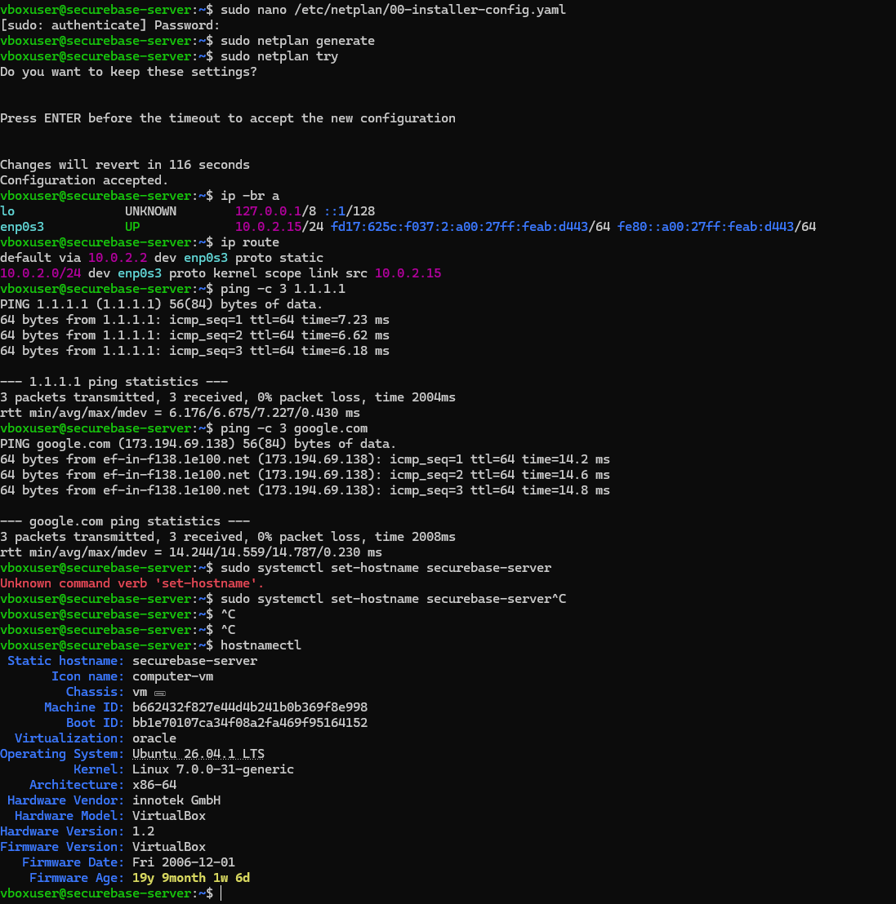
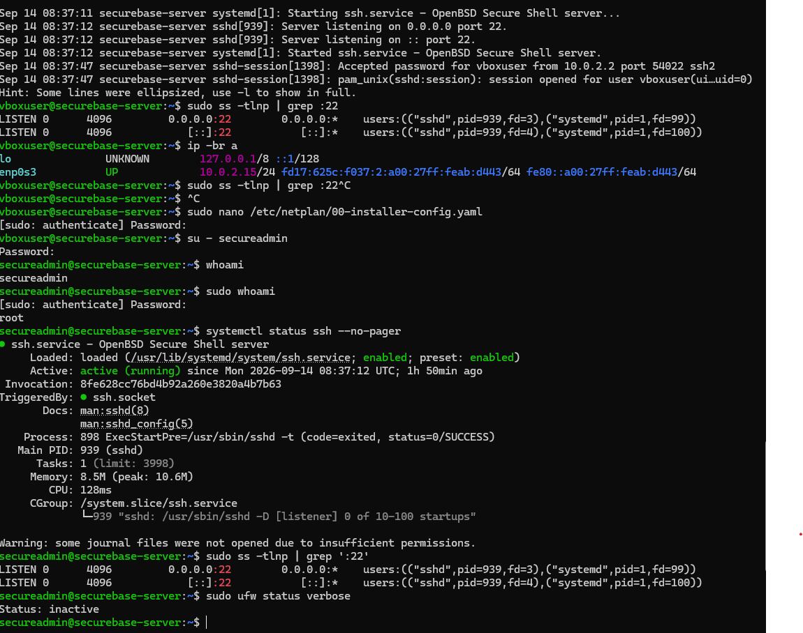
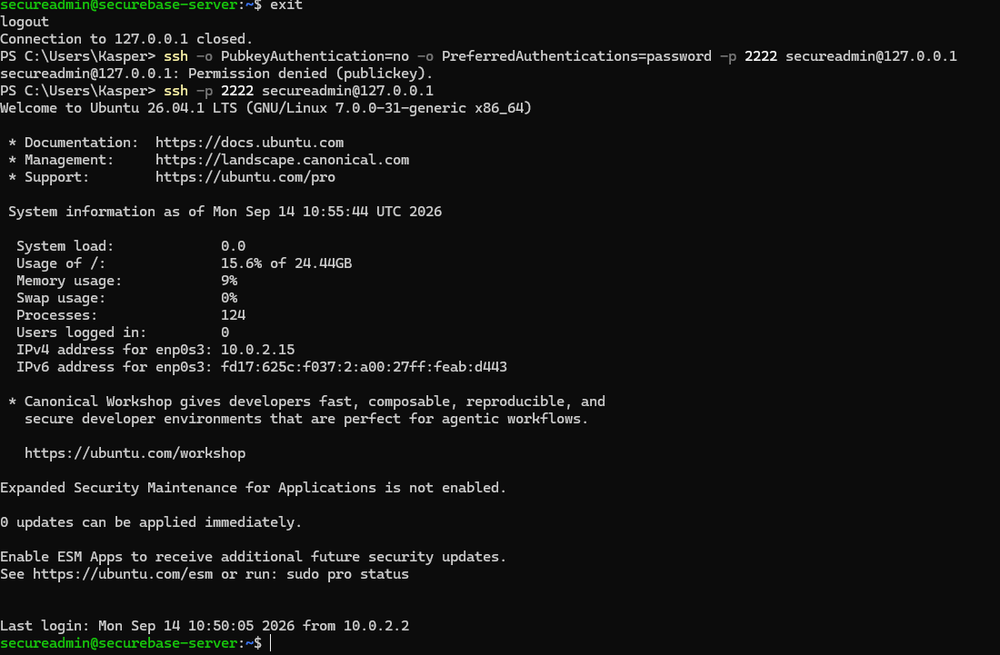
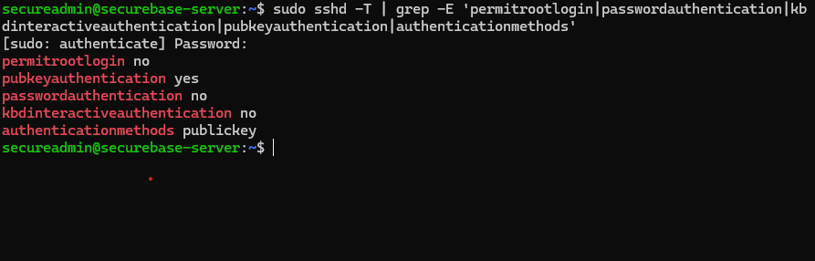

# Modul 1: VM-opsætning og netværk

[← Overblik](../README.md) · [Næste modul](02-filsystem.md)

> **Tidsmæssig afgrænsning:** Dette er tilstanden efter Modul 1 på den manuelt opbyggede VM. secureadmin havde her bred sudo-adgang; den erstattes af den begrænsede rolle i Modul 3. UFW aktiveres først i Modul 4.

## Formål

At etablere en Ubuntu-server uden GUI med forudsigeligt netværk og en kontrolleret fjernadgang. Serveren skal kunne administreres uden direkte root-login og uden SSH-password-login.

## Udførte opgaver

- Installeret Ubuntu Server 26.04.1 LTS i VirtualBox og opdateret pakkerne.
- Konfigureret hostname, statisk IPv4, gateway og DNS og afprøvet forbindelsen.
- Oprettet secureadmin, etableret nøglebaseret SSH og dokumenteret både vellykket login og afvist password-forsøg.

## Sikkerhedsmæssig begrundelse

En server uden unødvendig GUI og med opdaterede pakker giver et mere kontrolleret udgangspunkt. Den faste adresse og det sigende hostname gør administrationen forudsigelig.

Nøglebaseret SSH, deaktiveret direkte root-login og en loopback-bundet VirtualBox-forward begrænser fjernadgangen. Den private klientnøgle indgår ikke i repoet.

## Dokumentation / bevis

Detaljerne nedenfor er konverteret fra den samlede rapport. [Alle 4 screenshots for dette modul](../evidence/01-vm-netvaerk/README.md) er udtrukket fra rapporten uden ændring af billedindhold. [Kilde- og versionsgrundlag](GRUNDLAG.md).

### 1. Status på Modul 1

Modul 1 kræver installation af en Linux-server, statisk IP og hostname, en ikke-root administrator samt hærdet SSH med nøglebaseret autentifikation. Tabellen nedenfor viser den aktuelle status.

| Krav | Aktuel løsning / dokumentation | Status |
| --- | --- | --- |
| Linux-server i VM | Ubuntu Server 26.04.1 LTS kører i VirtualBox | Gennemført |
| Systemopdatering | Pakker er opdateret med apt | Gennemført |
| Sigende hostname | securebase-server | Gennemført |
| Statisk IP | 10.0.2.15/24 på enp0s3 | Gennemført |
| Routing og DNS | Gateway og navneopslag er testet | Gennemført |
| Ikke-root administrator | secureadmin (UID 1001) er oprettet og medlem af sudo-gruppen | Gennemført |
| SSH key authentication | Nøglebaseret login som secureadmin er testet og virker | Gennemført |
| Password-login via SSH | Password-only login er tvunget i test og afvises med Permission denied (publickey) | Gennemført |
| OpenSSH / port forwarding | sshd er aktiv på port 22; Windows forbinder via 127.0.0.1:2222 til guest port 22 | Gennemført |
| Direkte root-login via SSH | Effektiv sshd-konfiguration verificeret: PermitRootLogin no og AuthenticationMethods publickey | Gennemført |
| README: netværk og sikkerhedsvalg | Kort README-sektion beskriver netværkskonfiguration, VirtualBox NAT/port forwarding og de centrale SSH-sikkerhedsvalg med begrundelser | Gennemført |

### 2. Gennemført arbejde

#### 2.1 Ubuntu Server og grundopsætning

Serveren er oprettet som en virtuel maskine i Oracle VirtualBox med Ubuntu Server 26.04.1 LTS. Arbejdet udføres fra terminalen, hvilket passer til opgavens server- og sikkerhedsfokus.

Systemet blev opdateret, så installationen tager udgangspunkt i aktuelle pakker og sikkerhedsrettelser:

```bash
sudo apt update
sudo apt full-upgrade -y
```

**Sikkerhedsmæssig begrundelse:** Et opdateret system reducerer risikoen for kendte sårbarheder og giver et bedre udgangspunkt for efterfølgende hærdning.

#### 2.2 Hostname

Serverens hostname blev ændret fra Ubuntu-Server1 til securebase-server og efterfølgende verificeret med hostnamectl.

```bash
sudo hostnamectl set-hostname securebase-server
hostnamectl
```

Sikkerhedsmæssig og driftsmæssig begrundelse: Et tydeligt hostname gør serveren lettere at identificere i terminaler, logs og administrationsværktøjer og mindsker risikoen for at udføre handlinger på den forkerte maskine.

#### 2.3 Netværksinterface og statisk IP

Det primære netværksinterface er enp0s3. VirtualBox NAT tildelte oprindeligt adressen 10.0.2.15/24 via DHCP, og routingtabellen viste gatewayen 10.0.2.2.

```bash
ip -br a
ip route
```

For at gøre serverens adresse forudsigelig blev DHCP deaktiveret, og Netplan-konfigurationen i /etc/netplan/00-installer-config.yaml blev ændret til statisk IPv4.

```yaml
network:
  version: 2
  ethernets:
    enp0s3:
      dhcp4: false
      dhcp6: false
      addresses:
        - 10.0.2.15/24
      routes:
        - to: default
          via: 10.0.2.2
      nameservers:
        addresses:
          - 10.0.2.3
          - 1.1.1.1
      match:
        macaddress: 08:00:27:ab:d4:43
      set-name: enp0s3
```

Sikkerhedsmæssig og driftsmæssig begrundelse: En statisk serveradresse gør administration, SSH-adgang og senere firewall-regler forudsigelige. Serveren kan dermed identificeres på samme adresse efter genstart.

### 3. Validering af netværkskonfigurationen

Inden netværksændringen blev accepteret permanent, blev konfigurationen først valideret og derefter testet med Netplans sikkerhedsmekanisme:

```bash
sudo netplan generate
sudo netplan try
```

netplan generate kontrollerede konfigurationen for fejl. netplan try anvendte ændringerne midlertidigt og ville automatisk rulle tilbage ved manglende bekræftelse. Det reducerer risikoen for at låse administratoren ude ved en forkert netværkskonfiguration.

#### 3.1 Kontrol af IP og routing

Efter ændringen blev IP-adressen og routingtabellen verificeret. Resultatet viste den forventede statiske adresse og default route:

```text
enp0s3  UP  10.0.2.15/24
default via 10.0.2.2 dev enp0s3 proto static
```

#### 3.2 Test af internet og DNS

Forbindelsen blev testet i to trin. Først blev en ekstern IP-adresse pinget for at kontrollere routing uden DNS. Derefter blev google.com pinget for at kontrollere navneopslag.

```bash
ping -c 3 1.1.1.1
ping -c 3 google.com
```

Begge tests blev gennemført med 0 % pakketab. Det dokumenterer, at både routing til internettet og DNS fungerer efter overgangen til statisk IP.

Dokumentation fra den aktuelle VM

<a id="figur-1-1"></a>



*Figur 1.1. Terminaloutput med accepteret Netplan-konfiguration, statisk IP, routing, ping-tests og hostname securebase-server.*

### 4. Administratorbruger og SSH-adgang

Efter netværksdelen blev fjernadministrationen flyttet over på en separat administratorbruger og OpenSSH. Målet er, at daglig administration ikke udføres som root, og at SSH kun accepterer en kryptografisk nøgle som autentifikation.

#### 4.1 Ikke-root administrator

Brugeren secureadmin blev oprettet som en almindelig bruger og derefter tilføjet til sudo-gruppen. Dette gør det muligt at arbejde med normale brugerrettigheder og kun hæve privilegier ved administrative opgaver.

```bash
sudo adduser secureadmin
sudo usermod -aG sudo secureadmin
id secureadmin
```

Kontrollen viste UID 1001 for secureadmin og medlemskab af sudo-gruppen. Derudover blev sudo-adgangen funktionstestet:

```bash
su - secureadmin
whoami
sudo whoami
```

Resultatet var først secureadmin og derefter root ved brug af sudo. Det dokumenterer, at kontoen ikke er root, men kan udføre nødvendige administrative handlinger kontrolleret.

#### 4.2 OpenSSH og VirtualBox port forwarding

OpenSSH-serveren er aktiv og lytter på TCP port 22 på både IPv4 og IPv6. Dette blev verificeret med systemd og ss:

```bash
systemctl status ssh --no-pager
sudo ss -tlnp | grep ':22'
```

Da VirtualBox-netkortet bruger NAT, kan Windows-værten ikke administrere guest-adressen 10.0.2.15 direkte som et almindeligt LAN-interface. Derfor anvendes en målrettet port-forward i VirtualBox:

```text
Host IP:   127.0.0.1
Host Port: 2222
Protocol:  TCP
Guest IP:  10.0.2.15
Guest Port: 22
```

SSH-forbindelsen etableres derfor fra Windows PowerShell med:

```powershell
ssh -p 2222 secureadmin@127.0.0.1
```

**Sikkerhedsmæssig begrundelse:** Port-forwarden bindes til loopback-adressen 127.0.0.1, så SSH-porten ikke eksponeres direkte på værtsmaskinens øvrige netværksinterfaces. Samtidig kan serveren administreres fra den lokale Windows-vært.

<a id="figur-1-2"></a>



*Figur 1.2. Verifikation af secureadmin, sudo-adgang, aktiv ssh.service, lyttende port 22 og UFW-status.*

#### 4.3 Nøglebaseret SSH-autentifikation

Et ED25519-nøglepar blev oprettet på Windows-klienten. Den private nøgle forbliver på klienten, mens public key blev installeret i secureadmin-brugerens ~/.ssh/authorized_keys på serveren. Denne model fjerner behovet for at sende eller validere et kontopassword ved almindeligt SSH-login.

```powershell
ssh-keygen -t ed25519 -a 100 -C "secureadmin@securebase-server"
```

Public key blev overført til serverkontoen, hvorefter almindelig SSH-adgang blev testet fra PowerShell. Et normalt login med følgende kommando lykkes:

```powershell
ssh -p 2222 secureadmin@127.0.0.1
```

#### 4.4 SSH-hærdning: kun public key

SSH blev herefter hærdet, så passwordbaseret autentifikation ikke længere accepteres, mens public key authentication er den tilladte adgangsmetode. Den anvendte hardening omfatter følgende centrale indstillinger:

```conf
PermitRootLogin no
PasswordAuthentication no
KbdInteractiveAuthentication no
PubkeyAuthentication yes
AuthenticationMethods publickey
PermitEmptyPasswords no
```

**Sikkerhedsmæssig begrundelse:** Password-login er udsat for blandt andet brute-force, password spraying og genbrugte credentials. Ved at kræve public key skal en angriber både have adgang til den relevante private nøgle og eventuelt dens passphrase. Direkte root-login bør samtidig være deaktiveret, så en ekstern forbindelse ikke kan starte direkte i den mest privilegerede konto.

### 5. Validering og bevis af SSH-hærdningen

Hærdningen blev testet fra Windows PowerShell på to måder: først ved bevidst at deaktivere public key på klienten og tvinge et password-forsøg, og derefter ved at foretage et normalt SSH-login med den installerede nøgle.

#### 5.1 Password-only login afvises

```powershell
ssh -o PubkeyAuthentication=no -o PreferredAuthentications=password -p 2222 secureadmin@127.0.0.1
```

Forsøget returnerede:

```text
secureadmin@127.0.0.1: Permission denied (publickey).
```

Denne test er et direkte bevis på, at serveren ikke tilbyder password som accepteret autentifikationsmetode for forbindelsen. Klienten blev specifikt instrueret i ikke at bruge public key og kun forsøge password; serverens svar viser i stedet, at publickey er den accepterede metode.

#### 5.2 Nøglebaseret login lykkes

```powershell
ssh -p 2222 secureadmin@127.0.0.1
```

Det normale SSH-login lykkedes umiddelbart efter den afviste password-test, og sessionen åbnede som secureadmin@securebase-server. Kombinationen af de to tests dokumenterer derfor både, at password-login er deaktiveret, og at den installerede SSH-nøgle fungerer korrekt.

<a id="figur-1-3"></a>



*Figur 1.3. PowerShell-bevis: password-only login afvises med “Permission denied (publickey)”, mens et normalt SSH-login umiddelbart efter lykkes som secureadmin.*

#### 5.3 Verifikation af den effektive SSH-konfiguration

Som sidste kontrol blev den effektive sshd-konfiguration læst direkte fra den kørende SSH-server. Dermed dokumenteres ikke kun indholdet af en konfigurationsfil, men de indstillinger sshd faktisk anvender.

```bash
sudo sshd -T | grep -E 'permitrootlogin|passwordauthentication|kbdinteractiveauthentication|pubkeyauthentication|authenticationmethods'
```

Kontrollen returnerede følgende effektive værdier:

```text
permitrootlogin no
pubkeyauthentication yes
passwordauthentication no
kbdinteractiveauthentication no
authenticationmethods publickey
```

Resultatet bekræfter, at direkte root-login via SSH er deaktiveret, at password- og keyboard-interactive authentication er slået fra, at public key authentication er aktiv, og at serveren kræver public key som autentifikationsmetode. SSH-hærdningen er dermed verificeret i den effektive serverkonfiguration.

<a id="figur-1-4"></a>



*Figur 1.4. Effektiv sshd-konfiguration: root-login og password-login er deaktiveret, mens public key er påkrævet.*

### 6. README – netværkskonfiguration og sikkerhedsvalg

Denne README-sektion samler den korte drifts- og sikkerhedsdokumentation, som afleveringskravet efterspørger. Den beskriver serverens netværksopsætning, adgangsvej og de vigtigste sikkerhedsvalg i Modul 1.

#### 6.1 System og identifikation

```text
Operativsystem: Ubuntu Server 26.04.1 LTS
Virtualisering: Oracle VirtualBox
GUI: Ingen
Hostname: securebase-server
```

Ubuntu Server er installeret uden grafisk brugerflade for at holde installationen enkel og reducere mængden af unødvendig software og services. Det giver et mere kontrolleret servermiljø og reducerer samtidig den potentielle angrebsflade.

#### 6.2 Netværkskonfiguration

```text
Interface: enp0s3
Statisk IPv4: 10.0.2.15/24
Default gateway: 10.0.2.2
DNS: 10.0.2.3, 1.1.1.1
VirtualBox netværk: NAT
SSH port forwarding: 127.0.0.1:2222 -> 10.0.2.15:22
```

Sikkerhedsmæssig og driftsmæssig begrundelse: En statisk serveradresse gør administration, SSH-adgang og senere firewall-regler forudsigelige. VirtualBox-portforwarden er bundet til 127.0.0.1, så den videresendte SSH-port kun er tilgængelig fra værtsmaskinen og ikke eksponeres direkte på værtsmaskinens øvrige netværksinterfaces.

#### 6.3 Administrator og least privilege

```text
Administratorbruger: secureadmin
Rolle: almindelig ikke-root-bruger med sudo-adgang
Direkte root-login via SSH: deaktiveret
```

**Sikkerhedsmæssig begrundelse:** Administration udføres med en individuel ikke-root-konto og kun med forhøjede rettigheder via sudo, når det er nødvendigt. Det følger princippet om least privilege og reducerer konsekvensen af fejl eller kompromittering sammenlignet med konstant root-brug.

#### 6.4 SSH-sikkerhedsvalg

```conf
PermitRootLogin no
PasswordAuthentication no
KbdInteractiveAuthentication no
PubkeyAuthentication yes
AuthenticationMethods publickey
```

Nøglebaseret autentifikation er valgt i stedet for password-login. Det fjerner muligheden for almindelige online password-angreb som brute-force, password spraying og credential stuffing mod SSH-login og kræver i stedet adgang til den korrekte private nøgle.

Direkte root-login via SSH er deaktiveret, så root-kontoen ikke kan angribes direkte over fjernforbindelsen. Administratoren logger i stedet ind som secureadmin og anvender sudo til de handlinger, der kræver forhøjede rettigheder.

Den private SSH-nøgle skal fortsat beskyttes på klienten, gerne med en passphrase. Nøglebaseret autentifikation reducerer især risikoen ved password-gætning, men erstatter ikke behovet for opdateringer, korrekt adgangskontrol og sikker håndtering af private nøgler.

#### 6.5 Verifikation

SSH-hærdningen er både funktions- og konfigurationsverificeret. Et normalt SSH-login med den installerede public key lykkes, mens et forsøg, hvor klienten tvinges til kun at anvende password, afvises med Permission denied (publickey).

```bash
Vellykket key-login:
ssh -p 2222 secureadmin@127.0.0.1

Tvunget password-test:
ssh -o PubkeyAuthentication=no -o PreferredAuthentications=password -p 2222 secureadmin@127.0.0.1
Resultat: Permission denied (publickey)
```

Den effektive sshd-konfiguration er desuden kontrolleret med sshd -T og viser PermitRootLogin no, PasswordAuthentication no, PubkeyAuthentication yes og AuthenticationMethods publickey. Dermed er både den ønskede konfiguration og den faktiske login-adfærd dokumenteret.

### 7. Endelig status og konklusion

Modul 1 er nu gennemført og dokumenteret. VM- og netværksopsætningen er valideret, secureadmin er etableret som ikke-root administrator, OpenSSH er aktivt, og fjernadgang kræver public key. Password-only login er dokumenteret afvist, og den effektive sshd-konfiguration bekræfter samtidig, at direkte root-login er deaktiveret.

- Ubuntu Server 26.04.1 LTS kører i Oracle VirtualBox uden GUI.

- Hostname er securebase-server.

- Statisk IPv4 er 10.0.2.15/24 på enp0s3 med gateway 10.0.2.2.

- Routing, internet og DNS er valideret.

- secureadmin er en separat ikke-root administrator med sudo-adgang.

- OpenSSH er aktiv og lytter på port 22.

- VirtualBox videresender 127.0.0.1:2222 til 10.0.2.15:22.

- Public-key login er testet og fungerer.

- Password-only login er testet og afvises.

- Den effektive sshd-konfiguration dokumenterer PermitRootLogin no, PasswordAuthentication no og AuthenticationMethods publickey.

- README-sektion med netværkskonfiguration og sikkerhedsvalg er inkluderet som kort afleveringsdokumentation.

> Aktuel status: Modul 1 er gennemført og dokumenteret. Serveren har statisk IP og hostname, separat ikke-root administrator, aktiv OpenSSH samt udelukkende nøglebaseret SSH-adgang. Password-login og direkte root-login via SSH er verificeret deaktiveret, og en kort README-sektion dokumenterer netværkskonfigurationen og de trufne sikkerhedsvalg.

## Overvejelser og fravalg

NAT med loopback-forward blev valgt frem for direkte LAN-eksponering. SSH bruger port 22 i Ubuntu; 2222 er værtsporten. Nøglelogin blev kontrolleret før deaktivering af password-login. Se Modul 4 for den efterfølgende firewall.

### Kobling til de aktuelle scripts

- [`scripts/modules/01-system.sh`](../scripts/modules/01-system.sh)
- [`scripts/modules/03-users.sh`](../scripts/modules/03-users.sh)
- [`scripts/modules/05-ssh.sh`](../scripts/modules/05-ssh.sh)
- [`scripts/modules/02-network.sh`](../scripts/modules/02-network.sh)

### Kildegrundlag

[Samlet Word-rapport, uændret kopi](../reports/SecureBase_Modul_1_2_3_4_5_6_DOKUMENTATION.docx). Figurnumrene svarer til rapporten; i Modul 1–2 er modulnummeret tilføjet for entydighed. Kommandoer er dokumentation af det viste forløb, ikke en opfordring til at genkøre alle historiske trin på den færdige server.

[← Overblik](../README.md) · [Næste modul](02-filsystem.md)
