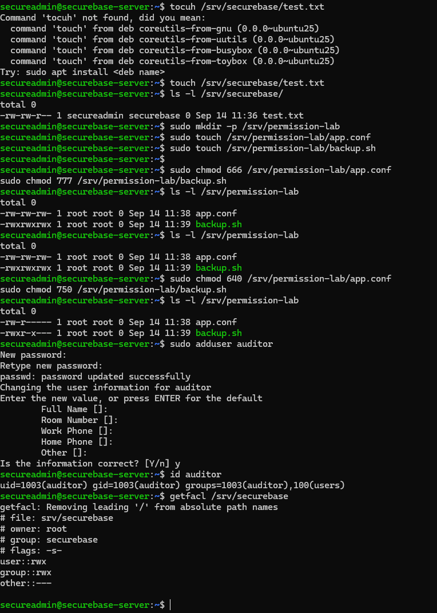
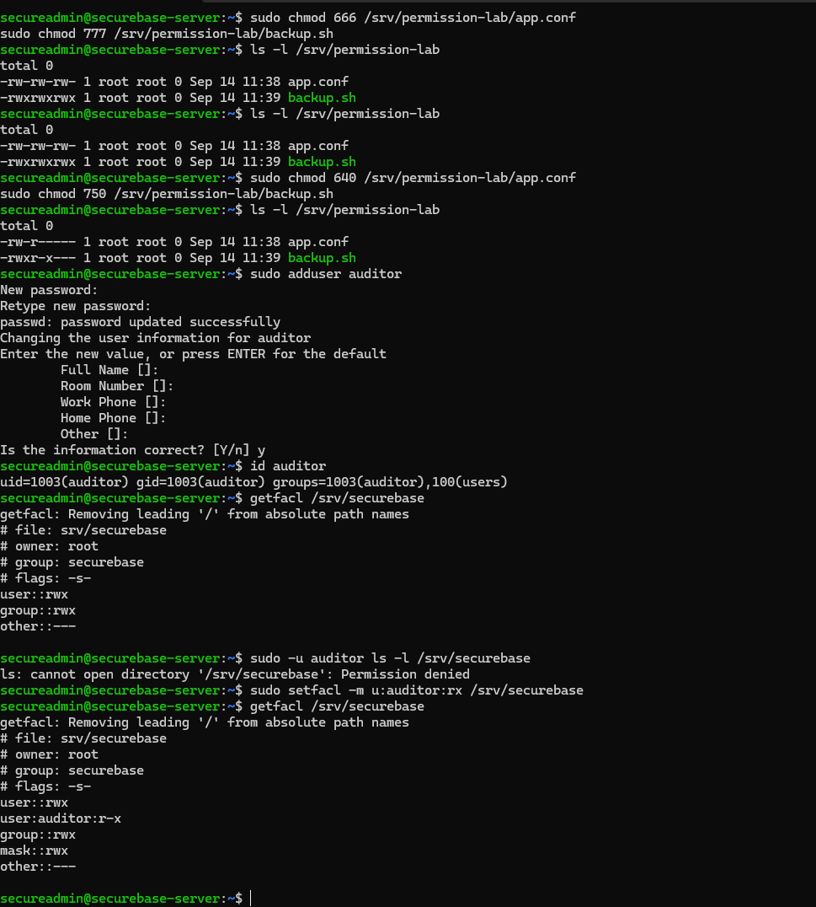
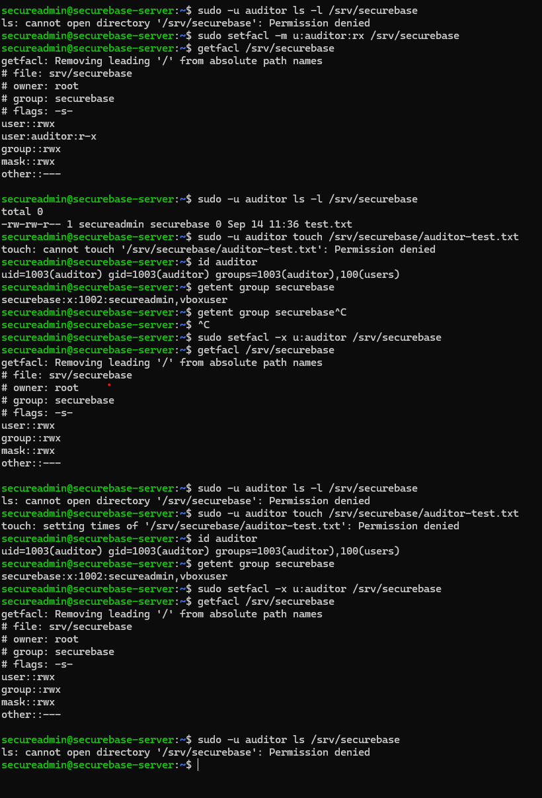

# Modul 2: Filsystemet og adgangskontrol

[← Overblik](../README.md) · [Forrige modul](01-vm-netvaerk.md) · [Næste modul](03-brugere-grupper.md)

> **Tidsmæssig afgrænsning:** Dokumentationen gælder den manuelle VM efter Modul 2. Default ACL og de tre rollegrupper tilføjes i Modul 3. Permission-lab er et afgrænset øvelsesmiljø, ikke en del af deploymentets ønskede sluttilstand.

## Formål

At anvende Linux-filsystemets struktur og rettigheder, så projektdata kun er tilgængelige for de relevante brugere. Både almindelige gruppepermissions og midlertidige ACL-undtagelser afprøves.

## Udførte opgaver

- Undersøgt FHS-mapper og root-filsystemets ext4-baseline.
- Oprettet /srv/securebase som root:securebase med SGID og mode 2770.
- Rettet to usikre testfiler og afprøvet tildeling og fjernelse af auditors midlertidige ACL-adgang.

## Sikkerhedsmæssig begrundelse

Projektadgang styres med grupper frem for chmod 777. Kun ejeren og projektgruppen har normal mappeadgang, og SGID sørger for den valgte gruppearv.

Testkonfiguration og testscript begrænses til henholdsvis 640 og 750. Den midlertidige auditor-adgang gives og fjernes uden at ændre gruppestrukturen.

## Dokumentation / bevis

Detaljerne nedenfor er konverteret fra den samlede rapport. [Alle 3 screenshots for dette modul](../evidence/02-filsystem/README.md) er udtrukket fra rapporten uden ændring af billedindhold. [Kilde- og versionsgrundlag](GRUNDLAG.md).

### 1. Status på Modul 2

| Krav | Dokumentation / resultat | Status |
| --- | --- | --- |
| FHS og centrale mapper | /etc, /var, /home, /tmp og /var/log er undersøgt og forklaret. Root-filsystemet er ext4. | Gennemført |
| Delt projektmappe | /srv/securebase ejes af root:securebase og anvender 2770/SGID i stedet for chmod 777. | Gennemført |
| To usikre permissions | app.conf: 666 -> 640 og backup.sh: 777 -> 750 er dokumenteret før/efter. | Gennemført |
| ACL-værktøjer | acl-pakken er installeret; getfacl 2.3.2 og setfacl anvendes. | Gennemført |
| Midlertidig ACL-adgang | auditor får r-x via ACL uden medlemskab af securebase; skriveforsøg afvises; ACL fjernes igen. | Gennemført |
| Dokumentation før/efter | ls -l og getfacl-output samt screenshots er samlet nedenfor. | Gennemført |

### 2. Filsystemhierarki (FHS) og baseline

Som første trin blev de centrale mapper undersøgt med ls -ld, og disk-/mount-oplysninger blev kontrolleret med df -h og findmnt /. Serverens root-filsystem ligger på /dev/sda2 og anvender ext4.

| Mappe | Primært formål | Sikkerhedsrelevans |
| --- | --- | --- |
| /etc | System- og servicekonfiguration. | Konfigurationsfiler bør normalt kun kunne ændres af privilegerede brugere. |
| /var | Variable data som caches, køer og service-data. | Indhold ændres løbende og bør beskyttes efter den enkelte services behov. |
| /var/log | System- og applikationslogs. | Logs er centrale for fejlfinding, audit og incident response; manipulation bør begrænses. |
| /home | Brugernes personlige hjemmemapper. | Adgang bør adskilles mellem brugere og følge need-to-know. |
| /tmp | Midlertidige filer. | Er fælles skrivbar, men sticky bit (t) begrænser sletning af andre brugeres filer. |
| /srv | Data som serveren stiller til rådighed for services/projekter. | Velegnet til et fælles projektområde med styret gruppeadgang. |

```bash
ls -ld /etc /var /home /tmp /var/log
df -h
findmnt /
```

Observation: /tmp fremstod som drwxrwxrwt. Det afsluttende t er sticky bit, som er vigtigt på en fælles skrivbar mappe, fordi brugere ikke frit kan slette hinandens filer.

### 3. Gruppebaseret projektområde uden chmod 777

ACL-værktøjerne manglede oprindeligt og blev installeret med pakken acl. Herefter blev projektgruppen securebase oprettet, og både secureadmin og vboxuser blev tilføjet til gruppen. Efter nyt login kunne secureadmin se medlemskabet i id-output.

```bash
sudo apt install acl -y
sudo groupadd securebase
sudo usermod -aG securebase secureadmin
sudo usermod -aG securebase vboxuser
getent group securebase
```

Det fælles projektområde blev placeret under /srv og konfigureret med root som ejer, securebase som gruppe og mode 2770:

```bash
sudo mkdir -p /srv/securebase
sudo chown root:securebase /srv/securebase
sudo chmod 2770 /srv/securebase
ls -ld /srv/securebase
```

Resultatet var drwxrws--- root securebase. Tallet 2 aktiverer SGID på mappen, så nye filer og undermapper arver gruppen securebase. 770 giver fuld adgang til ejer og gruppe, mens øvrige brugere ikke har adgang til selve projektmappen.

En testfil blev oprettet som secureadmin, og ls -l viste, at filen automatisk fik gruppen securebase. Det dokumenterer, at SGID-gruppearven fungerer som tiltænkt.

```bash
touch /srv/securebase/test.txt
ls -l /srv/securebase/
# resultat: -rw-rw-r-- secureadmin securebase ... test.txt
```

**Sikkerhedsmæssig begrundelse:** Gruppebaseret adgang er mere kontrolleret end chmod 777. Kun medlemmer af den udpegede gruppe kan traversere og skrive i projektområdet, hvilket følger least privilege og need-to-know.

### 4. Identifikation og rettelse af usikre filrettigheder

For ikke at ændre rigtige systemfiler blev der oprettet et isoleret testmiljø i /srv/permission-lab. To filer blev bevidst gjort usikre for at demonstrere identifikation og hærdning.

```bash
sudo mkdir -p /srv/permission-lab
sudo touch /srv/permission-lab/app.conf
sudo touch /srv/permission-lab/backup.sh
sudo chmod 666 /srv/permission-lab/app.conf
sudo chmod 777 /srv/permission-lab/backup.sh
ls -l /srv/permission-lab
```

Før rettelsen var app.conf world-writable (666), og backup.sh var world-readable, world-writable og executable (777). Begge konfigurationer giver unødvendigt brede rettigheder.

| Fil | Før | Efter | Begrundelse |
| --- | --- | --- | --- |
| app.conf | 666 · rw-rw-rw- | 640 · rw-r----- | Andre lokale brugere må ikke kunne ændre en konfigurationsfil. |
| backup.sh | 777 · rwxrwxrwx | 750 · rwxr-x--- | Et script, især hvis det senere køres privilegeret, må ikke være skrivbart af alle. |

```bash
sudo chmod 640 /srv/permission-lab/app.conf
sudo chmod 750 /srv/permission-lab/backup.sh
ls -l /srv/permission-lab
```

**Sikkerhedsmæssig begrundelse:** World-writable konfigurationsfiler eller scripts kan bruges til manipulation og i værste fald privilege escalation, hvis en højere privilegeret proces efterfølgende læser eller udfører det ændrede indhold. Rettighederne blev derfor reduceret til det nødvendige minimum.

#### Rettigheder i parret før/efter-visning

**Før — udsnit af de dokumenterede rettighedsfelter:**

```text
app.conf   -rw-rw-rw-  (666)
backup.sh  -rwxrwxrwx  (777)
```

**Efter — samme filer:**

```text
app.conf   -rw-r-----  (640)
backup.sh  -rwxr-x---  (750)
```

Dette er et læsbart uddrag af rettighederne fra figur 2.1, ikke en ny terminaleksport.

<a id="figur-2-1"></a>



*Figur 2.1. Projektmappe, før/efter-rettigheder i permission-lab, oprettelse af auditor og getfacl før ACL-ændringen.*

### 5. Midlertidig, afgrænset adgang med ACL

Brugeren auditor blev oprettet som en separat testbruger og blev bevidst ikke tilføjet til gruppen securebase. id auditor og getent group securebase dokumenterer, at gruppestrukturen ikke blev ændret.

```bash
sudo adduser auditor
id auditor
getent group securebase
```

Før ACL-reglen havde auditor ingen adgang til /srv/securebase:

```bash
sudo -u auditor ls -l /srv/securebase
# resultat: Permission denied
```

Derefter blev der tilføjet en bruger-specifik ACL med read + execute (r-x). Execute på en mappe betyder, at brugeren må traversere den; write blev bevidst udeladt.

```bash
sudo setfacl -m u:auditor:rx /srv/securebase
getfacl /srv/securebase
```

getfacl viste user:auditor:r-x. Auditor kunne nu liste indholdet, men et forsøg på at oprette auditor-test.txt blev afvist. Adgangen var dermed afgrænset til læse/traverse-adgang og gav ikke skriverettighed.

```bash
sudo -u auditor ls -l /srv/securebase
sudo -u auditor touch /srv/securebase/auditor-test.txt
# resultat: Permission denied
```

<a id="figur-2-2"></a>



*Figur 2.2. ACL før og efter: auditor går fra Permission denied til r-x-adgang og kan liste projektmappen uden at kunne skrive.*

#### 5.1 Fjernelse af den midlertidige ACL

For at demonstrere at adgangen er midlertidig, blev den bruger-specifikke ACL fjernet igen med setfacl -x. Efter fjernelsen viste getfacl ikke længere auditor-reglen, og auditor blev igen afvist ved forsøg på at liste mappen.

```bash
sudo setfacl -x u:auditor /srv/securebase
getfacl /srv/securebase
sudo -u auditor ls /srv/securebase
# resultat: Permission denied
```

<a id="figur-2-3"></a>



*Figur 2.3. Gruppestrukturen forbliver uændret; auditor-ACL fjernes, og adgangen bliver straks afvist igen.*

### 6. Hvorfor chmod 777 undgås

chmod 777 giver ejer, gruppe og alle øvrige lokale brugere fuld read/write/execute-adgang. På en delt server bryder det med princippet om least privilege og øger risikoen for utilsigtede ændringer, datamanipulation og misbrug af scripts eller konfigurationsfiler.

I denne løsning er chmod 777 erstattet af flere mere præcise mekanismer:

- Gruppebaseret adgang med root:securebase og mode 2770 på /srv/securebase.

- SGID på projektmappen, så nye objekter arver den korrekte projektgruppe.

- Målrettede filrettigheder som 640 og 750 i stedet for world-writable modes.

- ACL til en enkelt midlertidig bruger, når der er behov for en undtagelse uden at ændre gruppemedlemskab.

### 7. Afleveringskrav og aktuel status

- FHS: /etc, /var, /home, /tmp, /var/log og /srv er beskrevet med formål og sikkerhedsrelevans.

- Delt projektmappe: /srv/securebase anvender gruppebaseret adgang og SGID – ikke chmod 777.

- To fejlkonfigurationer: 666 og 777 er dokumenteret og rettet til 640 og 750.

- ACL: auditor får midlertidig r-x-adgang uden at blive medlem af securebase, hvorefter ACL fjernes igen.

- Dokumentation: ls -l og getfacl før/efter fremgår af terminalbeviser og figurer.

### 8. Konklusion og eventuel ekstra hardening

De obligatoriske tekniske og dokumentationsmæssige krav i Modul 2 er gennemført. Projektområdet demonstrerer gruppebaseret adgang, to usikre permission-scenarier er korrigeret, og ACL-forløbet dokumenterer både tildeling, begrænsning og fjernelse af en individuel midlertidig adgang.

Der mangler derfor ikke noget obligatorisk i Modul 2 ud fra opgavebeskrivelsen. Som frivillig ekstra hardening kan der senere sættes en strammere umask eller en default ACL på /srv/securebase, så nye filer automatisk oprettes uden rettigheder til “other”. Det er ikke et krav for modulet, fordi selve projektmappen allerede blokerer øvrige brugere med mode 2770.

> Aktuel status: Modul 2 er gennemført og dokumenteret. Alle obligatoriske krav er dækket; default ACL/strammere umask er kun en valgfri ekstra hardening.

## Overvejelser og fravalg

Ingen rigtige systemfiler i /etc blev gjort world-writable; øvelsen brugte /srv/permission-lab. auditor-testen viser listing og afvist nyfiloprettelse, ikke en generel læse-/skriveaudit af alle projektfiler. Default ACL var et senere tilvalg i Modul 3.

### Kobling til de aktuelle scripts

- [`scripts/modules/04-storage-acl.sh`](../scripts/modules/04-storage-acl.sh)

### Kildegrundlag

[Samlet Word-rapport](../reports/SecureBase_Modul_1_2_3_4_5_6_DOKUMENTATION.docx). Figurnumrene svarer til rapporten; i Modul 1–2 er modulnummeret tilføjet for entydighed. Kommandoerne dokumenterer de viste testtrin; ved en ny installation bruges deploymentvejledningen.

[← Overblik](../README.md) · [Forrige modul](01-vm-netvaerk.md) · [Næste modul](03-brugere-grupper.md)
