# Modul 3: Bruger- og gruppestyring

[← Overblik](../README.md) · [Forrige modul](02-filsystem.md) · [Næste modul](04-firewall.md)

> **Tidsmæssig afgrænsning:** Dette er den manuelle Modul 3-model: de tre sudo-kommandoer kræver lokalt password. Deploymentet i Modul 6 bruger NOPASSWD til præcis de samme tre opgaver for nye konti uden lokalt password, aldrig NOPASSWD: ALL.

## Formål

At adskille administration, udvikling og gæsteadgang. Roller og rettigheder kontrolleres både i konfigurationen og med handlinger, der skal lykkes eller blive afvist.

## Udførte opgaver

- Oprettet admins, developers og guests med secureadmin, developer1 og guest1.
- Tildelt mappe-, fil- og default ACL og testet developers skrivning samt guests læseadgang og afviste skriveforsøg.
- Fjernet secureadmins brede sudo-medlemskab og verificeret tre konkrete sudo-tilladelser; developer og guest har ingen sudo-tilladelser.

## Sikkerhedsmæssig begrundelse

Rollegrupper adskiller behovet for at administrere systemet fra behovet for at arbejde med projektfiler. Fil- og mappetests viser, at gæsten kan læse uden at kunne ændre indhold eller oprette filer.

Den daglige administrator får kun de tre udvalgte SSH-driftsopgaver. vboxuser bevares og dokumenteres særskilt som opsætnings-/gendannelseskonto med fuld sudo.

## Dokumentation / bevis

Detaljerne nedenfor er konverteret fra den samlede rapport. [Alle 17 screenshots for dette modul](../evidence/03-brugere-grupper/README.md) er udtrukket fra rapporten uden ændring af billedindhold. [Kilde- og versionsgrundlag](GRUNDLAG.md).

### 1. Udgangspunkt og oprettelse af roller

Før ændringerne var secureadmin medlem af sudo og securebase. Projektmappen havde ejer root, gruppe securebase og SGID. sudo -l viste den brede tilladelse (ALL : ALL) ALL; developer- og guest-rollerne var endnu ikke tilføjet til projektets ACL.

<a id="figur-3-1"></a>

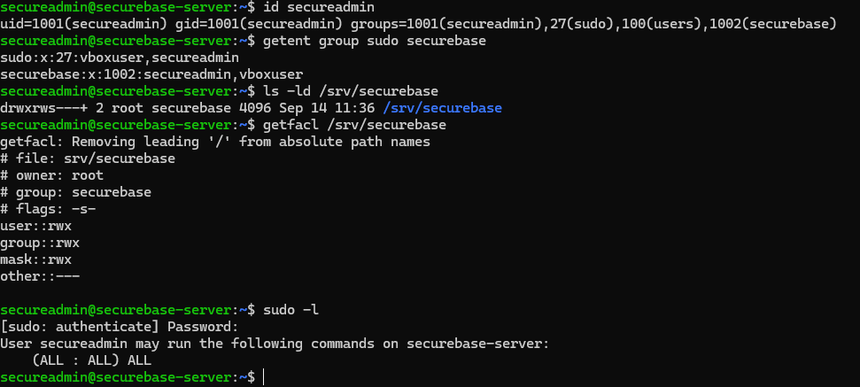

*Figur 3.1. Udgangspunkt før Modul 3. id, gruppeoplysninger, projektmappens ACL og den brede sudo-tilladelse er samlet i samme terminaludsnit.*

#### 1.1 Oprettelse af rollegrupper

```bash
sudo groupadd admins
sudo groupadd developers
sudo groupadd guests
getent group admins developers guests
```

<a id="figur-3-2"></a>

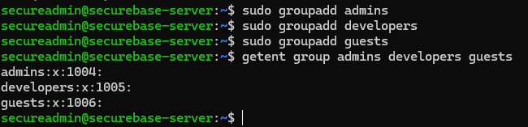

*Figur 3.2. Rollegrupperne admins, developers og guests er oprettet med GID 1004, 1005 og 1006. Udsnit af det uploadede terminalbillede.*

De to brugere developer1 og guest1 blev oprettet med adduser. Derefter blev kontiene tilknyttet deres respektive rollegrupper; resultatet er dokumenteret med id og et uddrag af /etc/group nedenfor.

**Sikkerhedsbegrundelse:** Adgang tildeles gennem rollegrupper frem for tilfældige individuelle undtagelser. Oprettelse af en gruppe giver ikke i sig selv projekt- eller administratoradgang; tilladelserne defineres særskilt.

### 2. Rollemodel og gruppemedlemskab

| Bruger | Gruppe / rolle | Rettigheder efter Modul 3 | Begrundelse |
| --- | --- | --- | --- |
| secureadmin<br>UID 1001 | admins<br>GID 1004 | Tre konkrete SSH-kommandoer som root. Bevarer projektadgang via securebase. | Daglig administration afgrænses til de valgte driftsopgaver. |
| developer1<br>UID 1007 | developers<br>GID 1005 | Læse-/skriveadgang til projektet via ACL. Ingen sudo-tilladelser. | Udvikleren kan arbejde med projektfiler uden generel systemadministration. |
| guest1<br>UID 1008 | guests<br>GID 1006 | Læse-/gennemgangsadgang via ACL. Ingen skrive- eller sudo-tilladelser. | Gæsten må se projektdata, men ikke ændre dem. |
| vboxuser | sudo og<br>securebase | Fuld sudo-adgang. Testet ved lokalt login i VirtualBox-konsollen. | Særskilt opsætnings-/gendannelseskonto; ikke en begrænset adminrolle. |

```bash
sudo adduser developer1
sudo adduser guest1
sudo usermod -aG admins secureadmin
sudo usermod -aG developers developer1
sudo usermod -aG guests guest1
```

Med -aG blev rollegruppen tilføjet uden at erstatte de eksisterende supplerende grupper. På dette tidspunkt blev secureadmin bevidst i sudo-gruppen, indtil de nye regler og gendannelsesadgangen var kontrolleret.

<a id="figur-3-3"></a>

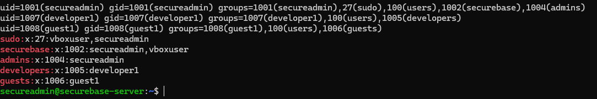

*Figur 3.3. De tre konti, deres UID/GID og /etc/group efter rolletildelingen. secureadmin har endnu både sudo og admins. Developer og guest er ikke medlemmer af sudo eller securebase.*

Kontrolkommandoer: id secureadmin, id developer1, id guest1 samt grep -E '^(admins|developers|guests|sudo|securebase):' /etc/group. Den endelige gruppe- og sudo-status vises i figur 3.13.

### 3. Gruppebaseret adgang til projektmappen

Før rettighedstildelingen blev ls forsøgt som både developer1 og guest1. Begge blev afvist med Permission denied, og getfacl viste endnu ingen regler for de to rollegrupper.

<a id="figur-3-4"></a>

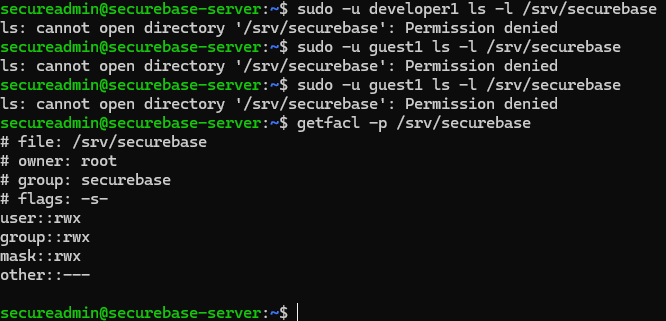

*Figur 3.4. Før-bevis: de nye brugere kan ikke liste /srv/securebase. Ejer, gruppe, SGID og den daværende ACL vises.*

```bash
sudo setfacl -m g:developers:rwx,g:guests:r-x /srv/securebase
getfacl -p /srv/securebase
```

<a id="figur-3-5"></a>

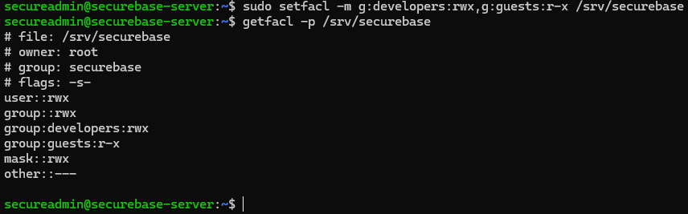

*Figur 3.5. Efter-bevis: developers har rwx på mappen, guests har r-x, og other har ingen adgang. Ejerskabet root:securebase og SGID er bevaret.*

På mappen blev developers tildelt mulighed for at liste, gennemgå og skrive i projektområdet. Guests fik mulighed for at liste og gennemgå mappen, men ikke skrive i den. Filernes indhold styres derudover af rettighederne på hver fil.

**Sikkerhedsbegrundelse:** To grupper kan have forskellig adgang til samme projektområde uden at blive samlet i securebase-gruppen. mask::rwx er en øvre grænse for de berørte ACL-regler; den ændrer ikke guests-reglen fra r-x til rwx.

### 4. Filrettigheder og default ACL

Den eksisterende test.txt fik sine egne ACL-regler. Før ændringen var filen ejet af secureadmin:securebase med other::r--; efter ændringen har developers rw-, guests r-- og other ingen adgang.

<a id="figur-3-6"></a>

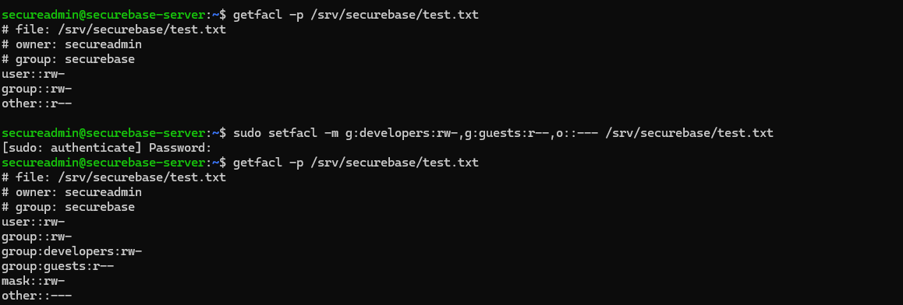

*Figur 3.6. test.txt før og efter setfacl. Udsnittet viser både de oprindelige rettigheder, ændringskommandoen og de nye filregler.*

Dernæst blev en default ACL lagt på projektmappen, så nye objekter får gruppernes adgang som udgangspunkt. Denne ændring erstatter ikke den særskilte rettighedstildeling på en eksisterende fil.

```bash
sudo setfacl -d -m \
  u::rwx,g::rwx,g:developers:rwx,g:guests:r-x,m::rwx,o::--- \
  /srv/securebase
getfacl -p /srv/securebase
```

<a id="figur-3-7"></a>

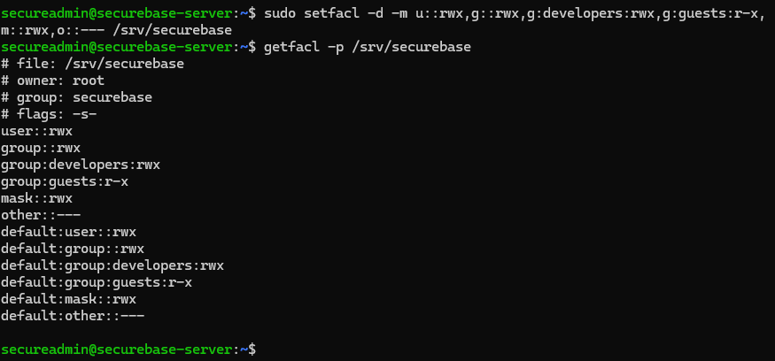

*Figur 3.7. Projektmappens adgangs-ACL og default ACL. Begge rollegrupper er med i standardreglerne, mens default:other::--- udelukker generel adgang for øvrige brugere.*

**Læringspunkt:** Adgangs-ACL gælder det eksisterende objekt; default ACL er et udgangspunkt ved oprettelse. De effektive filrettigheder blev derfor også kontrolleret på en ny fil, som vist nedenfor.

### 5. Funktionstest: developer og rettighedsarv

En ny fil, rolletest.txt, blev oprettet som secureadmin. Herefter tilføjede developer1 en linje og læste filen. Testen viser dermed udviklerens adgang til en anden brugers fil – ikke kun ejerens adgang til sin egen fil.

```bash
printf "Oprettet af secureadmin\n" > /srv/securebase/rolletest.txt
sudo -u developer1 sh -c \
  'printf "Tilfoejet af developer1\n" >> /srv/securebase/rolletest.txt'
sudo -u developer1 cat /srv/securebase/rolletest.txt
getfacl -p /srv/securebase/rolletest.txt
```

<a id="figur-3-8"></a>

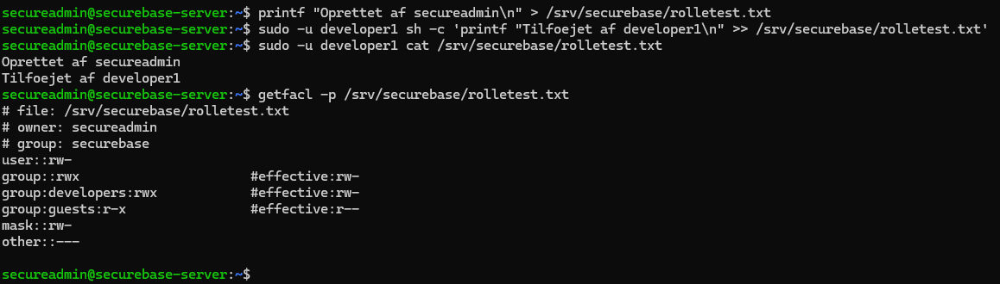

*Figur 3.8. Ny fil ejet af secureadmin, vellykket tilføjelse og læsning som developer1 samt de nedarvede ACL-regler. Udsnit af det samlede terminalbillede.*

#### 5.1 Observeret resultat

```text
Oprettet af secureadmin
Tilfoejet af developer1
```

| ACL-regel på rolletest.txt | Effektiv adgang i outputtet |
| --- | --- |
| group:developers:rwx | rw- – læsning og skrivning |
| group:guests:r-x | r-- – læsning |
| mask::rw- | Begrænser de berørte grupperegler til højst rw- |
| other::--- | Ingen generel adgang for øvrige brugere |

Der blev ikke kørt setfacl på rolletest.txt. Reglerne på den nye fil dokumenterer derfor default ACL-arven. Kommentarerne #effective viser, at x ikke er effektiv på denne almindelige tekstfil.

**Sikkerhedsbegrundelse:** Developerens skriveadgang kan dokumenteres konkret, mens gæstegruppens adgang er begrænset allerede ved oprettelsen af filen. Det er den viste redigering og læsning, der er funktionstestet; separat nyfiloprettelse som developer1 er ikke vist i bevismaterialet.

### 6. Funktionstest: guest har kun læseadgang

Testene blev udført som guest1 via sudo -u. Der blev ikke givet nye tilladelser under testen; det var de tidligere konfigurerede mappe- og filrettigheder, der blev afprøvet.

```bash
sudo -u guest1 cat /srv/securebase/rolletest.txt
sudo -u guest1 sh -c \
  'printf "Denne aendring skal afvises\n" >> /srv/securebase/rolletest.txt'
sudo -u guest1 touch /srv/securebase/guest-test.txt
sudo -u guest1 cat /srv/securebase/rolletest.txt
```

<a id="figur-3-9"></a>

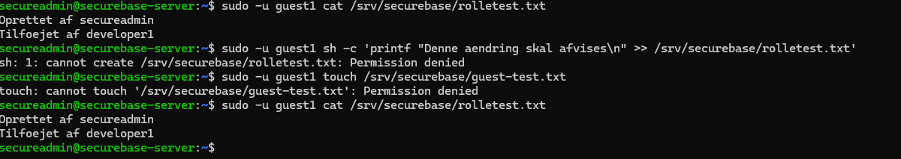

*Figur 3.9. Gæsten læser begge linjer. Skrivning til rolletest.txt og oprettelse af guest-test.txt afvises. Den afsluttende læsning viser uændret indhold. Udsnit af det uploadede billede.*

| Handling som guest1 | Faktisk resultat | Hvad testen dokumenterer |
| --- | --- | --- |
| Læse rolletest.txt | Tilladt | Adgang til filens indhold – ikke blot filnavnet. |
| Tilføje en tekstlinje | Permission denied | Ingen skriveadgang til den eksisterende fil. |
| Oprette guest-test.txt | Permission denied | Ingen skriveadgang til projektmappen. |
| Læse rolletest.txt igen | To oprindelige linjer | Det afviste ændringsforsøg ændrede ikke indholdet. |

#### 6.1 Hvorfor testes både fil og mappe?

Et forbud mod at ændre en fil og et forbud mod at oprette en fil er to forskellige kontroller. Skriveforsøget mod rolletest.txt tester filens rettigheder, mens touch-forsøget tester muligheden for at oprette et objekt i projektmappen.

**Sikkerhedsbegrundelse:** Gæstens behov er indsigt, ikke ændringer. De afviste skriveforsøg er derfor positive sikkerhedsresultater og blev ikke forsøgt løst med bredere rettigheder.

### 7. Gendannelsesadgang og sudoers-regler

Før den brede sudo-adgang blev fjernet fra secureadmin, blev vboxuser testet i VirtualBox-konsollen. whoami viste vboxuser, sudo whoami viste root, og sudo -l viste (ALL : ALL) ALL.

<a id="figur-3-10"></a>

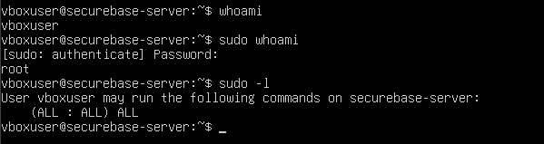

*Figur 3.10. Afprøvet opsætnings-/gendannelseskonto. Udsnittet viser den lokale konto og dens fulde sudo-adgang.*

Derefter blev den separate fil /etc/sudoers.d/securebase-admins oprettet med visudo. Filen blev sat til root:root og 440. Det dokumenterede indhold er:

```sudoers
%admins ALL=(root) /usr/sbin/sshd -t
%admins ALL=(root) /usr/bin/systemctl reload ssh.service
%admins ALL=(root) /usr/bin/journalctl --no-pager -u ssh.service -n 30
```

<a id="figur-3-11"></a>

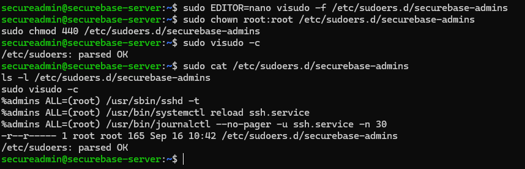

*Figur 3.11. Reglerne, filens root:root-ejerskab og -r--r----- samt sudo visudo -c med parsed OK. Den faktiske indlæsning blev efterfølgende kontrolleret med sudo -l.*

%admins udpeger gruppen. ALL er værtsfeltet, (root) angiver målbrugeren, og højre side angiver de konkrete programmer med argumenter. Reglerne giver ikke tilladelse til en vilkårlig shell eller til redigering af systemfiler.

**Sikkerhedsbegrundelse:** De valgte opgaver er SSH-kontrol, genindlæsning og et afgrænset logudsnit. --no-pager viser loggen direkte uden en interaktiv tekstfremviser. vboxuser er fortsat privilegeret og dokumenteres særskilt.

### 8. Fra fuld til begrænset sudo-adgang

En ny SSH-session blev brugt til at kontrollere medlemskabet af admins og indlæsningen af reglerne. Før fjernelsen af sudo-medlemskabet viste sudo -l både den brede tilladelse og de tre nye tilladelser.

<a id="figur-3-12"></a>

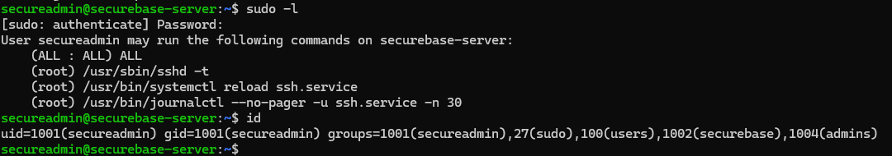

*Figur 3.12. Før: secureadmin er medlem af både sudo og admins. Den generelle (ALL : ALL) ALL-regel gælder stadig ved siden af de tre konkrete regler.*

#### 8.1 Fjernelse og nyt login

```bash
sudo deluser secureadmin sudo
exit
# Ny forbindelse fra Windows PowerShell:
ssh -p 2222 secureadmin@127.0.0.1
# Kontrol i den nye Ubuntu-session:
id
sudo -l
```

secureadmin blev fjernet fra gruppen sudo, ikke slettet som bruger. Kontrollen blev gentaget efter nyt login, så den efterfølgende dokumentation ikke beroede på en gammel sessions gruppeliste.

<a id="figur-3-13"></a>

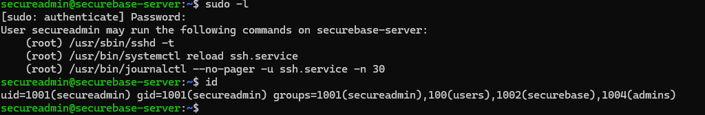

*Figur 3.13. Efter: sudo-gruppen og den brede tilladelse er væk. secureadmin har stadig admins og securebase, og kun de tre afgrænsede kommandoer vises i sudo -l.*

**Dokumenteret sluttilstand:** secureadmin har UID 1001 og grupperne secureadmin, users, securebase og admins. De viste sudo-tilladelser er alene sshd -t, systemctl reload ssh.service og den fastlagte journalctl-kommando.

**Sikkerhedsbegrundelse:** En ny begrænset regel er ikke nok, hvis brugeren samtidig beholder en generel tilladelse. Derfor blev den brede adgang først fjernet efter kontrol af den nye regel og gendannelsesmuligheden.

### 9. Funktionstest: tilladt og afvist sudo

Testene blev nu kørt i secureadmin-sessionen efter fjernelsen af den brede adgang. Først blev en godkendt opgave udført, og derefter blev en kommando uden for tilladelseslisten forsøgt.

```bash
sudo /usr/sbin/sshd -t
echo "Returkode: $?"
sudo /usr/bin/id
echo "Returkode: $?"
```

<a id="figur-3-14"></a>

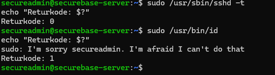

*Figur 3.14. Den tilladte SSH-kontrol afsluttes med returkode 0. sudo /usr/bin/id afvises og afsluttes med returkode 1.*

Resultatet viser en konkret politikforskel: secureadmin kan udføre den godkendte kontrol, men ikke køre id som root. Almindelig id uden sudo er ikke det, der begrænses i testen.

#### 9.1 Tilladt læsning af SSH-loggen

```bash
sudo /usr/bin/journalctl --no-pager -u ssh.service -n 30
echo "Returkode: $?"
```

<a id="figur-3-15"></a>

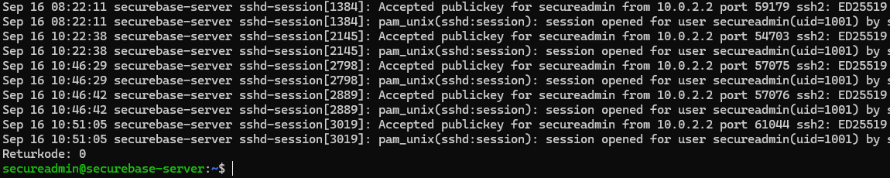

*Figur 3.15. Udsnit af SSH-logtesten med Accepted publickey og returkode 0. Ældre linjer og højre del af de lange nøglefingeraftryk er beskåret; den udførte kommando er gengivet ovenfor.*

Logtesten returnerede SSH-hændelser og returkode 0. Den dokumenterer, at den præcist tilladte logkommando kan bruges uden den tidligere generelle sudo-adgang. $?-værdien blev læst umiddelbart efter den pågældende kommando.

### 10. SSH-reload og ikke-administrative roller

#### 10.1 Godkendt genindlæsning af SSH

```bash
sudo /usr/sbin/sshd -t && sudo /usr/bin/systemctl reload ssh.service
echo "Returkode: $?"
systemctl is-active ssh.service
```

<a id="figur-3-16"></a>

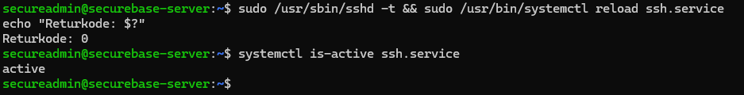

*Figur 3.16. Konfigurationskontrol og reload lykkes med returkode 0. Den efterfølgende statuskontrol uden sudo viser active.*

&& blev brugt, så reload kun blev forsøgt efter en vellykket konfigurationskontrol. Resultatet dokumenterer den tredje tilladte sudo-opgave og den aktive SSH-tjeneste efter genindlæsningen.

#### 10.2 Developer og guest har ingen sudo-tilladelser

Kontrollen af de andre konti blev udført fra den tidligere verificerede vboxuser-konsol. Her blev hver brugers tilladelser slået op uden at ændre deres konti eller grupper.

```bash
whoami
sudo -l -U developer1
sudo -l -U guest1
```

<a id="figur-3-17"></a>

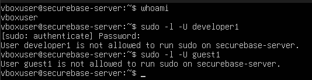

*Figur 3.17. vboxuser foretager politikopslaget. Sudo angiver, at hverken developer1 eller guest1 må køre sudo på securebase-server.*

```text
User developer1 is not allowed to run sudo on securebase-server.
User guest1 is not allowed to run sudo on securebase-server.
```

**Sikkerhedsbegrundelse:** Projektadgang er adskilt fra systemadministration. Developer og guest har deres ACL-baserede filadgang, men ingen kommandoer er tildelt dem gennem sudo ved denne kontrol.

### 11. Samlet test- og afleveringsstatus

| Kontrol | Dokumenteret resultat | Bevis |
| --- | --- | --- |
| Tre roller og gruppestruktur | secureadmin → admins; developer1 → developers; guest1 → guests. | Fig. 3.2–3.3 |
| Projektmappe og filrettigheder | Separate gruppe-ACL’er på mappe og test.txt. | Fig. 3.4–3.6 |
| Default ACL og arv | rolletest.txt får de to grupper; effektivt rw- og r--. | Fig. 3.7–3.8 |
| Developerens skriveadgang | Ændrer og læser en fil ejet af secureadmin. | Fig. 3.8 |
| Gæstens begrænsning | Læser; ændring og ny fil afvises; indhold uændret. | Fig. 3.9 |
| Granulære sudo-regler | root:root, 440, syntakskontrol og regler i sudo -l. | Fig. 3.11–3.13 |
| Fjernelse af bred sudo | sudo-gruppen og (ALL : ALL) ALL er fjernet for secureadmin. | Fig. 3.12–3.13 |
| Tilladt og afvist root-kommando | sshd -t: 0. sudo id: afvist, returkode 1. | Fig. 3.14 |
| Logadgang og reload | Logkommando: 0. Reload: 0. SSH: active. | Fig. 3.15–3.16 |
| Developer/guest uden sudo | Begge politikopslag angiver ingen sudo-tilladelse. | Fig. 3.17 |
| Gendannelseskonto | vboxuser har testet lokal adgang og fuld sudo. | Fig. 3.10 |

#### 11.1 Konklusion

Modul 3 er gennemført med tre rollegrupper, forskellige projektrettigheder og en begrænset administratorrolle. Rollefordelingen, gruppeoplysningerne, ACL-reglerne og sudoers-filen er dokumenteret sammen med funktionstests, der viser både tilladte og afviste handlinger.

#### 11.2 Afgrænsning og videre drift

vboxuser har fortsat fuld sudo-adgang som opsætnings-/gendannelseskonto. Det er derfor secureadmin-rollen, der er begrænset – ikke alle serverens administrative konti. Oprettelse af nye brugere, pakkeinstallation og ændring af sudoers er ikke en del af secureadmins tre tilladelser.

Beviserne dækker de viste filer, roller, kommandoer og testtidspunkter. Developerens skriveadgang er demonstreret ved ændring af en anden brugers fil; separat oprettelse eller sletning som developer1 er ikke vist. Rapporten hævder ikke, at yderligere sikkerhedstests eller senere moduler er gennemført.

Aflevering: Rolleskema, uddrag af /etc/group, id-output, sudoers-regler, sikkerhedsbegrundelser og før/efter-beviser er samlet i dette modul. Modul 1 og 2, inklusive deres eksisterende screenshots og README, er bevaret i rapporten.

## Overvejelser og fravalg

Eksisterende projektgruppe og SGID blev bevaret frem for at flytte alt til en ny ejergruppe. Developerens skriveadgang er konkret vist på en anden brugers fil; separat nyfiloprettelse er ikke vist i de manuelle beviser. vboxuser har fortsat fuld sudo, og det er ikke skjult som en begrænset rolle.

### Kobling til de aktuelle scripts

- [`scripts/modules/03-users.sh`](../scripts/modules/03-users.sh)
- [`scripts/modules/04-storage-acl.sh`](../scripts/modules/04-storage-acl.sh)
- [`scripts/modules/06-sudo.sh`](../scripts/modules/06-sudo.sh)

### Kildegrundlag

[Samlet Word-rapport, uændret kopi](../reports/SecureBase_Modul_1_2_3_4_5_6_DOKUMENTATION.docx). Figurnumrene svarer til rapporten; i Modul 1–2 er modulnummeret tilføjet for entydighed. Kommandoer er dokumentation af det viste forløb, ikke en opfordring til at genkøre alle historiske trin på den færdige server.

[← Overblik](../README.md) · [Forrige modul](02-filsystem.md) · [Næste modul](04-firewall.md)
