# Modul 4: Firewall og netværkssikkerhed

[← Overblik](../README.md) · [Forrige modul](03-brugere-grupper.md) · [Næste modul](05-monitorering.md)

> **Tidsmæssig afgrænsning:** Endelig tilstand: kun TCP/22 fra 10.0.2.2 i UFWs brugerregler. TCP/8080 er kun testhistorik. Windows-port 2222 videresendes til Ubuntu-port 22; det er ikke en ændret SSH-port inde i serveren.

## Formål

At begrænse nye indgående forbindelser med default deny og kun tillade nødvendig SSH-adgang. En midlertidig webservice bruges til et kontrolleret før/efter-forsøg og fjernes bagefter.

## Udførte opgaver

- Målt SSH-forbindelsens peer som 10.0.2.2 og aktiveret UFW med deny incoming og allow outgoing.
- Tilladt TCP/22 fra den observerede kilde og testet et nyt SSH-login efter aktivering.
- Afprøvet TCP/8080 med HTTP-timeout før tilladelse og HTTP 200 efter; stoppet servicen, slettet reglen og eksporteret den endelige status.

## Sikkerhedsmæssig begrundelse

Kun den nødvendige administrationsvej bevares som eksplicit indgående brugerregel. Kildebegrænsningen vælges ud fra den faktiske NAT-forbindelse i stedet for et gæt på klientadressen.

Firewallens netværksadgang og webservicens publicerede indhold vurderes hver for sig. Den midlertidige undtagelse fjernes igen, så testen ikke bliver en permanent ekstra adgangsvej.

## Dokumentation / bevis

Detaljerne nedenfor er konverteret fra den samlede rapport. [Alle 19 screenshots for dette modul](../evidence/04-firewall/README.md) er udtrukket fra rapporten uden ændring af billedindhold. [Kilde- og versionsgrundlag](GRUNDLAG.md).

### 1. Udgangspunkt og SSH-kildeadresse

Inden UFW blev aktiveret, blev firewallstatus og de lyttende sockets undersøgt fra vboxuser-konsollen. Udgangspunktet viste Status: inactive, SSH på TCP/22 og lokale DNS-/chrony-sockets på loopback-adresser.

```bash
sudo ufw status verbose
sudo ss -tulpn
```

<a id="figur-4-1"></a>

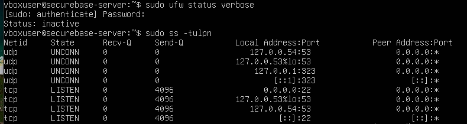

*Figur 4.1. Før-bevis: UFW er inaktiv, og socket-tabellen viser blandt andet SSH på IPv4 og IPv6. Udsnit med status og adresser; procesnavnenes højre kolonne er udeladt.*

| Kommando / flag | Hvad det bruges til i kontrollen |
| --- | --- |
| ufw status verbose | Viser firewallstatus og, når UFW er aktiv, standardpolitik og regler. |
| ss -tulpn | t: TCP · u: UDP · l: lyttende sockets · p: proces · n: numeriske adresser/porte. |
| 0.0.0.0:22 / [::]:22 | SSH lytter på IPv4 og IPv6. En lyttende socket er ikke alene bevis for adgang gennem firewallen. |

#### 1.1 Mål kildeadressen – gæt ikke

```bash
sudo ss -tnp | grep ESTAB | grep ':22'
```

<a id="figur-4-2"></a>

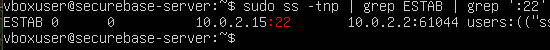

*Figur 4.2. Den etablerede forbindelse har lokal adresse 10.0.2.15:22 og peer 10.0.2.2:61044. Udsnit; proceslisten er beskåret.*

10.0.2.15 er VM’ens destinationsadresse. 10.0.2.2 er den kildeadresse, Ubuntu ser i denne NAT-forbindelse, mens 61044 er forbindelsens klientport. Det er derfor 10.0.2.2 – ikke VM’ens egen adresse – der bruges i from-delen af UFW-reglen.

Den første journalctl/grep-kontrol gav ingen matchende linjer i det viste logudsnit. Derfor blev den aktive forbindelse kontrolleret direkte med ss. En tom, filtreret logvisning blev ikke brugt som bevis for, at SSH var nede.

### 2. Default deny og målrettet SSH-regel

Reglerne blev oprettet før aktivering. VirtualBox-konsollen med vboxuser blev bevaret som administrativ adgang, så opsætningen ikke alene afhang af SSH-forbindelsen.

```bash
sudo ufw default deny incoming
sudo ufw default allow outgoing
sudo ufw allow from 10.0.2.2 to any port 22 proto tcp
sudo ufw show added
```

<a id="figur-4-3"></a>

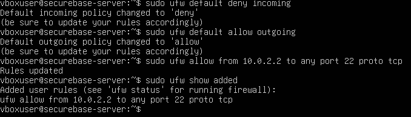

*Figur 4.3. Standardpolitikkerne er sat, og show added viser den præcise SSH-undtagelse, inden UFW aktiveres.*

deny incoming er udgangspunktet for indgående adgang. allow outgoing bevarer serverens mulighed for selv at starte udgående forbindelser. Den konkrete undtagelse tillader TCP til port 22 fra 10.0.2.2; to any henviser til destinationsadresser på serveren, ikke til alle kildeadresser.

```bash
sudo ufw enable
sudo ufw status verbose
```

<a id="figur-4-4"></a>

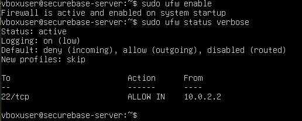

*Figur 4.4. UFW er aktiv og aktiveret ved systemstart. Standardpolitikken og SSH-reglen fremgår; Logging er on (low).*

**Sikkerhedsbegrundelse:** Kun den nødvendige administrationsvej blev åbnet. show added blev brugt til at kontrollere de oprettede regler; status verbose efter enable dokumenterer den aktive sluttilstand for dette trin. Genstartspersistens er angivet af UFW, men blev ikke særskilt testet med en genstart i Modul 4.

### 3. Ny SSH-forbindelse efter aktivering

En ny PowerShell-forbindelse blev oprettet, efter at UFW var aktiveret. Det tester ny adgang og ikke blot en session, der allerede var etableret inden firewallændringen.

```powershell
ssh -p 2222 secureadmin@127.0.0.1
# Inde i den nye Ubuntu-session:
whoami
hostname
```

<a id="figur-4-5"></a>

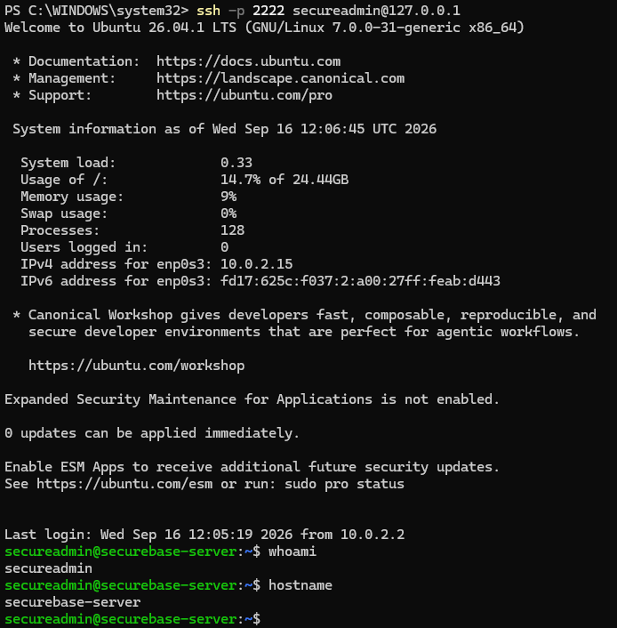

*Figur 4.5. Den nye SSH-forbindelse lykkes. whoami viser secureadmin, og hostname viser securebase-server.*

Port 2222 er Windows-værtens port i VirtualBox-forwarden; den videresendes til TCP/22 i Ubuntu. UFW-reglen gælder derfor port 22. Bannerets “Last login” beskriver det foregående login; figur 4.2 er det direkte socket-bevis for kildeadressen i den undersøgte forbindelse.

### 4. Midlertidig webservice på TCP/8080

En simpel Python-webservice blev startet uden sudo som secureadmin. Formålet var at have en faktisk lyttende tjeneste, mens UFW endnu ikke havde en tilladelse til port 8080.

```bash
python3 -m http.server 8080 --bind 0.0.0.0
# Kontrol i en anden Ubuntu-session:
ss -tln | grep ':8080'
```

<a id="figur-4-6"></a>

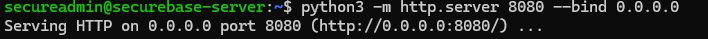

*Figur 4.6. Python-serveren startes i forgrunden og melder, at den lytter på port 8080.*

<a id="figur-4-7"></a>

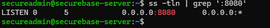

*Figur 4.7. Socket-tabellen bekræfter en lyttende TCP-socket på 0.0.0.0:8080.*

python3 -m http.server starter HTTP-modulet; 8080 vælger porten, og --bind 0.0.0.0 vælger alle IPv4-adresser. Første start skete fra hjemmemappen; den efterfølgende rettelse af webroden dokumenteres i afsnit 7.

| Testadgang fra Windows | Mål i Ubuntu |
| --- | --- |
| 127.0.0.1:8080 · VirtualBox TCP-forward | 10.0.2.15:8080 |

```powershell
Test-NetConnection 127.0.0.1 -Port 8080
```

<a id="figur-4-8"></a>

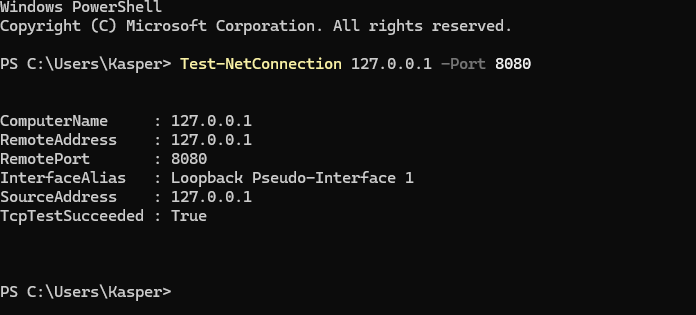

*Figur 4.8. PowerShell-testen giver TcpTestSucceeded: True, selv om HTTP-testen i næste trin endnu ikke får noget svar.*

**Læringspunkt:** Resultatet viser TCP-kontakt til 127.0.0.1:8080 på Windows-siden. Det blev ikke accepteret som bevis på et HTTP-svar fra Ubuntu. Derfor blev testen udvidet til en egentlig HTTP-request gennem samme adgangsvej.

### 5. HTTP før åbning – og den nye regel

```powershell
curl.exe -v --max-time 5 http://127.0.0.1:8080/
```

curl.exe blev kørt fra Windows. -v viser forbindelsesforløb og HTTP-headere; --max-time 5 begrænser testen til fem sekunder. Dermed undersøges mere end TCP-kontakt til værtsporten.

<a id="figur-4-9"></a>

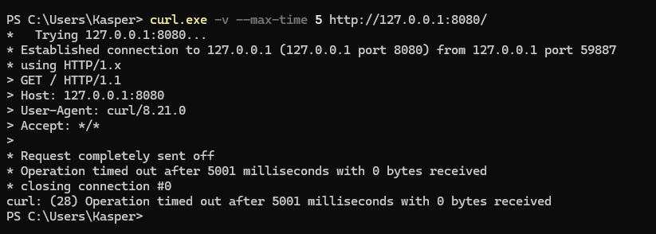

*Figur 4.9. Før-bevis: TCP-forbindelsen oprettes, og GET sendes, men testen afsluttes med timeout og 0 bytes modtaget.*

Resultatet dokumenterer et manglende HTTP-svar før åbningen. Timeout alene identificerer ikke entydigt UFW som årsag; vurderingen bygger også på den kendte lytter, den aktive politik og det efterfølgende før/efter-forløb.

#### 5.1 Åbn kun den valgte testtjeneste

```bash
sudo ufw allow from 10.0.2.2 to any port 8080 proto tcp
sudo ufw status verbose
```

<a id="figur-4-10"></a>

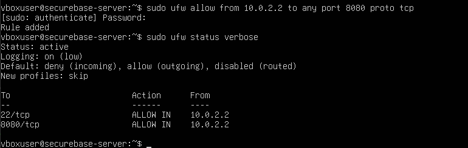

*Figur 4.10. Den midlertidige TCP/8080-regel er tilføjet. Både SSH og HTTP er begrænset til 10.0.2.2, og deny incoming er bevaret.*

**Sikkerhedsbegrundelse:** Webtesten fik sin egen snævre undtagelse i stedet for at deaktivere firewallen eller tillade porten fra alle kilder. Dette er testtilstanden med to tilladelser – ikke modulets endelige konfiguration.

### 6. HTTP efter åbning: 200 OK

Den samme curl-kommando blev kørt igen efter tilføjelsen af UFW-reglen. Denne gang returnerede serveren HTTP/1.0 200 OK, HTTP-headere og HTML-indhold.

<a id="figur-4-11"></a>

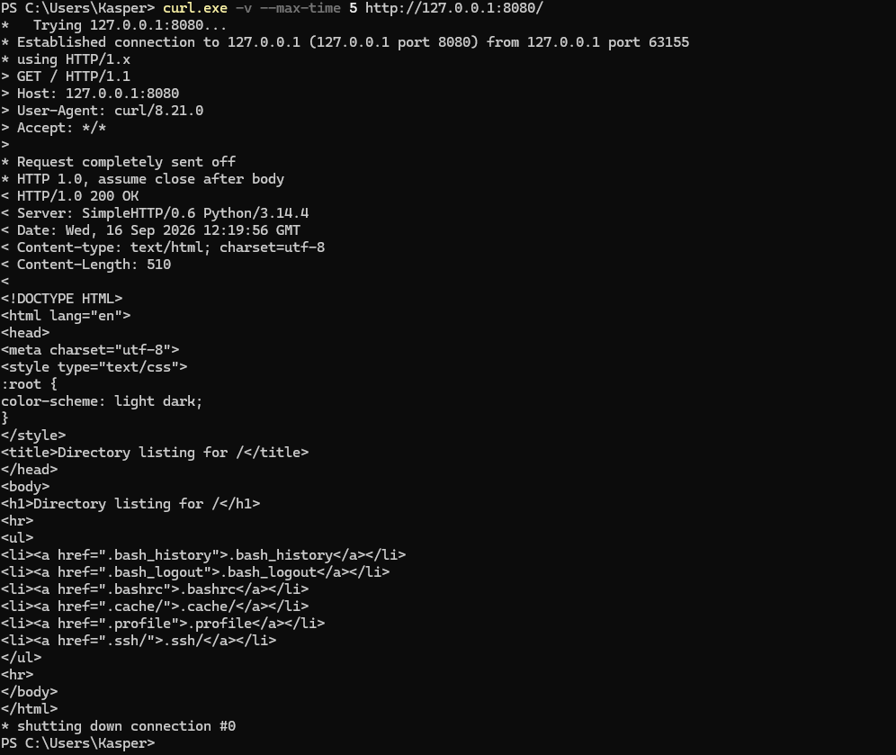

*Figur 4.11. Efter-bevis: HTTP 200 OK og directory-listing fra Python-serveren. Den viste listing afslører samtidig, at hjemmemappen var valgt som webrod.*

#### 6.1 Sikkerhedsfund under testen

HTML-listen viste blandt andet .bash_history og .ssh/. Det er ikke det tilsigtede indhold i en webtest. Screenshotet viser mappenavne og filnavne, men ikke, at en privat nøgle eller andre bestemte filers indhold blev hentet.

Testvurdering: Sammenligningen mellem timeout før ALLOW og HTTP 200 efter ALLOW dokumenterer firewallændringens virkning i dette labforløb. Samtidig viste testen, at netværksadgang og valg af publiceret indhold skal kontrolleres hver for sig.

### 7. Rettelse: en dedikeret webrod

Den første Python-proces blev stoppet med Ctrl+C. Derefter blev ~/webtest oprettet, og en enkel index.html blev skrevet. Den nye startkommando angav webroden eksplicit i stedet for at publicere den aktuelle hjemmemappe.

```bash
mkdir -p ~/webtest
printf '<h1>SecureBase webservice</h1>\n<p>Modul 4 firewall-test</p>\n' \
  > ~/webtest/index.html
python3 -m http.server 8080 --bind 0.0.0.0 --directory ~/webtest
```

<a id="figur-4-12"></a>

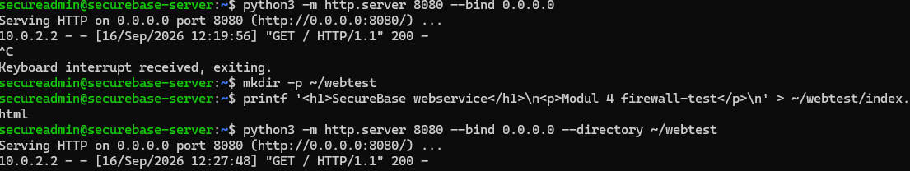

*Figur 4.12. Det faktiske rettelsesforløb: første server stoppes, testside oprettes, og serveren startes med --directory ~/webtest. Serverloggen viser efterfølgende GET og status 200.*

| Kommando / del | Forklaring i det udførte trin |
| --- | --- |
| Ctrl+C | Afslutter den Python-server, der kører i terminalens forgrund. |
| mkdir -p ~/webtest | Opretter den dedikerede mappe i secureadmins hjemmemappe. |
| printf ... > index.html | Skriver testsidens HTML til filen. > erstatter eventuelt eksisterende indhold. |
| --directory ~/webtest | Vælger dokumentroden eksplicit. Det ændrer publiceret indhold, ikke den konto processen kører som. |

```powershell
curl.exe http://127.0.0.1:8080/
```

<a id="figur-4-13"></a>

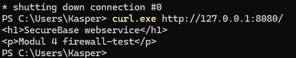

*Figur 4.13. Windows får nu kun den oprettede HTML-testside i stedet for den tidligere listing af hjemmemappen.*

**Sikkerhedsbegrundelse:** Kun ufarligt testindhold blev lagt i dokumentroden. Dette er en midlertidig laboratorietjeneste, ikke dokumentation for en permanent eller fuldt hærdet produktionswebserver. Testservicen blev fjernet igen efter demonstrationen.

### 8. Sammenhæng mellem regler og tjenester

Mens webtesten stadig kørte, blev de tilladte porte koblet til faktiske processer. Samtidig blev UFW-reglerne vist med numre og eksporteret til en tekstfil.

```bash
sudo ss -tlnp | grep -E ':22|:8080'
```

<a id="figur-4-14"></a>

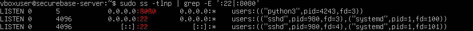

*Figur 4.14. Socket-tabellen viser python3 på TCP/8080 og sshd på TCP/22. Alle tre linjer er med.*

ss -tlnp viser lyttende TCP-sockets med numeriske adresser og procesoplysninger. Pipe-tegnet sender resultatet videre til grep; -E aktiverer mønstret med |, der her vælger linjer med :22 eller :8080. grep alene uden fil eller pipe venter på input.

```bash
sudo ufw status numbered
```

<a id="figur-4-15"></a>

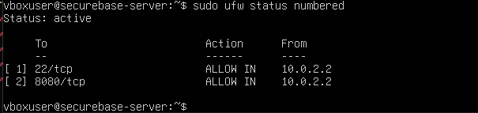

*Figur 4.15. Testtilstand: regel 1 er TCP/22, og regel 2 er TCP/8080. Begge er ALLOW IN fra 10.0.2.2.*

#### 8.1 Første korrekte eksport – med webreglen

```bash
sudo ufw status verbose | tee ~/ufw-status-modul4.txt
cat ~/ufw-status-modul4.txt
```

<a id="figur-4-16"></a>

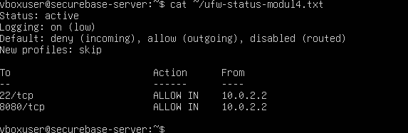

*Figur 4.16. cat bekræfter den gemte eksport med begge testperiodens regler. Denne fil blev senere overskrevet med sluttilstanden.*

tee viser outputtet og skriver det til filen. Uden -a overskrives filen; cat læser den gemte fil tilbage.

### 9. Oprydning efter webtesten

Da webservicen kun var nødvendig til demonstrationen, blev den stoppet, og UFW-undtagelsen for TCP/8080 blev fjernet. Den endelige løsning skulle alene bevare SSH-adgangen.

```bash
sudo ufw delete 2
sudo ufw status numbered
```

<a id="figur-4-17"></a>

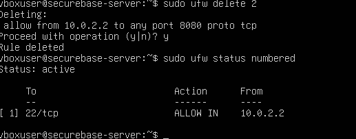

*Figur 4.17. UFW viser, at regel 2 gælder TCP/8080 fra 10.0.2.2. Sletningen bekræftes, og den efterfølgende liste indeholder kun SSH.*

delete 2 henviser til det aktuelle regelnummer i den netop kontrollerede liste. Det er ikke en fast identitet for port 8080; derfor blev reglens indhold læst og bekræftet før sletning.

#### 9.1 Kontrollér også selve tjenesten

```bash
sudo ss -tlnp | grep -E ':22|:8080'
```

<a id="figur-4-18"></a>

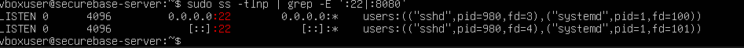

*Figur 4.18. Efter oprydningen viser det filtrerede socket-output kun SSH på IPv4 og IPv6. Der er ingen lyttende TCP/8080-socket i resultatet.*

Kontrollen skelner mellem en firewallregel og en kørende service. Sletningen fjernede tilladelsen i UFW; socket-kontrollen dokumenterer særskilt, at testporten ikke længere havde en lytter.

#### 9.2 Hvad er dokumenteret ryddet op?

| Kontrol | Dokumenteret resultat |
| --- | --- |
| Python på TCP/8080 | Ingen lytter på testporten i den afsluttende ss-kontrol. |
| UFW-undtagelsen til 8080 | Slettet; kun SSH-reglen vises i status numbered. |
| VirtualBox WEB-test-forward | Der er ikke uploadet bevis for sletning af denne værtsregel. Rapporten markerer derfor ikke dette som udført. |

**Sikkerhedsbegrundelse:** En midlertidig tjeneste skal ikke efterlade en permanent UFW-undtagelse. Oprydningen er dokumenteret på Ubuntu-siden; den midlertidige VirtualBox-forward bør også fjernes, hvis den stadig findes og ikke længere skal bruges.

### 10. Endelig eksport og portbegrundelse

Den tidligere eksport indeholdt to regler. Efter oprydningen blev den samme fil derfor overskrevet med den endelige status og læst tilbage for at kontrollere indholdet.

```bash
sudo ufw status verbose | tee ~/ufw-status-modul4.txt
cat ~/ufw-status-modul4.txt
```

<a id="figur-4-19"></a>

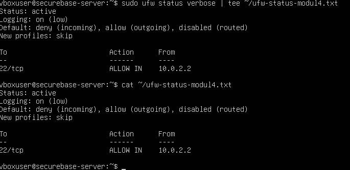

*Figur 4.19. Endelig eksport: Status: active; deny incoming; allow outgoing; kun TCP/22 tilladt fra 10.0.2.2. cat viser samme indhold fra den gemte fil.*

Filen ligger hos vboxuser som /home/vboxuser/ufw-status-modul4.txt. Dette er den læsbare UFW-statusrapport, der efterspørges i modulet, ikke en selvstændig importfil eller fuld backup af alle underliggende firewalltabeller.

#### 10.1 Portbegrundelsestabel – endelig konfiguration

| Port / protokol | Tjeneste / kilde | Hvorfor nødvendig | Risiko og afgrænsning |
| --- | --- | --- | --- |
| 22 / TCP | OpenSSH<br>Fra 10.0.2.2 | Fjernadministration fra Windows-værten via 127.0.0.1:2222 og VirtualBox NAT til 10.0.2.15:22. | SSH er en fjernadgangsvej. Risikoen begrænses af kilde-IP-reglen, nøglebaseret login og deaktiveret root-/password-login. Kompromitterede nøgler eller værten kan stadig give en adgangsrisiko. |

#### 10.2 Testport – ikke en permanent tilladelse

8080/TCP (Python HTTP) var kun åben fra 10.0.2.2 til før/efter-testen. Risikoen var blandt andet utilsigtet udstilling af filer, hvilket den oprindelige directory-listing demonstrerede. Webroden blev rettet; efter testen blev servicen stoppet og UFW-reglen slettet. Porten indgår derfor ikke som åben i sluttabellen.

### 11. Samlet afleveringsstatus

| Krav / kontrol | Dokumenteret resultat | Bevis |
| --- | --- | --- |
| Default deny | UFW aktiv; deny incoming og allow outgoing. | Fig. 4.4, 4.19 |
| Kun nødvendige porte | Kun TCP/22 er tilbage som eksplicit indgående tilladelse. | Fig. 4.17–4.19 |
| Kildeafgrænset SSH | ALLOW IN fra 10.0.2.2, valgt ud fra observeret peer-IP. | Fig. 4.2–4.4 |
| SSH efter aktivering | Ny forbindelse lykkes som secureadmin på securebase-server. | Fig. 4.5 |
| Webtest før/efter | HTTP-timeout før ALLOW; HTTP 200 efter ALLOW. | Fig. 4.9–4.11 |
| Rettelse af webrod | Dedikeret testmappe og forventet HTML-indhold. | Fig. 4.12–4.13 |
| Oprydning | 8080-regel slettet; socket-kontrol uden TCP/8080. | Fig. 4.17–4.18 |
| Eksport af aktive regler | Slutstatus gemt via tee og verificeret med cat. | Fig. 4.19 |
| Portbegrundelse | Port, protokol, tjeneste, kilde, nødvendighed og risiko. | Afsnit 10.1–10.2 |

#### 11.1 Konklusion

Modul 4 er gennemført med en aktiv UFW-firewall, en afgrænset SSH-undtagelse og dokumenterede funktionstests. Den midlertidige HTTP-service blev både åbnet efter behov og fjernet igen. Den endelige eksport og portbegrundelsen viser, at kun den nødvendige SSH-adgang er bevaret som eksplicit UFW-tilladelse.

#### 11.2 Afgrænsning af beviserne

Kildeadressen 10.0.2.2 identificerer den observerede NAT-adgangsvej, ikke i sig selv en bestemt Windows-bruger. Materialet viser en tilladt forbindelse fra denne adresse, men ikke en separat negativ test fra en anden kildeadresse eller via IPv6.

De viste funktionstests gælder de konkrete forbindelser og tidspunkter. Før/efter-testen bygger på den samlede sammenhæng; hverken Test-NetConnection: True eller en enkelt timeout blev brugt alene som bevis for UFWs virkning.

Bevaret rollefordeling: vboxuser har fuld sudo som opsætnings-/gendannelseskonto. secureadmin er fortsat den begrænsede daglige administrator fra Modul 3. Firewallopgaverne er udført fra vboxuser-konsollen uden at ophæve secureadmins begrænsning.

## Overvejelser og fravalg

En webservice var kun nødvendig til testen. Den blev ikke gjort til en permanent service. En negativ forbindelsestest fra en anden kilde-IP eller via IPv6 er ikke vist. Sletning af den midlertidige VirtualBox-forward er heller ikke dokumenteret, selv om Ubuntu-servicen og UFW-undtagelsen er fjernet.

### Kobling til de aktuelle scripts

- [`scripts/modules/07-firewall.sh`](../scripts/modules/07-firewall.sh)

### Kildegrundlag

[Samlet Word-rapport, uændret kopi](../reports/SecureBase_Modul_1_2_3_4_5_6_DOKUMENTATION.docx). Figurnumrene svarer til rapporten; i Modul 1–2 er modulnummeret tilføjet for entydighed. Kommandoer er dokumentation af det viste forløb, ikke en opfordring til at genkøre alle historiske trin på den færdige server.

[← Overblik](../README.md) · [Forrige modul](03-brugere-grupper.md) · [Næste modul](05-monitorering.md)
