# Modul 5: System monitoring og logging

[← Overblik](../README.md) · [Forrige modul](04-firewall.md) · [Næste modul](06-scripting.md)

> **Tidsmæssig afgrænsning:** Manuel Modul 5-version: top/free-baseret monitor. Den fulde historiske kode findes i scripts/history/monitor-modul5.sh. Modul 6 installerer en anden monitor med /proc-baseret CPU-/RAM-måling og separat konfiguration.

## Formål

At opdage ressourceproblemer og relevante sikkerhedshændelser gennem automatisk logging, logrotation og analyse af loginforsøg. Mindst to grænseværdier skal give tydelige advarsler.

## Udførte opgaver

- Oprettet en root-ejet monitor-log og et Bash-script til CPU, hukommelse og disk.
- Installeret cron hvert femte minut og en daily/rotate 7-regel; testet rotation og fortsat automatisk logning bagefter.
- Genfundet ét kontrolleret fakeuser-login i auth.log og journalen; testet disk-/RAM-betingelser og warning-kanalen særskilt.

## Sikkerhedsmæssig begrundelse

Root-ejede scripts, cronfiler og logfiler begrænser manipulation fra de almindelige projektroller. Rotation styrer antallet af gemte logversioner.

Disk ≥85 % og hukommelse ≥90 % giver anledning til undersøgelse. Et logmønster vurderes ud fra sammenhørende hændelser, tid, kilde og bruger; antal loglinjer er ikke automatisk antal angreb.

## Dokumentation / bevis

Detaljerne nedenfor er konverteret fra den samlede rapport. [Alle 26 screenshots for dette modul](../evidence/05-monitorering/README.md) er udtrukket fra rapporten uden ændring af billedindhold. [Kilde- og versionsgrundlag](GRUNDLAG.md).

### 1. Logging-baseline

Inden egne regler og scripts blev tilføjet, blev journalservicen og dens output undersøgt. Status viste active (running), og journalen indeholdt aktuelle hændelser fra blandt andet systemd, sudo og chronyd.

```bash
sudo systemctl status systemd-journald --no-pager
sudo journalctl -n 20 --no-pager
```

<a id="figur-5-1"></a>

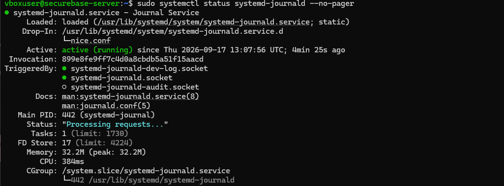

*Figur 5.1. Journald er aktiv og behandler loghændelser. Udsnit med kommando, service- og processtatus.*

systemctl status viser tjenestens tilstand. journalctl læser journalens hændelser; -n 20 vælger de seneste 20 poster, og --no-pager viser resultatet direkte i terminalen. Begge kontroller er læsninger og ændrer ikke logopsætningen.

<a id="figur-5-2"></a>

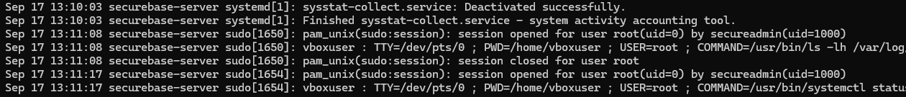

*Figur 5.2. Udsnit af aktuelle journalhændelser fra den indledende kontrol. Kommandoen er gengivet ovenfor; billedet viser system- og sudo-relaterede poster.*

#### Journal og tekstlogs er to forskellige visninger

I dette miljø findes både systemjournalen og traditionelle tekstlogfiler. Senere i modulet genfindes samme SSH-hændelse i begge. En kørende journalservice beviser ikke i sig selv, at et bestemt mislykket login findes; det kontrolleres særskilt i afsnit 6.

### 1.1 Traditionelle logfiler og auth.log

```bash
ls -lh /var/log
sudo ls -lh /var/log/auth.log
```

<a id="figur-5-3"></a>

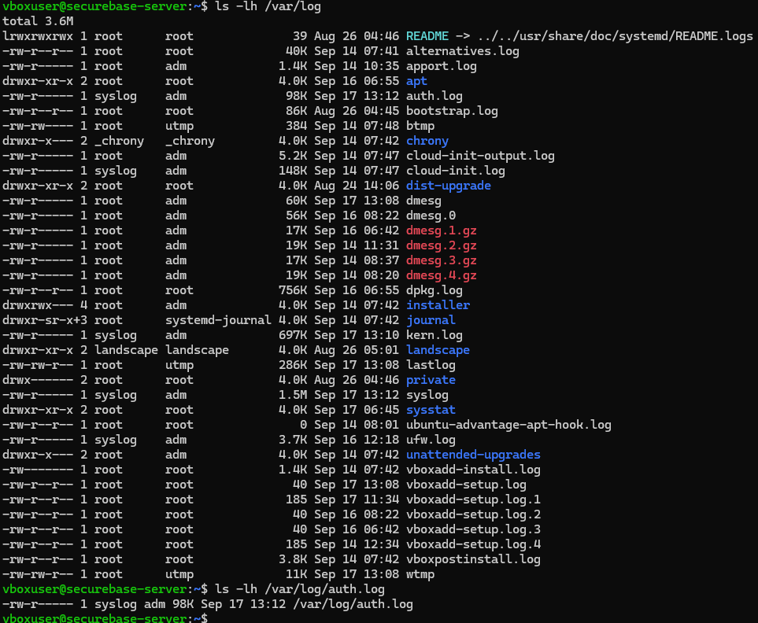

*Figur 5.3. Oversigt over /var/log og den særskilte kontrol af auth.log. Filen findes og er omkring 98K ved baseline-kontrollen.*

ls -l viser blandt andet ejerskab, rettigheder og størrelse; -h gør størrelserne læsbare. I oversigten ses auth.log, syslog, kern.log og ufw.log samt ældre logversioner. auth.log har ejerskabet syslog:adm og bruges senere til autentifikationsanalysen.

**Sikkerhedsbegrundelse:** Loggenes tilstedeværelse og læsbarhed kontrolleres, før der bygges overvågning ovenpå. Den nye monitor-log får egne rettigheder og en egen rotationsregel, så almindelige brugere ikke får mulighed for at ændre overvågningsdata.

### 2. Planlægning af Logrotate

```bash
systemctl status logrotate.timer --no-pager
cat /etc/logrotate.conf
ls -l /etc/logrotate.d/
```

<a id="figur-5-4"></a>

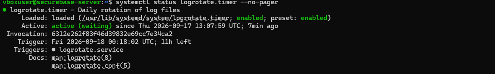

*Figur 5.4. Logrotate-timeren er enabled og active (waiting) med logrotate.service som udløst tjeneste. Udsnit af statusdelen.*

Timeren bestemmer, hvornår Logrotate undersøger reglerne. Rotationsreglen bestemmer, om en bestemt log skal roteres ved den kørsel. En daglig timer og en global weekly-regel er derfor ikke modstridende.

<a id="figur-5-5"></a>

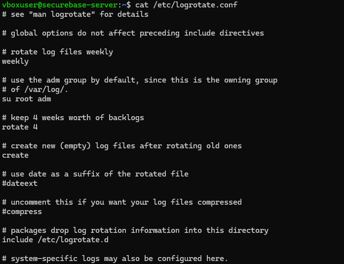

*Figur 5.5. Hovedkonfigurationen indeholder weekly, su root adm, rotate 4, create og include /etc/logrotate.d. compress er kommenteret ud i denne globale fil.*

Egne regler placeres i /etc/logrotate.d/. Monitor-loggen får daily og rotate 7 i sin egen regel; de værdier skal ikke forveksles med de globale standarder weekly og rotate 4.

### 3. Egen logfil og rotationsregel

Monitor-loggen blev oprettet med root som ejer og adm som læsegruppe. Det faste script skriver som root via cron. Andre lokale brugere får ikke læse- eller skriverettigheder gennem other.

```bash
sudo touch /var/log/securebase-monitor.log
sudo chown root:adm /var/log/securebase-monitor.log
sudo chmod 640 /var/log/securebase-monitor.log
```

<a id="figur-5-6"></a>

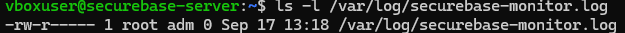

*Figur 5.6. Logfilen har -rw-r----- og root:adm. Det svarer til mode 0640.*

Den endelige regel i /etc/logrotate.d/securebase-monitor er:

```conf
/var/log/securebase-monitor.log {
    su root adm
    daily
    rotate 7
    compress
    delaycompress
    missingok
    notifempty
    create 0640 root adm
}
```

| Indstilling | Betydning i den valgte opsætning |
| --- | --- |
| su root adm | Rotation udføres med den angivne bruger og gruppe. |
| daily / rotate 7 | Daglig rotationsregel; behold højst syv roterede versioner. |
| compress / delaycompress | Komprimér ældre arkiver; den nyeste .1 forbliver først ukomprimeret. |
| missingok / notifempty | Manglende log accepteres; en tom log springes over. |
| create 0640 root adm | Opret en ny aktiv log med samme afgrænsede adgang. |

Retentionsvalget er syv rotationer, ikke et særskilt garanteret antal døgn. Reglen begrænser historikken, men definerer ikke en maksimal filstørrelse mellem de planlagte kørsler.

### 3.1 Validering før rotation

```bash
sudo logrotate -d /etc/logrotate.d/securebase-monitor
```

-d er debug: Logrotate læser og vurderer konfigurationen uden at udføre rotationen. Den endelige regel accepteres i outputtet, hvor bruger-/gruppeskiftet og den behandlede monitor-log fremgår.

<a id="figur-5-7"></a>

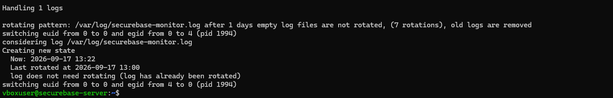

*Figur 5.7. Udsnit af den afsluttende debug-kontrol. Monitor-loggen vurderes med den endelige regel; der udføres ingen faktisk rotation i denne test.*

Teksten “log has already been rotated” i denne debug-visning er Logrotates vurdering ud fra sin tilstand; den bruges ikke som bevis for en udført rotation. En faktisk tvungen rotation og dens filresultat dokumenteres senere i afsnit 9.

#### 3.2 Scriptets placering og adgang

Overvågningsscriptet blev oprettet som /usr/local/sbin/securebase-monitor.sh. Ejerskabet blev sat til root:root og rettighederne til 750, før det blev kørt manuelt og kontrolleret i logfilen.

```bash
sudo chown root:root /usr/local/sbin/securebase-monitor.sh
sudo chmod 750 /usr/local/sbin/securebase-monitor.sh
sudo /usr/local/sbin/securebase-monitor.sh
sudo tail -n 5 /var/log/securebase-monitor.log
```

<a id="figur-5-8"></a>

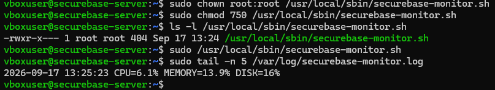

*Figur 5.8. Den første manuelle kørsel skriver CPU=6.1%, MEMORY=13.9% og DISK=16%. Scriptet er root:root og -rwxr-x---. Status- og journalbeskeder blev tilføjet senere.*

**Sikkerhedsbegrundelse:** Et script, der startes som root af cron, skal ikke kunne redigeres af de almindelige projektbrugere. Det er scriptets ejer og rettigheder, ikke filendelsen .sh, der afgrænser denne adgang.

### 4. Overvågningsscript – endelig version

Nedenfor er den endelige Bash-kode fra det dokumenterede forløb. Den skriver én ressourcepost pr. kørsel og sender desuden en journalbesked, når status ikke er OK.

```bash
#!/bin/bash

set -euo pipefail

LOGFILE="/var/log/securebase-monitor.log"

DISK_THRESHOLD=85
MEMORY_THRESHOLD=90

TIMESTAMP=$(date '+%Y-%m-%d %H:%M:%S')

CPU=$(LC_ALL=C top -bn1 | awk '/^%Cpu/ {printf "%.1f", 100 - $8}')
MEMORY=$(free | awk '/Mem:/ {printf "%.1f", ($3/$2) * 100}')
DISK=$(df -P / | awk 'NR==2 {gsub("%","",$5); print $5}')

STATUS="OK"

if (( DISK >= DISK_THRESHOLD )); then
    STATUS="DISK_WARNING"
fi

if awk -v mem="$MEMORY" -v threshold="$MEMORY_THRESHOLD" \
    'BEGIN {exit !(mem >= threshold)}'; then
    if [[ "$STATUS" == "OK" ]]; then
        STATUS="MEMORY_WARNING"
    else
        STATUS="${STATUS},MEMORY_WARNING"
    fi
fi

if [[ "$STATUS" != "OK" ]]; then
    logger -p user.warning -t securebase-monitor \
        "MEMORY=${MEMORY}% DISK=${DISK}% STATUS=${STATUS}"
fi

printf '%s CPU=%s%% MEMORY=%s%% DISK=%s%% STATUS=%s\n' \
    "$TIMESTAMP" "$CPU" "$MEMORY" "$DISK" "$STATUS" >> "$LOGFILE"
```

Placering: /usr/local/sbin/securebase-monitor.sh. Driftsgrænserne er 85/90; de lave testgrænser fra afsnit 7 er ikke indført i denne version.

### 4.1 Scriptbevis og syntakskontrol

<a id="figur-5-9"></a>

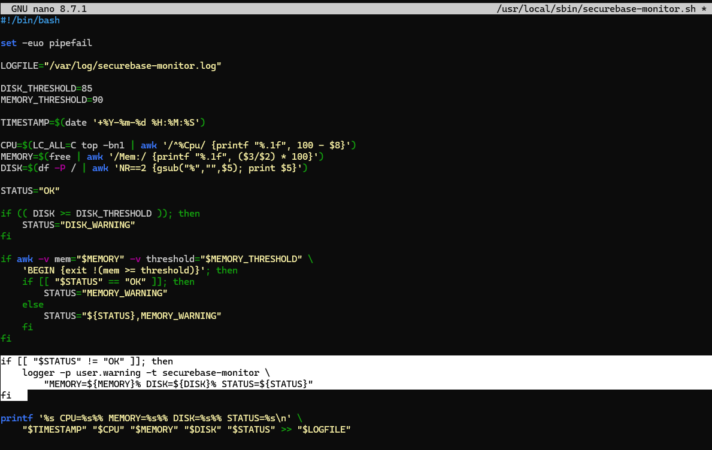

*Figur 5.9. Den afsluttende scriptversion med logger-blokken før printf. Screenshotet viser editorindhold; den gemte fil blev derefter syntakskontrolleret og kørt.*

```bash
sudo bash -n /usr/local/sbin/securebase-monitor.sh
echo "Returkode: $?"
```

<a id="figur-5-10"></a>

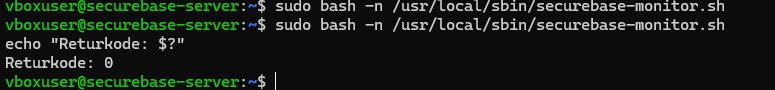

*Figur 5.10. Syntakskontrol af den gemte fil med returkode 0. Kontrollen blev gentaget i terminalen og accepterede scriptets Bash-syntaks.*

bash -n læser Bash-syntaksen uden at udføre målinger eller skrive til loggen. $? blev vist umiddelbart efter kontrollen. Returkode 0 dokumenterer en bestået syntakskontrol, ikke en fuld funktionstest; de faktiske log- og alarmtests vises særskilt.

### 4.2 Hvad gør scriptet?

| Del | Forklaring af den anvendte kode |
| --- | --- |
| #!/bin/bash | Angiver Bash som fortolker ved direkte eksekvering. |
| set -euo pipefail | Aktiverer fejlhåndtering, kontrol af udefinerede variable og pipeline-fejl. Det erstatter ikke kontrol af målingernes datakvalitet. |
| LOGFILE / TIMESTAMP | Samler logstien ét sted og sætter et tidspunkt på hver måling. |
| CPU | Kører top i batch én gang. awk finder %Cpu-linjen og beregner 100 minus felt 8 i det anvendte output. |
| MEMORY | free-output bruges til beregningen felt 3 / felt 2 × 100 på Mem:-linjen. |
| DISK | df -P / undersøger root-filsystemet. awk læser procentkolonnen og fjerner procenttegnet. |
| STATUS og if | Starter med OK. Disk og hukommelse sammenlignes med deres respektive grænser. |
| logger | Ved en warning sendes hukommelse, disk og status med tagget securebase-monitor og prioritet user.warning. |
| printf ... >> | Tilføjer en formateret målelinje til den centrale log. >> bevarer eksisterende indhold. |

#### Måling og fortolkning

CPU, MEMORY og DISK er de værdier, dette konkrete script producerer. Cron-intervallet på fem minutter betyder, at scriptet startes på de tidspunkter; CPU-feltet er ikke dokumenteret som et gennemsnit over hele femminuttersperioden.

Der ses enkelte CPU=100.0%-linjer i materialet. Rapporten bevarer dem som faktisk output, men konkluderer ikke, at serveren har været vedvarende fuldt belastet. Der er ikke udført en selvstændig validering af CPU-målingens nøjagtighed. CPU indgår ikke i de to valgte advarselsgrænser.

DISK gælder /, ikke nødvendigvis alle serverens filsystemer. MEMORY er den anvendte free-beregning; et højt tal skal undersøges i sammenhæng med systemets øvrige tilstand.

### 5. Automatisk kørsel via cron

```bash
systemctl status cron --no-pager
```

<a id="figur-5-11"></a>

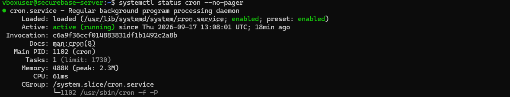

*Figur 5.11. Udsnit af cron-status: tjenesten er enabled og active (running). Det er en servicekontrol; selve monitor-jobbet testes særskilt.*

En system-cronfil blev oprettet i /etc/cron.d/securebase-monitor. Den bruger det udvidede format med en eksplicit bruger mellem tidsfelterne og kommandoen:

```cron
*/5 * * * * root /usr/local/sbin/securebase-monitor.sh
```

| Felt | Valg og betydning |
| --- | --- |
| Minut | */5: minutterne 00, 05, 10, 15 … 55. |
| Time, dag, måned, ugedag | *: ingen yderligere begrænsning i de fire felter. |
| Bruger | root: jobbet kan skrive i root-ejet monitor-log. |
| Kommando | Den faste absolutte sti til systemscriptet. |

```bash
sudo chown root:root /etc/cron.d/securebase-monitor
sudo chmod 644 /etc/cron.d/securebase-monitor
```

<a id="figur-5-12"></a>

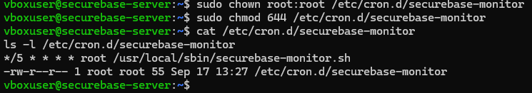

*Figur 5.12. Den gemte cronlinje og cronfilens root:root-ejerskab med -rw-r--r--. Kun root har skriveret.*

**Sikkerhedsbegrundelse:** Både tidsplan og script er beskyttet mod ændringer fra de almindelige roller. Tidsplanen giver løbende registrering uden at åbne en ny netværkstjeneste.

### 5.1 Bevis for automatisk udførelse

Efter den manuelle første måling blev der ventet på næste femminutters tidspunkt uden at starte scriptet manuelt. Monitor-loggen fik en ny post kl. 13:30:01, og cron-journalen viste starten af den samme scriptsti.

```bash
date
sudo tail -n 5 /var/log/securebase-monitor.log
sudo journalctl -u cron --since "10 minutes ago" --no-pager | grep securebase-monitor
```

<a id="figur-5-13"></a>

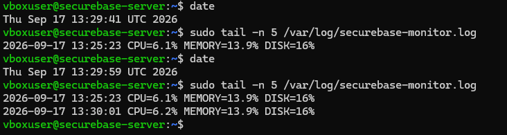

*Figur 5.13. Monitor-loggen får en ny måling kl. 13:30:01 efter første manuelle måling kl. 13:25:23. Terminaludsnittet viser kontrol før og omkring næste interval.*

<a id="figur-5-14"></a>

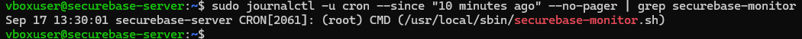

*Figur 5.14. Cron registrerer (root) CMD (/usr/local/sbin/securebase-monitor.sh) kl. 13:30:01.*

#### To forskellige beviser

Cron-journalen dokumenterer, at scheduler-processen starter kommandoen. Monitor-loggen dokumenterer, at scriptet producerer og gemmer ressourceværdier. Den ene kontrol er derfor ikke en erstatning for den anden.

```text
2026-09-17 13:25:23 CPU=6.1% MEMORY=13.9% DISK=16%
2026-09-17 13:30:01 CPU=6.2% MEMORY=13.9% DISK=16%
```

Dette er de faktiske to linjer fra den tidlige version. STATUS blev tilføjet senere. Den endelige drift med statusfelt er vist i afsnit 8 og i slutkontrollen.

### 6. Afvist SSH-login i to logkilder

Der blev foretaget ét kontrolleret loginforsøg fra Windows med brugernavnet fakeuser. Kontrollen demonstrerer afvisning af en ugyldig konto uden at genaktivere password-login på serveren.

```powershell
ssh -p 2222 fakeuser@127.0.0.1
```

<a id="figur-5-15"></a>

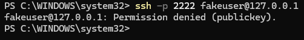

*Figur 5.15. Windows-klienten får Permission denied (publickey) ved forsøget med fakeuser.*

#### 6.1 Den traditionelle auth.log

```bash
sudo grep sshd /var/log/auth.log | \
  grep -Ei 'invalid user|failed publickey|authentication failure|connection closed' | \
  tail -n 20
```

<a id="figur-5-16"></a>

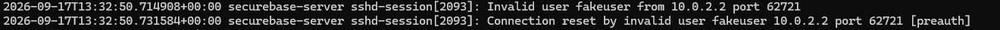

*Figur 5.16. Serverens auth.log indeholder Invalid user fakeuser og den afsluttende preauth-linje. Udsnit af de to hændelser; søgekommandoen er gengivet ovenfor.*

#### 6.2 Samme hændelse i systemjournalen

```bash
sudo journalctl -u ssh.service --since "5 minutes ago" --no-pager | \
  grep -Ei 'invalid user|preauth|failed|reset'
```

<a id="figur-5-17"></a>

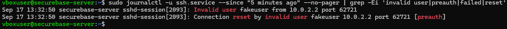

*Figur 5.17. Journaludsnittet viser de samme SSH-hændelser kl. 13:32:50 med proces 2093, fakeuser, kilde 10.0.2.2 og klientport 62721.*

Invalid user er det direkte tegn på en ikke-eksisterende konto. [preauth] placerer forbindelsens afslutning før fuldført autentifikation. De fælles tids-, proces- og forbindelsesoplysninger gør det muligt at sammenholde posterne fra de to logkilder.

10.0.2.2 er den observerede VirtualBox NAT-kilde i dette lab; den identificerer ikke i sig selv en bestemt person eller Windows-konto. Tekstsøgning efter sshd er et praktisk filter, ikke en garanti for at enhver matchende tekst er en SSH-fejl.

### 6.3 Unormale loginmønstre

En optælling med wc -l giver antallet af matchende loglinjer, ikke nødvendigvis antallet af separate loginforsøg. Der var ingen match i det seneste 30-minutters interval, men tre i hele den tilgængelige SSH-journal ved kontrollen.

<a id="figur-5-18"></a>

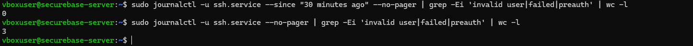

*Figur 5.18. 0 matchende linjer i 30-minutters vinduet og 3 uden tidsfilter. Resultaterne er linjetællinger, ikke en opgørelse af tre angreb.*

```bash
sudo journalctl -u ssh.service --no-pager | grep -Ei 'invalid user|failed|preauth'
```

<a id="figur-5-19"></a>

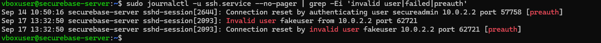

*Figur 5.19. De tre matchende hændelser: én ældre preauth-afbrydelse for secureadmin og to linjer fra det kontrollerede fakeuser-forsøg.*

De to fakeuser-linjer deler tidspunkt, proces og klientport og tilhører samme testforbindelse. Den ældre linje om secureadmin viser en afbrudt forbindelse før autentifikation; den beviser ikke alene et forkert password, en ugyldig nøgle eller et angreb.

#### Kort beskrivelse til afleveringen

Et unormalt mønster kan være mange afviste SSH-login på kort tid, gentagne forsøg mod ikke-eksisterende brugere eller samme kilde, der prøver mange forskellige kontonavne. Det bør undersøges som mulig automatiseret aktivitet, men en enkelt preauth-afbrydelse eller ét forkert brugernavn er ikke i sig selv bevis på et angreb.

Ved analysen skal tid, kildeadresse, brugernavn og sammenhørende forbindelseslinjer vurderes samlet. I dette NAT-lab kan flere klientforbindelser ses som 10.0.2.2, så en optælling pr. IP er ikke det samme som en optælling pr. bruger.

Rapporten dokumenterer det kontrollerede fakeuser-forsøg og en forklaring af mulige afvigelser. Der er ikke implementeret en automatisk login-rate-alarm eller registreret et reelt angrebsforløb i disse beviser.

### 7. Grænseværdier og kontrolleret test

| Måling | Grænse | Status og begrundelse |
| --- | --- | --- |
| Disk på / | ≥ 85 % | DISK_WARNING. Valgt som tidlig besked om begrænset resterende plads til blandt andet logs og drift. |
| Hukommelse | ≥ 90 % | MEMORY_WARNING. Valgt som anledning til at undersøge et højt målt hukommelsesforbrug. |

85 % og 90 % er de valgte labgrænser, ikke universelle garantier for et driftsproblem. Scriptet reagerer på den enkelte måling. Hvis begge grænser er nået, samles de to statusnavne i samme logpost.

```bash
DISK_THRESHOLD=85
MEMORY_THRESHOLD=90

STATUS=OK
# Mulige warnings:
STATUS=DISK_WARNING
STATUS=MEMORY_WARNING
STATUS=DISK_WARNING,MEMORY_WARNING
```

#### 7.1 Test af betingelserne uden belastning

En midlertidig kopi af scriptet blev anvendt med begge testgrænser sat til 10. Den særskilte testlog var /var/log/securebase-monitor-test.log. Originalscriptets driftsgrænser forblev 85/90; testen krævede ikke, at disk eller hukommelse blev fyldt op.

```bash
LOGFILE="/var/log/securebase-monitor-test.log"
DISK_THRESHOLD=10
MEMORY_THRESHOLD=10
```

<a id="figur-5-20"></a>

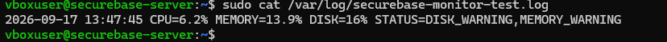

*Figur 5.20. Faktisk output fra threshold-testen kl. 13:47:45: MEMORY=13.9% og DISK=16% udløser begge warnings ved testgrænserne 10/10.*

Resultatet dokumenterer den kombinerede warning-status. Det er ikke en måling af 85 % disk eller 90 % hukommelse i normal drift. Testkopien og den særskilte testlog blev fjernet efter verificeringen.

Denne test blev udført før tilføjelsen af logger-blokken. Den beviser betingelserne og statusdannelsen; den senere journaltest dokumenterer beskedkanalen separat.

### 8. Journalbesked ved en advarsel

Den endelige scriptversion sender en warning til systemjournalen, når status er forskellig fra OK. Den normale målelinje skrives fortsat til monitor-loggen.

```bash
if [[ "$STATUS" != "OK" ]]; then
    logger -p user.warning -t securebase-monitor \
        "MEMORY=${MEMORY}% DISK=${DISK}% STATUS=${STATUS}"
fi
```

logger sender beskeden til logging-systemet. -p user.warning angiver facility user og severity warning. -t securebase-monitor giver beskeden det tag, der bruges ved opslag i journalen. Det er en journalbesked, ikke en opsat e-mail- eller push-notifikation.

#### 8.1 Normal drift

<a id="figur-5-21"></a>

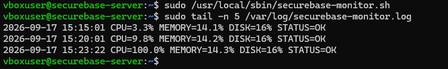

*Figur 5.21. Den endelige scriptversion køres manuelt og skriver STATUS=OK. Den viste måling kl. 15:23:22 har MEMORY=14.3% og DISK=16%.*

<a id="figur-5-22"></a>

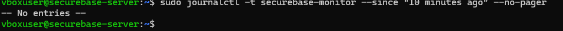

*Figur 5.22. Opslag på tagget securebase-monitor i det kontrollerede 10-minutters vindue giver No entries. Det stemmer med de viste OK-målinger.*

#### 8.2 Isoleret test af beskedkanalen

```bash
sudo logger -p user.warning -t securebase-monitor \
  "TEST WARNING: DISK=95% MEMORY=92% STATUS=DISK_WARNING,MEMORY_WARNING"
sudo journalctl -t securebase-monitor --since "5 minutes ago" --no-pager
```

<a id="figur-5-23"></a>

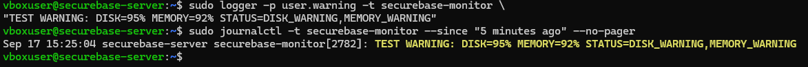

*Figur 5.23. Den manuelt sendte TEST WARNING genfindes i journalen. Tallene 95/92 er testtekst og ikke målte belastninger på serveren.*

**Afgrænsning:** Threshold-logikken og journal-kanalen er funktionstestet hver for sig. En fuld end-to-end-overskridelse gennem det endelige script med driftsgrænserne 85/90 er ikke fremprovokeret.

### 9. Funktionstest af den faktiske rotation

Efter at monitor-loggen havde fået flere målinger, blev den specifikke Logrotate-regel kørt med -f. Det fremtvinger denne regels rotation uden at vente på den normale dagsbetingelse.

```bash
sudo ls -lh /var/log/securebase-monitor.log*
sudo logrotate -f /etc/logrotate.d/securebase-monitor
sudo ls -lh /var/log/securebase-monitor.log*
sudo tail -n 5 /var/log/securebase-monitor.log.1
sudo ls -l /var/log/securebase-monitor.log
```

<a id="figur-5-24"></a>

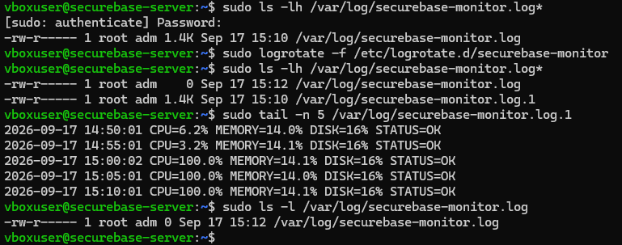

*Figur 5.24. Før/efter ved den tvungne rotation: den tidligere log på ca. 1.4K bliver til .log.1, og en ny tom aktiv log oprettes som root:adm med mode 0640.*

| Kontrol | Faktisk resultat |
| --- | --- |
| Gammel log bevares | .log.1 indeholder de tidligere målinger frem til kl. 15:10:01. |
| Ny aktiv log | Ny .log på 0 bytes efter rotation kl. 15:12. |
| Rettigheder | Den nye fil viser -rw-r----- root adm. |
| Komprimering | .1 er ikke komprimeret ved denne første rotation; det stemmer med delaycompress. |

Denne test dokumenterer én faktisk rotation og oprettelse af en ny fil. rotate 7 og komprimeringen af ældre arkiver er konfigureret, men syv rotationscyklusser og en senere .gz-fil er ikke særskilt funktionstestet i materialet.

### 10. Drift efter rotation og slutkontrol

Efter rotationen blev den næste automatiske kørsel afventet. Den nye aktive log fik en måling kl. 15:15:01. Det viser, at monitoreringen ikke kun virker før rotation, men også skriver videre i den nyoprettede logfil.

<a id="figur-5-25"></a>

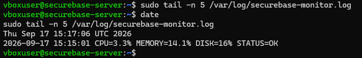

*Figur 5.25. Efterkontrol: den nye aktive log indeholder CPU=3.3%, MEMORY=14.1%, DISK=16% og STATUS=OK kl. 15:15:01. date viser kontrollen kl. 15:17:06 UTC.*

#### 10.1 Endelige driftsværdier

Til sidst blev originalscriptets logsti og thresholds, cronfilen, Logrotate-reglen og de seneste målinger samlet i én kontrol. Den viser driftsgrænserne 85/90 – ikke de midlertidige testgrænser.

<a id="figur-5-26"></a>

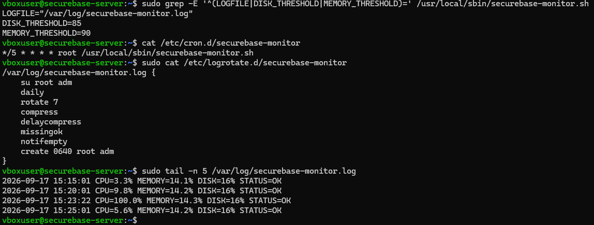

*Figur 5.26. Samlet slutbevis: korrekt logsti, diskgrænse 85, hukommelsesgrænse 90, cron hvert femte minut, endelig Logrotate-regel og monitor-linjer med STATUS=OK.*

Den sidste automatiske post i slutudsnittet er kl. 15:25:01 med CPU=5.6%, MEMORY=14.2%, DISK=16% og STATUS=OK. Den særskilte TEST WARNING i journalen skal ikke læses som en alarm udløst af denne driftsmåling.

### 11. Samlet test- og afleveringsstatus

| Krav / kontrol | Dokumenteret resultat | Bevis |
| --- | --- | --- |
| Logging-baseline | Journald aktiv; traditionelle logs og auth.log findes. | Fig. 5.1–5.3 |
| Egen logrotation | Endelig daily-regel med su root adm, rotate 7 og create 0640 root adm; debug-kontrol. | Afsnit 3; fig. 5.7, 5.26 |
| CPU, RAM og disk | Root-ejet Bash-script skriver alle tre felter til én central log. | Afsnit 4; fig. 5.8–5.10 |
| Automatisk cron-kørsel | Root-job hvert femte minut; faktisk jobstart og målelinje. | Fig. 5.11–5.14 |
| Mislykket login | Fakeuser afvises på klienten; hændelsen ses i auth.log og journalen. | Fig. 5.15–5.17 |
| Unormale mønstre | Loglinjer adskilles fra loginforsøg; tid, kilde, bruger og sammenhæng vurderes. | Afsnit 6.3; fig. 5.18–5.19 |
| Mindst to grænser | Disk ≥ 85 % og hukommelse ≥ 90 % i driftskonfigurationen. | Afsnit 7; fig. 5.26 |
| Threshold-test | Begge warnings ved testgrænserne 10/10 og faktisk målt 16/13.9. | Fig. 5.20 |
| Journalbesked | Normaltest uden warning; manuel TEST WARNING kan genfindes. | Fig. 5.21–5.23 |
| Faktisk rotation | Aktiv log bliver .1; ny 0640 root:adm-log oprettes. | Fig. 5.24 |
| Drift efter rotation | Næste cron-måling står i den nye aktive log. | Fig. 5.25–5.26 |

#### 11.1 Konklusion

Modul 5 er gennemført med en egen roteret monitor-log, cron-baserede ressourceposter, et kontrolleret afvist SSH-login og to definerede advarselsgrænser. Rapporten indeholder loguddrag, konfigurationer, sikkerhedsbegrundelser og den krævede beskrivelse af mulige unormale loginmønstre.

#### 11.2 Afgrænsning af dokumentationen

Beviserne gælder de viste kørsler og filversioner. Alarmbetingelser og journalbesked er testet separat; der er ikke opsat ekstern notifikation eller automatisk blokering af loginforsøg. Logrotate-reglen gælder monitor-tekstloggen, og der er ikke dokumenteret en ny størrelsespolitik for hele systemjournalen.

Syv arkiver og komprimering er valgte regler, ikke syv observerede rotationsforløb. Scriptets målemetoder er gengivet som anvendt; CPU-tal er ikke dokumentation for en vedvarende belastning. Dette er status ved afslutningen af Modul 5; den efterfølgende automatisering dokumenteres i Modul 6.

## Overvejelser og fravalg

Grænseoverskridelse blev testet uden at fylde RAM eller disk. Threshold-logik og journalbesked blev testet særskilt. Ingen ekstern e-mail-/SMS-alarm eller automatisk login-rate-blokering er implementeret. Syv arkiver og senere gzip-komprimering er konfigureret, ikke syv observerede rotationscyklusser.

### Kobling til de aktuelle scripts

- [`scripts/modules/08-monitoring.sh`](../scripts/modules/08-monitoring.sh)

- [Den historiske Modul 5-monitor](../scripts/history/monitor-modul5.sh)
- [Den nuværende deployment-monitor](../scripts/monitor.sh)

### Kildegrundlag

[Samlet Word-rapport, uændret kopi](../reports/SecureBase_Modul_1_2_3_4_5_6_DOKUMENTATION.docx). Figurnumrene svarer til rapporten; i Modul 1–2 er modulnummeret tilføjet for entydighed. Kommandoer er dokumentation af det viste forløb, ikke en opfordring til at genkøre alle historiske trin på den færdige server.

[← Overblik](../README.md) · [Forrige modul](04-firewall.md) · [Næste modul](06-scripting.md)
