# Modul 6: Shell og Bash scripting

[← Overblik](../README.md) · [Forrige modul](05-monitorering.md)

> **Verificeret v1.2-status — 18. september 2026:** Den aktuelle `scripts/`-struktur er afprøvet på en frisk Ubuntu Server 26.04.1-test-VM. Første apply rapporterede **12 ændrede administrerede filer**; anden fulde kørsel rapporterede **0**. Healthchecket, som setup kalder, viste **19 OK / 1 WARN / 0 FAIL**. Statisk netværk, SSH-adgang og afsluttende adminrolle er dokumenteret nedenfor. Den kendte `who`/utmp-advarsel er bevaret. De oprindelige beviser fra 17. september er fortsat mærket som historik.

## Formål

At automatisere den ønskede sluttilstand fra Modul 1–5 med modulopdelte, genkørbare scripts. Et selvstændigt healthcheck skal rapportere serverens faktiske tilstand uden at ændre den.

## Udførte opgaver

- Bygget setup, moduler, literal konfiguration, public-key-installation og uafhængige driftsværktøjer.
- Kørt preflight og første deployment på en separat Ubuntu-test-VM med statisk Netplan og eksternt SSH-sikkerhedsstop.
- Genkørt deploymentet med 0 ændrede administrerede filer og dokumenteret SSH-login, tre konkrete sudo-tilladelser og healthcheck 19 OK / 1 WARN / 0 FAIL.
- Gentaget fresh-install- og genkørselstesten den 18. september 2026 med repo 1.2, hvor setup ligger under `scripts/`. De nye VM-beviser supplerer det oprindelige forløb fra 17. september.

## Sikkerhedsmæssig begrundelse

Inputvalidering, testet konsoladgang, nøgleinstallation før hærdning og validering af konfigurationskandidater mindsker risikoen for fejl og udelukkelse. Ukendte UFW-/netværksmodeller stoppes til vurdering.

Idempotent filinstallation sammenligner indhold og metadata frem for blind append. Bootstrap-kontoen bevares som eksplicit ansvarlig opsætningskonto; healthcheck er læsende og skjuler ikke advarsler.

## Dokumentation / bevis

Dokumentationen består nu af to adskilte testforløb: [16 nye screenshots fra v1.2-testen](../evidence/06-scripting/v1.2-2026-09-18/README.md) og de [18 oprindelige Modul 6-figurer fra Word-rapporten](../evidence/06-scripting/README.md#historiske-figurer). De nye billeder ændrer ikke dato eller betydning af de tidligere beviser. Se [kilde- og versionsgrundlaget](GRUNDLAG.md).

**Afleveringsudgave 1.3:** Præsentation og repo er ryddet op; den testede serverkode under `scripts/` er uændret. Websitet gengiver denne Markdown-fil, så det ikke er en separat kopi af modulet. [Kildegrundlag](GRUNDLAG.md).

[Ny v1.2-verifikation](#vm-test-v12) · [Kort VM-testrapport](VM_TEST_REPORT.md) · [Historisk forløb](#historisk-forloeb)

### Aktuelle kommandoer i afleveringsudgave 1.3

Kør fra repo-roden som bootstrap-kontoen. Opret kun den lokale konfiguration, hvis den ikke allerede findes; tilpas værdier og public key før apply.

```bash
cp -n config/config.env.example config.env
nano config.env
sudo bash scripts/setup.sh --check
# Kun efter gennemgang og testet konsoladgang:
sudo bash scripts/setup.sh --apply --console-confirmed
sudo bash scripts/healthcheck.sh
```

<a id="vm-test-v12"></a>

### Ny VM-verifikation af repo 1.2 — 18. september 2026

Denne test retter den tidligere begrænsning: det er nu **den nye repos mappe-/scriptstruktur**, der er kørt på Ubuntu, ikke kun den gamle deploymentpakke. Der blev ikke ændret scripts for at udarbejde denne dokumentationsopdatering.

| Felt | Dokumenteret testgrundlag |
|---|---|
| Platform | Frisk Ubuntu Server 26.04.1 LTS test-VM i VirtualBox; single-NIC NAT |
| Kode/reference | Repo 1.2.0; Git-reference `54734b9` fra arbejdsforløbet |
| Arkiv på VM | `SecureBase-Linux101-v1.2-test.zip`, 6.340.751 bytes i downloadbilledet |
| Bootstrap / admin | `vboxuser` med lokal sudo / `secureadmin` med public-key-adgang |
| Netværksvalg | `CONFIGURE_NETWORK="yes"`, `NETWORK_APPLY="try"` |
| Slut-IP / route | `10.0.2.15/24` på `enp0s3`; default via `10.0.2.2`, `proto static` |
| Første / anden apply | 12 / 0 ændrede administrerede filer |
| Healthcheck i begge apply-kørsler | 19 OK / 1 WARN / 0 FAIL |

**Versionspræcision:** Git-referencen kommer fra det foregående commit-/arkivforløb. VM'en fik ZIP-arkivet uden `.git`; der er ikke vist en uafhængig commit-/arkivhash-kontrol på VM'en. Screenshots dokumenterer de angivne stier, konfigurationer og kørsler.

#### A. Frisk udgangstilstand og overførsel

Før-beviset viser `Ubuntu-Server1` og en default route med `proto dhcp`. Efter download og udpakning findes den nye struktur med `scripts/`, `config/`, `docs/` og `evidence/`.

<a id="v12-01"></a>

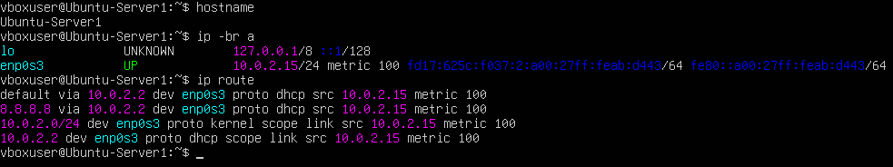

*V12-01. Før deployment: hostname Ubuntu-Server1, enp0s3 med 10.0.2.15/24 og default route via 10.0.2.2 med proto dhcp.*

<a id="v12-02"></a>

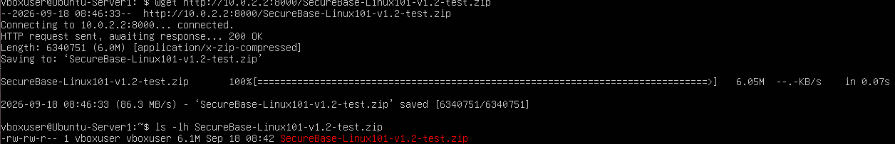

*V12-02. 18. september 2026 kl. 08:46:33 UTC: SecureBase-Linux101-v1.2-test.zip hentes med HTTP 200 og 6.340.751 bytes.*

<a id="v12-03"></a>

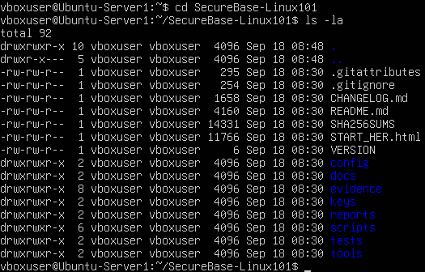

*V12-03. Den udpakkede repo-rod indeholder config/, docs/, evidence/, reports/, scripts/, tests/ og tools/.*

Arkivet blev overført over labbets midlertidige HTTP-forbindelse. Det er en bootstrap-metode; HTTP-overførslen alene autentificerer ikke pakkens oprindelse.

#### B. Valgt konfiguration og preflight

Den lokale `config.env` blev oprettet fra `config/config.env.example`, og netværksændring blev tilvalgt i nano. Efter udpakning blev gruppe-/others-skriveret fjernet i projektmappen før sudo-kørslen. Det er en rettighedsforudsætning, ikke en kodeændring.

```bash
# I den udpakkede repo-rod:
chmod -R go-w .
sudo bash ./scripts/setup.sh --check
```

Den gemte konfiguration blev efterfølgende indlæst af preflight, som viser Netplan tilvalgt og accepteret single-NIC-scope. `sshd` og `setfacl` mangler på dette tidspunkt og skal installeres ved apply.

<a id="v12-04"></a>

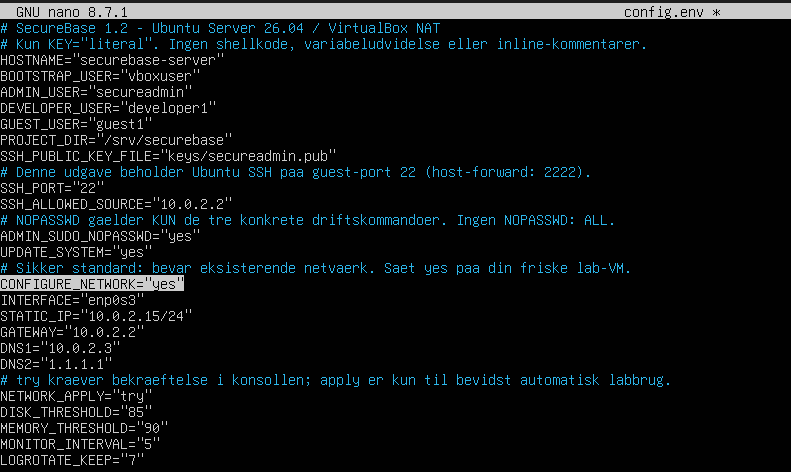

*V12-04. Editorvisning af v1.2-konfigurationen med CONFIGURE_NETWORK="yes", STATIC_IP="10.0.2.15/24" og NETWORK_APPLY="try". Den efterfølgende preflight viser den indlæste netværksplan.*

<a id="v12-05"></a>

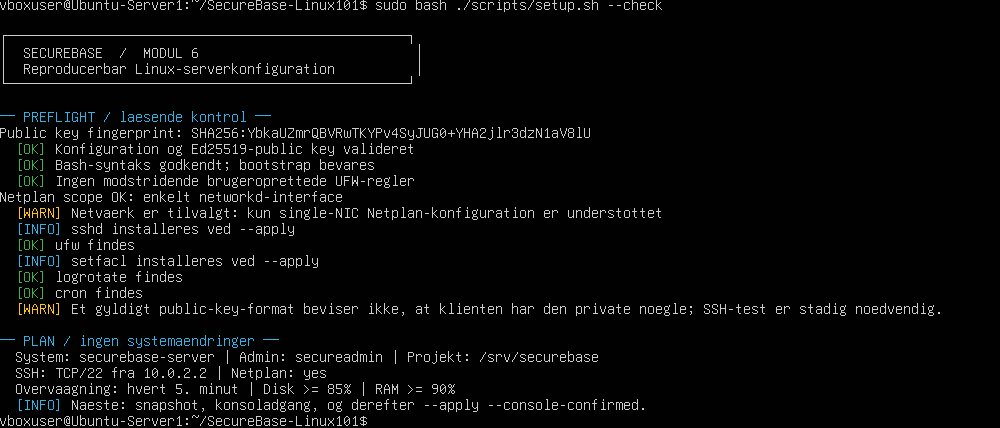

*V12-05. sudo bash ./scripts/setup.sh --check: konfiguration, public key, syntaks og single-NIC-scope accepteres. sshd og setfacl skal installeres ved apply; Netplan er tilvalgt.*

#### C. Første apply og eksternt SSH-sikkerhedsstop

```bash
sudo bash ./scripts/setup.sh --apply --console-confirmed
```

Setup opretter de manglende konti og rollegrupper, konfigurerer projekt-ACL og installerer admin-nøglen. Den oprindelige konsol bliver stående ved `KEY-OK`, mens forbindelsen afprøves fra Windows.

<a id="v12-06"></a>

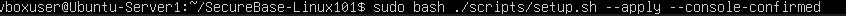

*V12-06. Første deployment startes fra den nye scripts/-struktur med sudo bash ./scripts/setup.sh --apply --console-confirmed.*

<a id="v12-07"></a>

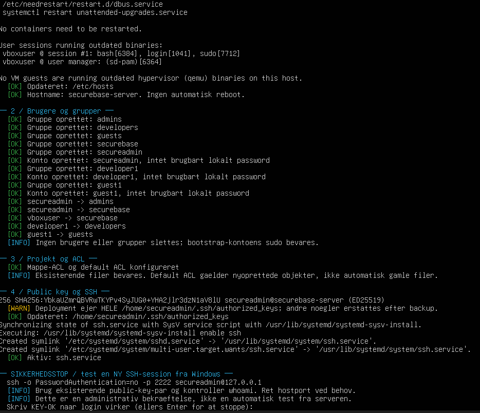

*V12-07. Første apply opretter konti og grupper, sætter projekt-ACL og installerer authorized_keys. ssh.service er aktiv, og forløbet venter på den eksterne SSH-test ved KEY-OK.*

```powershell
ssh -o PasswordAuthentication=no -p 2222 secureadmin@127.0.0.1
```

<a id="v12-08"></a>

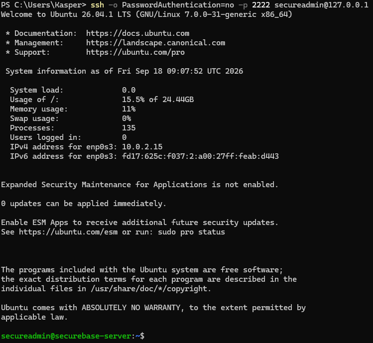

*V12-08. 18. september kl. 09:07:52 UTC: ny SSH-forbindelse fra Windows med PasswordAuthentication=no på klienten lykkes som secureadmin@securebase-server.*

Klientbilledet dokumenterer et vellykket login med password-metoden fravalgt på klienten. Det efterfølgende healthcheck dokumenterer særskilt serverens `authenticationmethods publickey` og deaktiveret password-/keyboard-interactive-login. VirtualBox-forwarden er værtens `127.0.0.1:2222` til gæstens `10.0.2.15:22`.

Efter SSH-kontrollen blev `KEY-OK` bekræftet i deployment-konsollen. Første kørsel nåede `DEPLOYMENT AFSLUTTET`, med følgende viste resultat:

```text
19 OK   1 WARN   0 FAIL
RESULTAT: WARN - gennemgaa bemaerkningerne
[OK] Aendrede administrerede filer i denne koersel: 12
```

<a id="v12-09"></a>

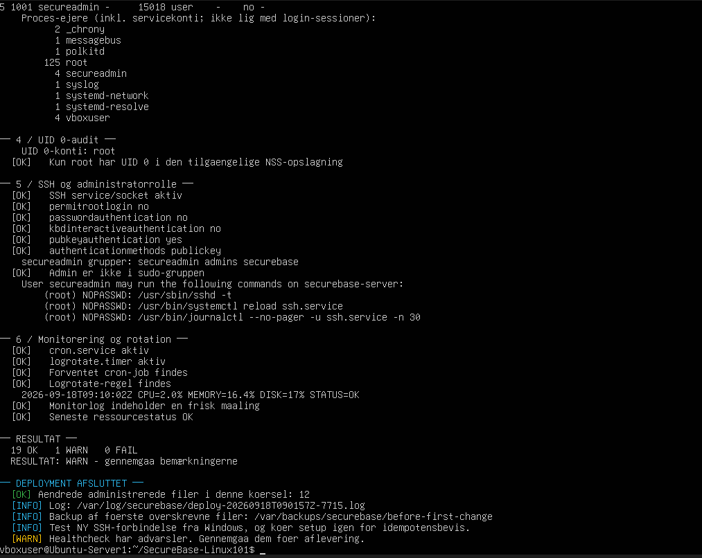

*V12-09. Første apply afsluttes med 12 ændrede administrerede filer og healthcheck 19 OK / 1 WARN / 0 FAIL. Monitor-linjen er tidsstemplet 09:10:02Z.*

#### D. Netværkets faktiske sluttilstand

```bash
ip -br a
ip route
sudo cat /etc/netplan/99-securebase.yaml
```

<a id="v12-10"></a>

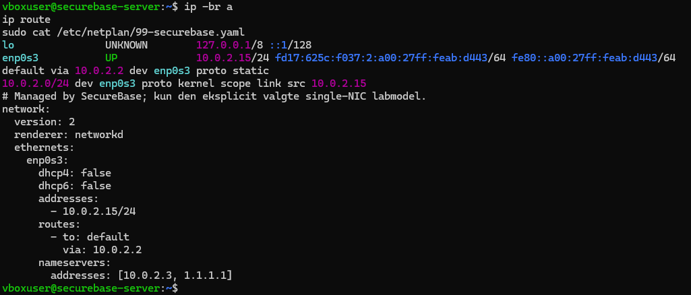

*V12-10. Netværkskontrol efter første apply: 10.0.2.15/24, default via 10.0.2.2 med proto static, dhcp4/dhcp6 false og DNS 10.0.2.3 samt 1.1.1.1.*

Den viste default route er statisk. YAML-filen viser `dhcp4: false`, `dhcp6: false`, adressen `10.0.2.15/24` og DNS `10.0.2.3`/`1.1.1.1`. IPv6-adresser er stadig synlige på interfacet; `dhcp6: false` er ikke det samme som deaktiveret IPv6. Kontrollen her er af adresser, route og konfigurationsfil — ikke en særskilt DNS-opslagstest.

#### E. Anden fulde kørsel — idempotens

Den samme apply-kommando blev kørt igen med samme konfiguration. Pakker krævede ingen opgradering, brugerne blev bevaret, og projekt-ACL samt `authorized_keys` var allerede korrekte. Et SSH-login blev afprøvet ved sikkerhedsstoppet under anden kørsel.

<a id="v12-11"></a>

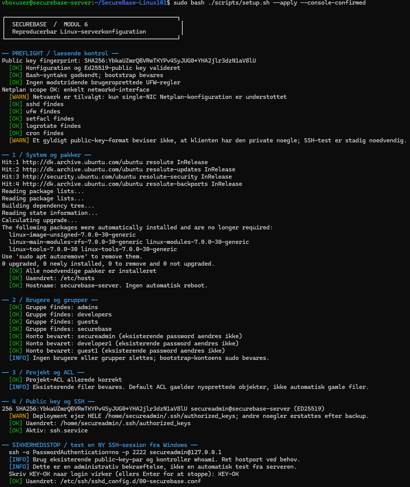

*V12-11. Anden apply fra scripts/setup.sh: ingen pakkeopgraderinger, eksisterende konti bevares, ACL er allerede korrekt, authorized_keys er uændret, og KEY-OK bekræftes.*

<a id="v12-12"></a>

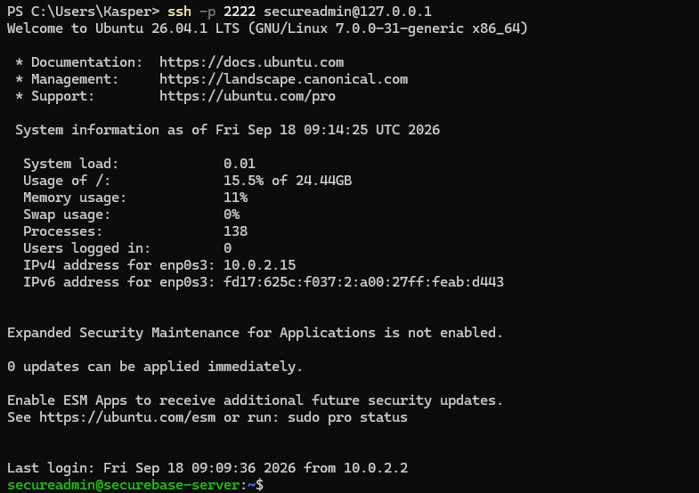

*V12-12. 18. september kl. 09:14:25 UTC: SSH-login som secureadmin lykkes under anden kørsel. Klientkommandoen er ssh -p 2222; den tvinger ikke selv en autentifikationsmetode.*

Sudoers, UFW, monitor og Logrotate genkendes som uændrede. UFW har fortsat den ene eksplicitte SSH-tilladelse fra `10.0.2.2`. Netplan genindlæses ikke, fordi den kontrollerede tilstand allerede passer.

<a id="v12-13"></a>

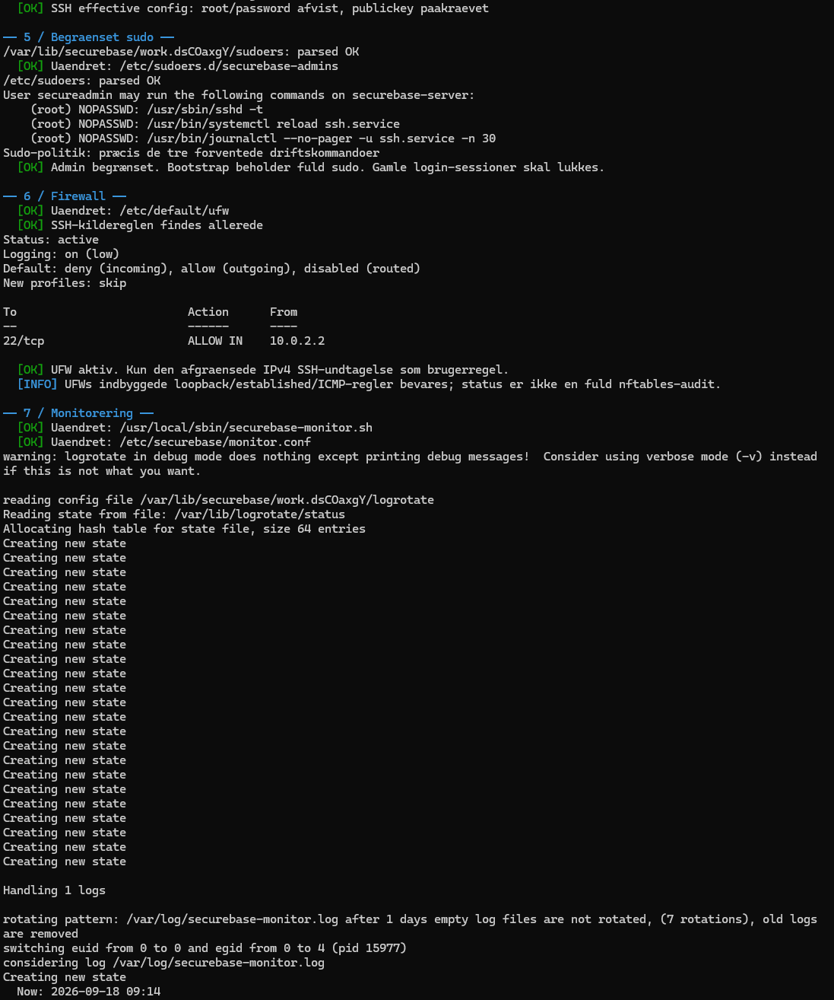

*V12-13. Anden apply: effektiv SSH-hærdning, uændret sudoers med tre afgrænsede NOPASSWD-kommandoer og eksisterende UFW-regel for TCP/22 fra 10.0.2.2. Nederst vises Logrotate-debug.*

<a id="v12-14"></a>

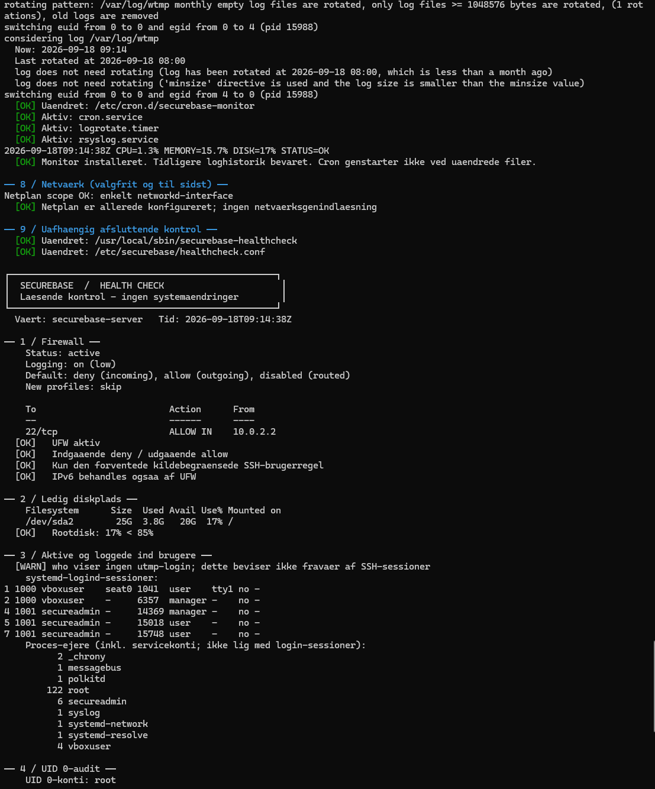

*V12-14. Anden apply kl. 09:14:38Z: Netplan genindlæses ikke; healthcheck og konfiguration er uændrede. UFW er aktiv, disken er 17 % brugt, og who/utmp-advarslen ses sammen med logind-sessioner.*

Det afgørende slutresultat er:

```text
19 OK   1 WARN   0 FAIL
RESULTAT: WARN - gennemgaa bemaerkningerne
[OK] Aendrede administrerede filer i denne koersel: 0
```

<a id="v12-15"></a>

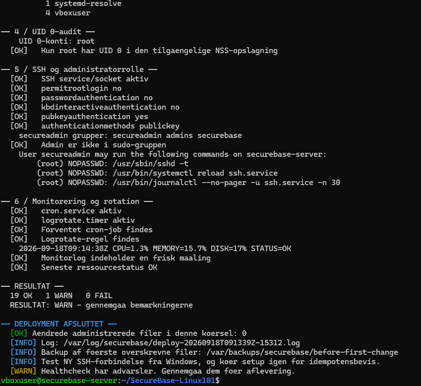

*V12-15. Anden apply afsluttes med 0 ændrede administrerede filer, 19 OK / 1 WARN / 0 FAIL, publickey påkrævet, ingen ekstra UID 0-konti i opslaget og en frisk monitor-linje.*

**Hvad idempotensbeviset dækker:** De administrerede filer behøvede ingen ændring på denne VM med samme input. Konti, ACL og UFW-reglen blev genkendt; netværket blev ikke genindlæst. En ny monitorlinje og en ny deploymentlog er forventet driftsoutput. Der er ikke vist en hash-diff af hele systemet eller en særskilt før/efter-kørsel af `scripts/tools/evidence.sh`.

#### F. Afsluttende identitet og begrænset sudo

```bash
whoami
hostname
sudo -l
```

<a id="v12-16"></a>

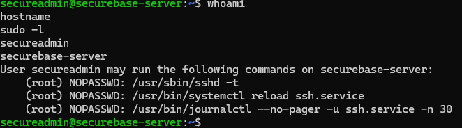

*V12-16. Afsluttende sessionskontrol: whoami viser secureadmin, hostname viser securebase-server, og sudo -l viser kun de tre forventede NOPASSWD-kommandoer.*

Den afsluttende sessionskontrol viser `secureadmin` på `securebase-server` og præcis disse tilladelser:

```text
(root) NOPASSWD: /usr/sbin/sshd -t
(root) NOPASSWD: /usr/bin/systemctl reload ssh.service
(root) NOPASSWD: /usr/bin/journalctl --no-pager -u ssh.service -n 30
```

Billedet viser identitet og sudo-politik, men ikke selve forbindelseskommandoen. Det daterede SSH-login kl. 09:14:25 er fra stoppet under anden apply. Beviserne bliver derfor ikke beskrevet som en separat dokumenteret ny forbindelsesstart efter, at anden apply var helt afsluttet.

#### G. Healthcheckets advarsel og testens rækkevidde

Den konkrete WARN i v1.2-testen er, at `who` ikke viser utmp-login; `systemd-logind` viser samtidig sessioner. Resultatet er **WARN**, ikke et omskrevet rent PASS. UFW, diskplads, UID 0-opslag, SSH/sudo og monitorering fremgår af V12-14 og V12-15.

Det selvstændige healthcheck-program blev her kaldt af setup. Der er ikke vist en separat manuel start af `scripts/healthcheck.sh` i det nye testforløb; den oprindelige selvstændige kørsel fra 17. september findes nedenfor. En fuld genstartstest og de supplerende kontroller i regressionstestplanen er ikke automatisk dækket af denne genkørsel.

Den tidligere formulering om **ingen Ubuntu-deployment af 1.2** gælder ikke længere. Den erstattes af det dokumenterede v1.2-forløb ovenfor; de historiske figurer bliver ikke omdateret. Se også [VM-testrapporten](VM_TEST_REPORT.md), [nyt evidensindeks](../evidence/06-scripting/v1.2-2026-09-18/README.md) og [testplanens status pr. kontrol](TESTPLAN.md).

---

<a id="historisk-forloeb"></a>

### Historisk testforløb — 17. september 2026

**De efterfølgende kommandoer og figurer 6.1–6.18 er det oprindelige testforløb.** I dem lå setup.sh i roden; brug de aktuelle kommandoer ovenfor eller [deploymentvejledningen](DEPLOYMENT.md) ved en ny kørsel. Dette materiale bevares for at vise den oprindelige implementering og dens relation til Modul 1–5.


### 1. Deployment-pakkens opbygning

Projektet er opdelt i et hovedscript, genbrugelige funktioner, særskilte moduler og to selvstændige driftsværktøjer. Hele mappen overføres; setup.sh behøver ikke generere sin egen kildekode ved installationen.

```text
securebase-deployment/
├── setup.sh                  # orkestrator: check eller apply
├── healthcheck.sh            # selvstændig, læsende kontrol
├── monitor.sh                # ressourcer, status og journalbesked
├── config.env                # valgte værdier for denne VM
├── config.env.example        # skabelon med sikre standardvalg
├── keys/secureadmin.pub      # kun offentlig SSH-nøgle
├── lib/common.sh             # config, filinstallation og status
├── modules/                  # opsætning opdelt efter ansvar
├── tools/                    # validering og evidensmanifest
├── tests/                    # isolerede tests
├── docs/                     # testplan og lokalt testresultat
├── README.md                 # kørselsvejledning og afgrænsning
└── START_HER.html             # visuel startside
```

#### Den faktiske kørselsrækkefølge

| Trin i setup.sh | Opgave / kald |
| --- | --- |
| Preflight | Forudsætninger, konfiguration, public key og kendte konflikter |
| 1–3 | System/pakker → brugere/grupper → projektmappe/ACL |
| 4–6 | Public key/SSH → begrænset sudo → UFW |
| 7–8 | Monitorering/cron/logrotate → valgfrit netværk |
| 9 | Installer og kør det selvstændige healthcheck |

Netværksmodulet hedder 02-network.sh, men kaldes bevidst til sidst i ændringsforløbet. Filnummeret bestemmer ikke rækkefølgen: setup.sh kalder funktionerne eksplicit. Det begrænser afhængigheden af en netværksændring under pakke- og SSH-opsætningen.

Kildesteder: setup.sh og README.md, afsnit 1. Fuld kildekode afleveres i deployment-arkivet; rapporten indeholder udvalgte kodeudsnit og faktiske VM-beviser.

### 2. Overførsel uden eksisterende SSH

Den friske VM startede med installationskontoen vboxuser. Pakken blev hentet fra Windows via en midlertidig HTTP-server og udpakket lokalt. Der var derfor ikke behov for først at oprette secureadmin eller bruge SSH til filoverførslen.

```bash
wget http://10.0.2.2:8000/SecureBase_Modul6.tar.gz
ls -lh SecureBase_Modul6.tar.gz
tar -xzf SecureBase_Modul6.tar.gz
cd securebase-deployment
ls -la
```

<a id="figur-6-1"></a>

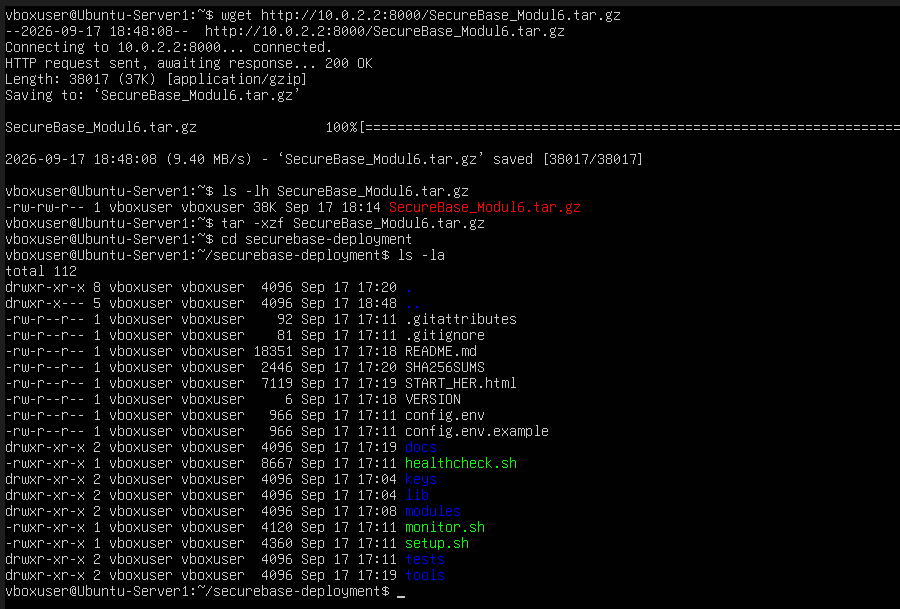

*Figur 6.1. Arkivet hentes med HTTP 200, gemmes med 38.017 bytes og udpakkes. Mappen indeholder blandt andet setup.sh, healthcheck.sh, config.env, keys og modules. (Udsnit af uploadet screenshot.)*

### 2.1 Første preflight med standardvalg

Den første kontrol blev kørt med arkivets uændrede netværksvalg. Her bevares DHCP, mens scriptet undersøger, hvilke forudsætninger og pakker der er på plads. Der foretages endnu ingen installation.

```bash
sudo bash ./setup.sh --check
```

<a id="figur-6-2"></a>

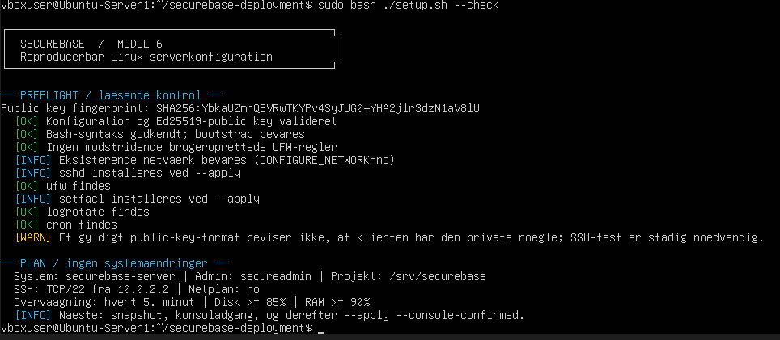

*Figur 6.2. Første preflight godkender konfiguration og nøgle. sshd og setfacl skal installeres ved apply; CONFIGURE_NETWORK=no bevarer netværket i denne første plan.*

| Udskrift | Tolkning i den første plan |
| --- | --- |
| sshd installeres ved --apply | SSH-serveren findes endnu ikke; setup skal installere den. |
| setfacl installeres ved --apply | ACL-værktøjerne kommer med de nødvendige pakker. |
| ufw / logrotate / cron findes | Disse værktøjer findes allerede på testinstallationen. |
| CONFIGURE_NETWORK=no | Ingen statisk netværksændring er endnu tilvalgt. |
| Public key advarsel | Formatvalidering er ikke en klienttest af den private nøgle. |

Dette dokumenterer forudsætningskontrol, ikke en færdig installation. --check er preflight og ikke en fuld simulering af alle ændringer. Netværksvalget ændres eksplicit i næste afsnit.

### 3. Miljøspecifik konfiguration

I arkivets skabelon er netværksændringer fravalgt. På den friske lab-VM blev CONFIGURE_NETWORK ændret til yes. Resten af den viste konfiguration angiver brugere, netværk, nøglefil og driftsgrænser.

<a id="figur-6-3"></a>

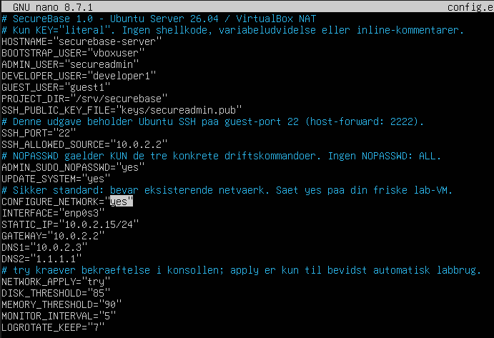

*Figur 6.3. Den anvendte config.env: netværksopsætning er tilvalgt, NETWORK_APPLY=try, og administratorrollen har NOPASSWD kun til de definerede driftskommandoer.*

| Valg | Betydning i dette deployment |
| --- | --- |
| BOOTSTRAP_USER=vboxuser | Eksisterende konto med lokal konsol og fuld sudo bevares. |
| ADMIN_USER=secureadmin | Ny daglig administratorkonto med nøglebaseret SSH. |
| CONFIGURE_NETWORK=yes | Statisk 10.0.2.15/24 på enp0s3; gateway 10.0.2.2. |
| ADMIN_SUDO_NOPASSWD=yes | Ingen passwordprompt for de tre kommandoer – ikke fri root-adgang. |
| 85 / 90 / 5 / 7 | Diskgrænse, RAM-grænse, cron-minutter og antal gamle rotationer. |

Konfigurationen i denne VM afviger på CONFIGURE_NETWORK fra arkivets sikre standard no. Det er den viste yes-konfiguration, som fresh-install-testen og genkørslen bygger på.

### 4. Preflight før systemændringer

<a id="figur-6-4"></a>

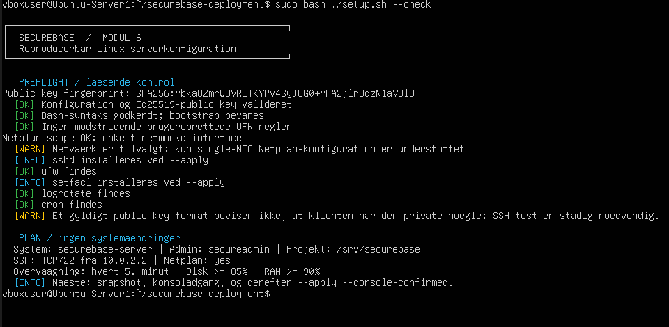

*Figur 6.4. Anden preflight viser Netplan: yes og godkender scope som ét networkd-interface. Pakker, konfiguration og public key er kontrolleret før apply.*

#### Kontrol før ændring

00-preflight.sh kontrollerer blandt andet Ubuntu-version, systemd, installationskontoens sudo/password, det valgte interface, nøgleformat, Bash-syntaks og udvalgte konflikter. Den enkle netværksmodel afgrænses eksplicit; scriptet lover ikke støtte til alle mulige Ubuntu-netværk.

| Mekanisme | Formål |
| --- | --- |
| Literal config-parser | config.env læses som KEY="værdi". Den bliver ikke udført med source. |
| Kendte nøgler og værdier | Ukendte/dobbelte felter og ugyldige værdier afvises. |
| Pakke- og scope-kontrol | Manglende nødvendige pakker identificeres; unsupported netværk stoppes. |
| SSH-nøglekontrol | Nøgleformat kontrolleres; en ekstern login-test er stadig nødvendig. |

Advarslen om private key er tilsigtet: serveren har kun public key. Et korrekt format kan ikke dokumentere, at Windows-klienten råder over den tilhørende private nøgle. Derfor har apply en særskilt KEY-OK-bekræftelse.

Kildesteder: lib/common.sh: load_config(), modules/00-preflight.sh og tools/validate_config.py. De viste kontroller er præflight; de er ikke i sig selv et bevis på det efterfølgende deployment.

### 5. Første apply: system og pakker

```bash
sudo bash ./setup.sh --apply --console-confirmed
```

Apply blev kørt fra VirtualBox-konsollen som vboxuser. --console-confirmed er administratorens bekræftelse på en lokal vej tilbage, ikke en automatisk sikkerhedstest. Scriptet installerer nødvendige pakker og genstarter ikke VM’en automatisk.

<a id="figur-6-5"></a>

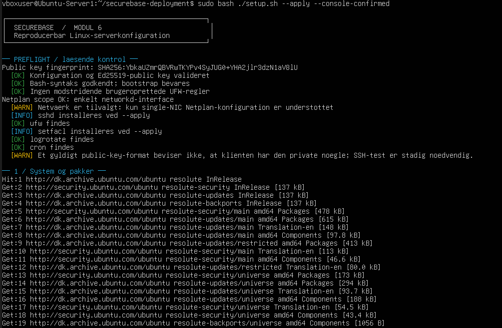

*Figur 6.5. Første apply starter med godkendt preflight og går videre til pakkeopdatering. Ubuntu-arkiverne kontaktes før den øvrige konfiguration.*

| Del | Implementeret handling |
| --- | --- |
| UPDATE_SYSTEM=yes | apt-get update og apt-get upgrade -y. |
| Nødvendige pakker | Blandt andet openssh-server, ufw, acl, logrotate, cron, rsyslog, procps og netplan.io. |
| Hostname | securebase-server; /etc/hosts administreres særskilt. |
| Fejl og genstart | Fejl stopper forløbet. Genstartskrav rapporteres; ingen automatisk VM-reboot. |

Kildested: modules/01-system.sh. En eventuel servicegenstart ved pakkeopdatering er ikke det samme som en automatisk genstart af hele VM’en.

### 6. Brugere, ACL og nøgle-bootstrap

Det første apply opretter de manglende rollegrupper og konti, bevarer bootstrap-kontoen og konfigurerer projektets access/default ACL. Public key installeres på secureadmin, før SSH-hærdningen fortsætter.

<a id="figur-6-6"></a>

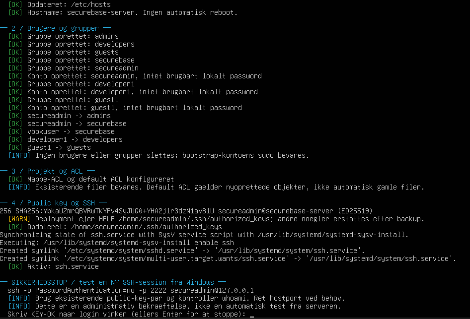

*Figur 6.6. Første kørsel opretter roller og brugere, konfigurerer ACL og installerer authorized_keys. Derefter stopper scriptet ved den planlagte eksterne SSH-test. (Udsnit af uploadet screenshot.)*

#### Sikkerhedsstop før SSH-hærdning

```bash
# Fra Windows under det planlagte stop:
ssh -o PasswordAuthentication=no -p 2222 secureadmin@127.0.0.1
# I den nye Ubuntu-session:
whoami
# I deployment-konsollen efter vellykket test:
KEY-OK
```

Prompten er en administrativ bekræftelse. Den afsluttende SSH-test i afsnit 15 er det direkte klientbevis i rapporten. Den private klientnøgle indgår ikke i deployment-pakken.

### 7. Bevidst afgrænsning af SSH og sudo

#### Public key og serveridentitet

keys/secureadmin.pub installeres i /home/secureadmin/.ssh/authorized_keys. Pakken administrerer hele denne fil: eksisterende indhold sikkerhedskopieres og kan blive erstattet. Det undgår append-dubletter, men bevarer ikke automatisk andre administratornøgler.

```bash
# Fra modules/05-ssh.sh:
install_managed "$WORK/authorized_keys" \
    "$home/.ssh/authorized_keys" 0600 "$ADMIN_USER" "$ADMIN_USER"
ssh-keygen -A
```

Klientens private nøgle forbliver på Windows. ssh-keygen -A vedrører derimod SSH-serverens hostnøgler og udføres for manglende servernøgler; eksisterende hostidentitet erstattes ikke af deploymentet. Kilder: 05-ssh.sh og pakkens README, afsnit 5.

#### Ændring fra den manuelle Modul 3-model

Nye konti oprettes uden brugbare lokale passwords. Derfor bruges NOPASSWD til tre eksakte sudo-kommandoer i deploymentet. Den oprindelige Modul 3-dokumentation beskriver den tidligere passwordkrævende model; den nye sluttilstand er nedenstående.

```sudoers
%admins ALL=(root) NOPASSWD: /usr/sbin/sshd -t
%admins ALL=(root) NOPASSWD: /usr/bin/systemctl reload ssh.service
%admins ALL=(root) NOPASSWD: /usr/bin/journalctl --no-pager -u ssh.service -n 30
```

| Rolle | Sluttilstand i deploymentet |
| --- | --- |
| secureadmin / admins | Nøglebaseret SSH; kun de tre konkrete sudo-kommandoer. |
| developer1 / developers | Projektadgang gennem gruppens ACL; ingen tilsigtet sudo-rolle. |
| guest1 / guests | Læse-/gennemgangsadgang gennem ACL; ingen tilsigtet sudo-rolle. |
| vboxuser / bootstrap | Fuld sudo bevares til installation og gendannelse; ingen skjult konto. |

06-sudo.sh validerer sudoers, fjerner admin fra den brede sudo-gruppe og tester både en tilladt SSH-kontrol og et afvist sudo id. Den endelige sudo-liste fra den nye SSH-session vises i figur 6.18.

### 8. Statisk netværk og første afslutning

Netværket håndteres efter de øvrige opsætningstrin. 02-network.sh genererer en kandidat, validerer Netplan og migrerer den understøttede single-NIC-konfiguration til 99-securebase.yaml. Sluttilstanden blev derefter aflæst uden at ændre noget.

```bash
ip -br a
ip route
sudo cat /etc/netplan/99-securebase.yaml
```

<a id="figur-6-7"></a>

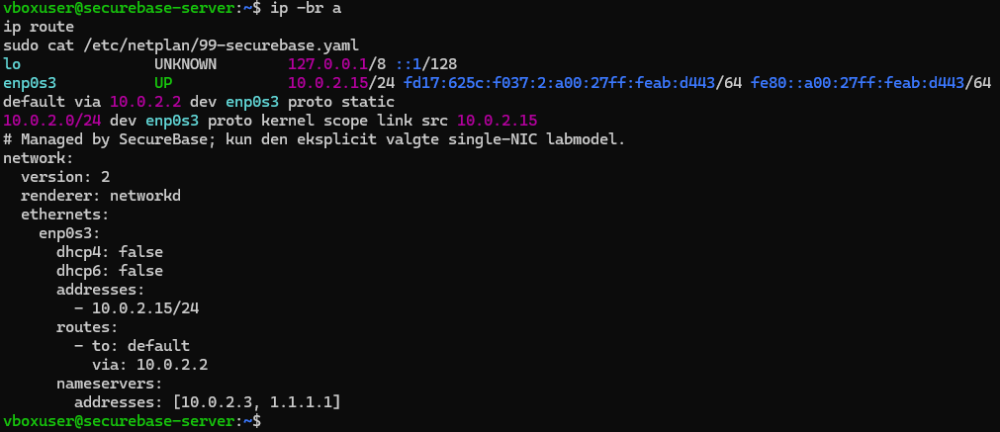

*Figur 6.7. Efterkontrollen viser enp0s3 med 10.0.2.15/24, default route via 10.0.2.2 med proto static samt den genererede YAML med DHCP slået fra.*

DNS-adresserne i den viste fil er 10.0.2.3 og 1.1.1.1. IPv6-adresser fremgår stadig af interfacet; dhcp6: false er derfor ikke dokumentation for, at IPv6 som helhed er deaktiveret. Healthcheckets UFW-kontrol omtaler IPv6 separat.

<a id="figur-6-8"></a>

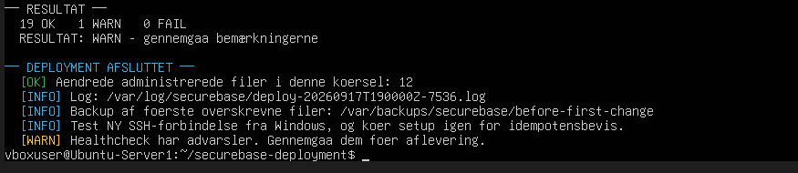

*Figur 6.8. Første apply afsluttes med 12 ændrede administrerede filer og healthcheck-resultatet 19 OK, 1 WARN, 0 FAIL. Log- og backupplacering oplyses. (Udsnit af uploadet screenshot.)*

Den første gennemførte kørsel bruges som reference. Det selvstændige healthcheck og den efterfølgende genkørsel dokumenteres i de næste afsnit.

### 9. Monitorering installeres som drift

Deploymentet installerer monitor.sh på den samme systemsti som i Modul 5, men målemetoden er forbedret i pakkens version 2. Konfigurationsværdierne udskilles i /etc/securebase/monitor.conf; den eksisterende log tømmes ikke.

| Del | Implementeret løsning i pakken |
| --- | --- |
| CPU | To aflæsninger af /proc/stat med ét sekund imellem. Idle og iowait regnes ikke som busy i denne model. |
| RAM | (MemTotal − MemAvailable) / MemTotal fra /proc/meminfo. |
| Disk og tid | df -P / måler root-filsystemet. Tidsstemplet er UTC med afsluttende Z. |
| Overlappende kørsler | flock på en separat monitor-lås; ingen parallel logskrivning fra samme job. |
| Advarsler | Disk ≥ 85 eller RAM ≥ 90 giver status og user.warning til journalen. |
| Logfiler | root:adm, 0640. Nyåbning ved hver kørsel; loggen bevares ved deployment. |

#### Installeret tidsplan og rotationsregel

```bash
# /etc/cron.d/securebase-monitor
SHELL=/bin/bash
PATH=/usr/sbin:/usr/bin:/sbin:/bin
LC_ALL=C
MAILTO=""
*/5 * * * * root /usr/local/sbin/securebase-monitor.sh
```

```bash
# /etc/logrotate.d/securebase-monitor
/var/log/securebase-monitor.log {
    su root adm
    daily
    rotate 7
    compress
    delaycompress
    missingok
    notifempty
    create 0640 root adm
}
```

CPU-værdien er ikke et femminutters gennemsnit. Der er ingen ekstern mail-/SMS-alarm. Kildesteder: monitor.sh og modules/08-monitoring.sh; den faktiske monitor-linje efter installation fremgår af healthchecket.

### 10. Selvstændigt healthcheck: systemstatus

Efter første deployment blev sudo ./healthcheck.sh kørt særskilt. Scriptet læser den installerede tilstand og foretager ikke reparation eller installation. Det viser flere kilder til bruger-/sessionsoplysninger.

<a id="figur-6-9"></a>

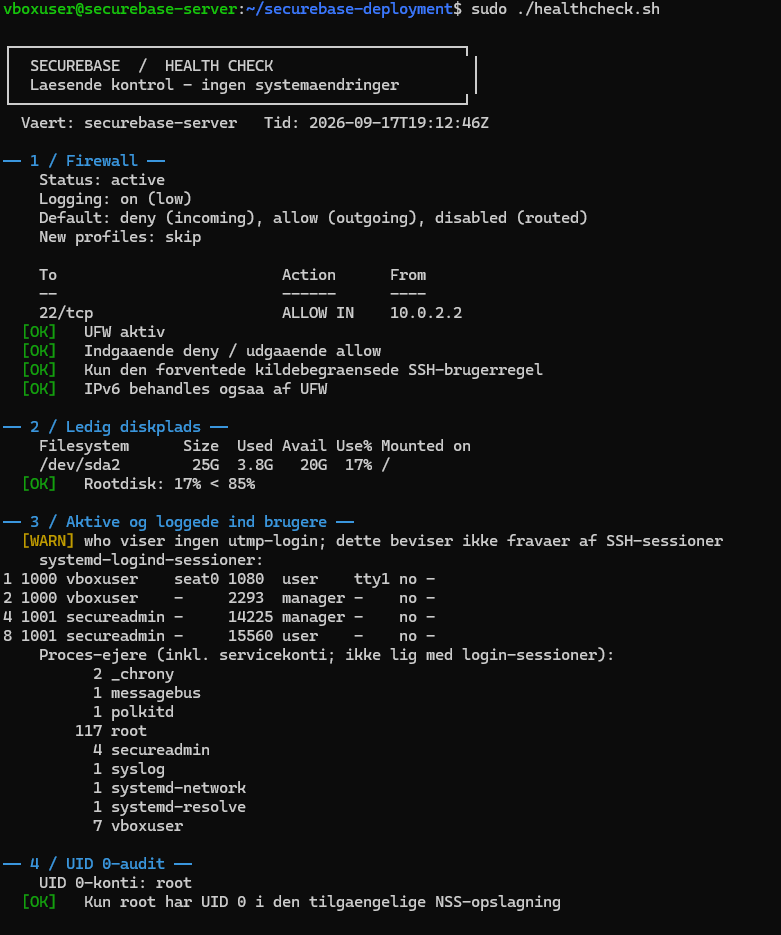

*Figur 6.9. Selvstændigt healthcheck: aktiv UFW, kildebegrænset SSH-regel, ca. 20G ledig diskplads, sessionsoplysninger og kun root med UID 0 i NSS-opslaget.*

Resultatet om sessioner skal læses med advarslen: who er tom, mens systemd-logind viser både vboxuser og secureadmin. Proces-ejere vises særskilt og er ikke i sig selv en liste over login-sessioner.

### 10.1 Healthcheck: SSH, drift og advarsel

<a id="figur-6-10"></a>

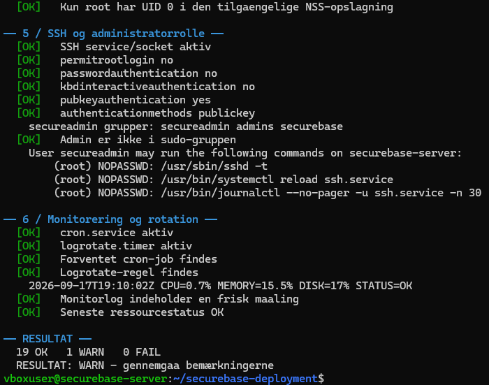

*Figur 6.10. Samme selvstændige kontrol viser SSH-hærdning, admin uden sudo-gruppemedlemskab, de tre NOPASSWD-regler samt aktiv cron/logrotate og en frisk monitor-linje. Resultat: 19 OK, 1 WARN, 0 FAIL.*

#### Hvordan skal WARN forstås?

Den konkrete advarsel er: who viser ingen utmp-login. Scriptet undlader derfor at konkludere, at ingen er logget ind, og viser i stedet systemd-logind-sessioner. Advarslen er bevaret i dokumentationen; resultatet omskrives ikke til et rent PASS.

| Returkode | Scriptets betydning |
| --- | --- |
| 0 | PASS: de viste kontroller består uden advarsler. |
| 1 | WARN: mindst én bemærkning skal vurderes, men ingen registreret FAIL. |
| 2 | FAIL: mindst én registreret fejl i healthchecket. |

setup.sh viderefører healthcheckets advarselsstatus, selv om opsætningen når DEPLOYMENT AFSLUTTET. Derfor er en afsluttende returkode 1 ikke automatisk en mislykket installation i netop denne pakke. Kilder: setup.sh og healthcheck.sh.

### 11. Kravene implementeret i healthcheck.sh

Healthchecket kan køres direkte fra projektmappen eller som det installerede /usr/local/sbin/securebase-healthcheck. Det sourcer ikke projektets lib/common.sh og kan derfor bruges uafhængigt af deploymentmappen.

| Obligatorisk kontrol | Kommando / implementering | Dokumentation |
| --- | --- | --- |
| Firewall | ufw status verbose og ufw show added; sammenligning med forventet politik. | Fig. 6.9 |
| Ledig diskplads | df -hP / og procent fra df -P /. | Fig. 6.9 |
| Aktive / loggede ind brugere | who; loginctl list-sessions; proces-ejere vises separat. | Fig. 6.9 |
| Ekstra UID 0 | getent passwd efterfulgt af awk-filter på tredje felt. | Fig. 6.9 |
| Supplerende kontroller | SSH, sudo-liste, cron, logrotate og monitor-loggens friskhed. | Fig. 6.10 |

#### Kodeudsnit: UID 0-kontrollen

```bash
if accounts=$(getent passwd); then
    root_accounts=$(awk -F: '$3==0 {print $1}' <<< "$accounts")
    extra=$(awk -F: '$3==0 && $1!="root" {print $1}' <<< "$accounts")
    if [[ -n $extra ]]; then
        fail "Ekstra UID 0-konti: $extra"
    elif [[ $root_accounts == root ]]; then
        ok 'Kun root har UID 0 i den tilgaengelige NSS-opslagning'
    else
        fail 'Forventet root-konto med UID 0 mangler'
    fi
else
    fail 'getent passwd fejlede'
fi
```

Her er $3 UID-feltet, og $1 er kontonavnet i passwd-formatet. En tom liste over ekstra konti er kun positiv, når den forventede root-konto også findes. Det er derfor ikke nok blot at teste, at et grep-opslag ikke giver output.

Kildested: healthcheck.sh, afsnittet UID 0-audit. Udsnittet er fra den leverede kode. Resultatet gælder de konti, som det viste NSS-opslag returnerede, ikke en fuldstændig sikkerhedsaudit af alle mulige identitetskilder.

### 12. Funktioner, variable og fejlhåndtering

#### Fælles udgangspunkt i hovedscriptet

```bash
#!/bin/bash
set -Eeuo pipefail
export PATH=/usr/sbin:/usr/bin:/sbin:/bin
export LC_ALL=C
umask 027
SCRIPT_DIR=$(cd -- "$(dirname -- "${BASH_SOURCE[0]}")" && pwd -P)
source "$SCRIPT_DIR/lib/common.sh"
```

| Konstruktion | Anvendelse i løsningen |
| --- | --- |
| Variable | HOSTNAME, ADMIN_USER, PROJECT_DIR og thresholds adskiller værdier fra logik. |
| Funktioner | system_setup(), users_setup(), ssh_setup() m.fl. opdeler ansvar. |
| Betingelser | Eksisterende grupper/filer kontrolleres, før de oprettes eller udskiftes. |
| set -Eeuo pipefail | Fejlhåndteringsgrundlag: udefinerede variable og pipeline-fejl bliver synlige; ERR-trap giver fejlsted. |
| flock og mktemp | Forhindrer parallelle setup-kørsler og opretter særskilt arbejdsområde. |
| Validering før aktivering | SSH-kandidat, sudoers, Netplan og Logrotate kontrolleres før/under installation. |

#### Kodeudsnit: en gruppe sikres uden dubletter

```bash
ensure_group() {
    if getent group "$1" >/dev/null; then
        [[ $(getent group "$1" | cut -d: -f3) -ge 1000 ]] || \
            die "Rolle-/brugergruppe $1 har system-GID; afklar manuelt"
        ok "Gruppe findes: $1"
    else
        groupadd "$1"
        ok "Gruppe oprettet: $1"
    fi
}
```

Fejlstop er ikke en fuld transaktion: tidligere moduler kan allerede være gennemført, hvis et senere modul fejler. Pakken har førstegangsbackups og særskilte gendannelsesforsøg, men lover ikke automatisk tilbagerulning af hele serveren. Kilder: setup.sh, lib/common.sh og 03-users.sh.

### 13. Idempotens i filinstallationen

Genkørsel skal bevare den ønskede konfiguration med samme input. Det er ikke et krav, at driftslogs, tidsstempler og Ubuntu-pakkearkivets indhold står stille. Pakken bruger install_managed() til at sammenligne indhold og metadata før installation.

#### Udsnit fra lib/common.sh

```bash
CHANGED=0
if [[ -f $target ]] && cmp -s -- "$source" "$target"; then
    old=$(stat -c '%a:%u:%g' "$target")
    if [[ $old == "$wanted" ]]; then
        ok "Uaendret: $target"
        return 0
    fi
    backup_once "$target"
    chown "$owner:$group" "$target"
    chmod "$mode" "$target"
else
    # Destinationen valideres, og den tidligere fil sikkerhedskopieres.
    backup_once "$target"
    temp=$(mktemp "$parent/.securebase.XXXXXXXX")
    install -m "$mode" -o "$owner" -g "$group" -- "$source" "$temp"
    mv -fT -- "$temp" "$target"
fi
CHANGED=1
CHANGES=$((CHANGES+1))
```

Udsnittet viser sammenlignings- og installationsdelen; funktionens forudgående validering af kilde, destination og ejerskab fremgår af den fulde kildefil. En eksisterende uændret fil giver ikke et nyt append eller en ny indholdsversion.

| Område | Sådan undgås gentagne ændringer |
| --- | --- |
| Brugere og grupper | getent og medlemskabskontrol før oprettelse/tilføjelse. |
| authorized_keys / cron | Hele den administrerede fil sammenlignes; ingen gentagen >>. |
| Projekt-ACL | Den eksisterende ACL sammenlignes med en fast ønsket ACL. |
| UFW | Den ene tilladte SSH-regel genkendes; ukendte regler stoppes til vurdering. |
| Netplan | Fil, metadata og aktuel IPv4/route kontrolleres; ingen genindlæsning ved korrekt tilstand. |

### 14. Genkørsel: pakker og konti

Efter den første installation og netværkskontrollen blev hele setup kørt igen med samme valgte konfiguration. UPDATE_SYSTEM=yes var fortsat aktiv; genkørslen var ikke kun en test af enkelte funktioner.

```bash
sudo bash ./setup.sh --apply --console-confirmed
```

<a id="figur-6-11"></a>

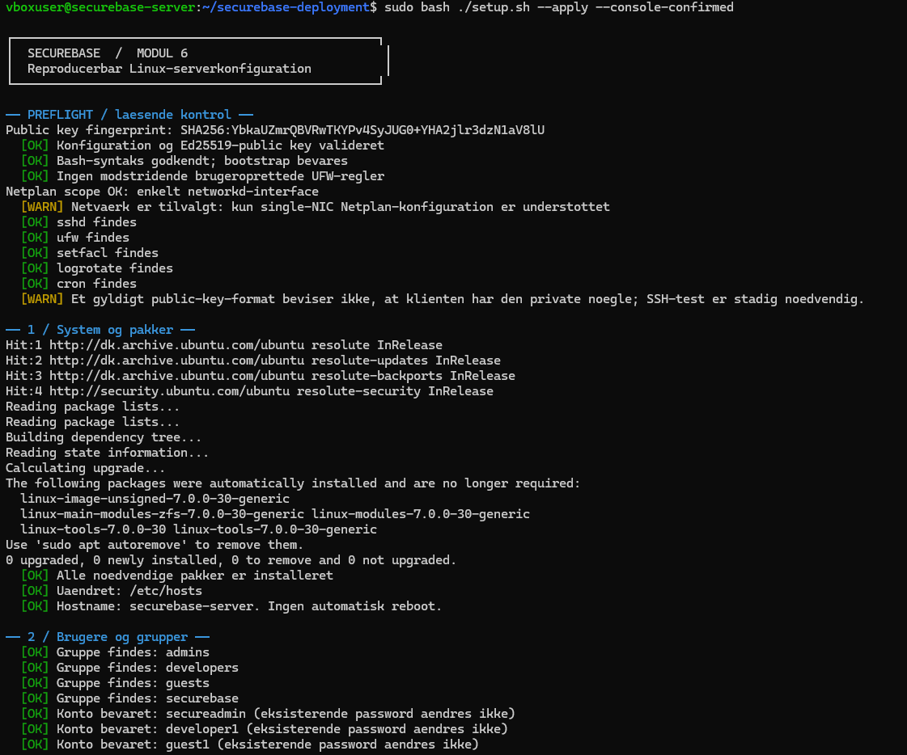

*Figur 6.11. Anden apply: ingen pakker opgraderes eller installeres, /etc/hosts er uændret, grupperne findes, og de eksisterende konti bevares.*

Skærmbilledet viser 0 upgraded, 0 newly installed, 0 to remove and 0 not upgraded. Det er den observerede pakke-status ved denne kørsel; fremtidige arkivopdateringer kan give nye pakkeversioner uden at skabe konfigurationsdubletter.

De efterfølgende sider viser bevarelse af nøgler, sudoers, firewall og driftsfiler samt den samlede ændringstæller.

### 14.1 Genkørsel: ACL, public key og sudo

<a id="figur-6-12"></a>

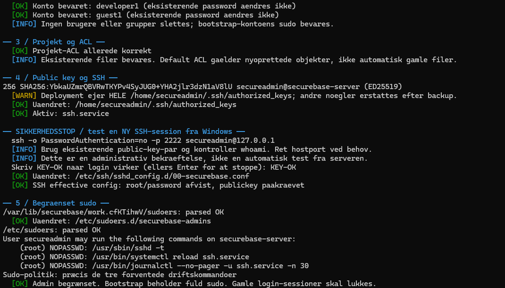

*Figur 6.12. Projekt-ACL er allerede korrekt; authorized_keys, SSH-konfiguration og sudoers er uændrede. KEY-OK er indtastet ved sikkerhedsstoppet, og sudo-politikken er de tre forventede kommandoer. (Udsnit af uploadet screenshot.)*

#### Hvad viser denne del af genkørslen?

| Observation | Faglig betydning |
| --- | --- |
| Projekt-ACL allerede korrekt | Genkørslen behøver ikke genopbygge projektets adgangsregler. |
| authorized_keys: uændret | Nøglen bliver ikke lagt ind igen som en ekstra linje. |
| SSH-filen: uændret | Hærdningsindstillingerne matcher den ønskede fil. |
| Sudoers: uændret | Rollefilen er bevaret, og den indlæste politik er kontrolleret. |
| Bootstrap bevares | vboxuser har fortsat opsætnings-/gendannelsesadgang. |

Dette er output fra deploymentets egne kontroller. Den senere, nye SSH-session er et separat funktionsbevis for den administrationsvej, som reglerne skal beskytte.

Pakkens advarsel om hele authorized_keys er et designvilkår, ikke en fejl i denne kørsel. Den står synligt, også når filen er uændret.

### 14.2 Genkørsel: firewall, drift og netværk

<a id="figur-6-13"></a>

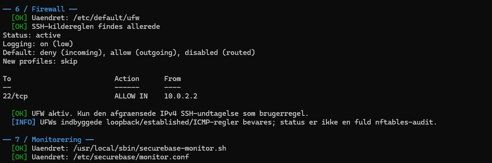

*Figur 6.13. UFW-kildereglen findes allerede; kun TCP/22 fra 10.0.2.2 står som eksplicit brugerregel. Monitor-script og monitor.conf er uændrede. (Udsnit af uploadet screenshot.)*

<a id="figur-6-14"></a>

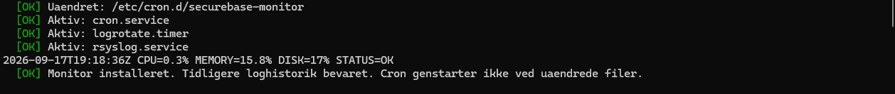

*Figur 6.14. Cronfilen er uændret; cron, logrotate og rsyslog er aktive. En ny monitor-måling tilføjes uden at slette loghistorik. (Udsnit af uploadet screenshot.)*

<a id="figur-6-15"></a>

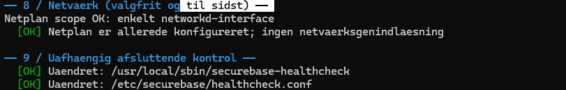

*Figur 6.15. Netplan er allerede konfigureret og genindlæses ikke. Den installerede healthcheck og dens konfiguration er også uændrede. (Udsnit af uploadet screenshot.)*

De lange Logrotate-udskrifter i råmaterialet er debug-validering, ikke tvungne rotationer. De er ikke gengivet i fuld længde, fordi de gentager kontrol af systemets øvrige logregler. I genkørslen vises også, at SecureBase-rotationsfilen er uændret.

Monitoren skriver en ny datalinje ved apply. Det er forventet driftsoutput og ikke det samme som, at en administreret konfigurationsfil er ændret. Den sondring er vigtig for at forstå ændringstælleren.

### 14.3 Samlet resultat af anden apply

<a id="figur-6-16"></a>

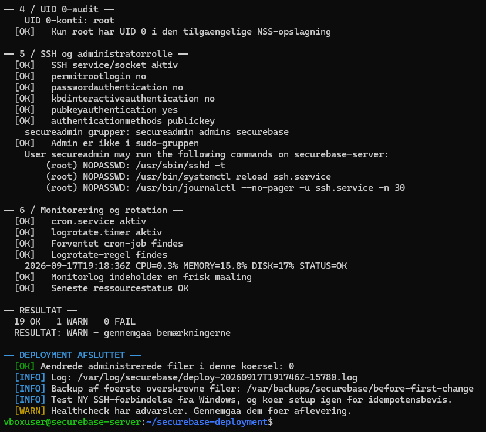

*Figur 6.16. Anden kørsel afsluttes med 19 OK, 1 WARN, 0 FAIL og Aendrede administrerede filer i denne koersel: 0. En ny deployment-log er oprettet; førstegangsbackups bevares. (Udsnit af uploadet screenshot.)*

#### Idempotensbevisets rækkevidde

Genkørslen viser, at de administrerede filer ikke behøvede ændring, at kendte roller og regler blev genkendt, og at netværket ikke blev genindlæst. Det er et konkret idempotensbevis for denne konfiguration og denne VM.

Tælleren er ikke en hash-sammenligning af hele operativsystemet. Logfiler og målinger ændres normalt; en uafhængig før/efter-kørsel af tools/evidence.sh er ikke vist i screenshots. Rapporten kalder derfor ikke hele disken bit-identisk.

### 15. Sluttest: ny SSH-session og adminrolle

Efter genkørslen blev den eksisterende SSH-forbindelse lukket, og en ny forbindelse fra Windows blev oprettet. Den landede på securebase-server som secureadmin.

<a id="figur-6-17"></a>

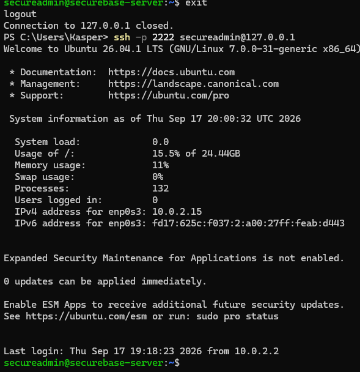

*Figur 6.17. Windows opretter en ny ssh -p 2222-forbindelse. Login lykkes på Ubuntu 26.04.1 LTS efter den anden apply-kørsel.*

<a id="figur-6-18"></a>

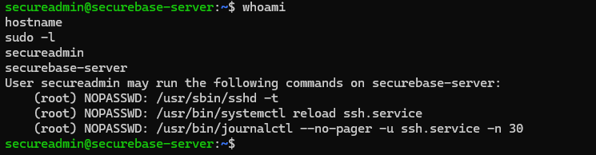

*Figur 6.18. Sidste direkte kontrol: whoami viser secureadmin, hostname viser securebase-server, og sudo -l viser kun de tre specifikke NOPASSWD-kommandoer.*

Kommandoen i klientbilledet tvinger ikke selv en autentifikationsmetode. Nøglekravet understøttes derfor af kombinationen af vellykket ny forbindelse og den dokumenterede effektive SSH-konfiguration: authenticationmethods publickey og passwordauthentication no.

### 16. Kort kørselsvejledning til afleveringen

Kildepakken og denne rapport har forskellige roller: pakken indeholder den fulde, kommenterede kode, mens rapporten forklarer modellen og dokumenterer kørslerne. På en ny VM tilpasses config.env og public key, før apply bruges.

#### Forberedelse og preflight

```bash
tar -xzf SecureBase_Modul6.tar.gz
cd securebase-deployment
nano config.env
sudo bash ./setup.sh --check
```

Brug installationskontoen angivet i BOOTSTRAP_USER, her vboxuser. Den friske test bruger CONFIGURE_NETWORK="yes" og NETWORK_APPLY="try". VirtualBox NAT-forwarden skal være oprettet på Windows-værten før SSH-sikkerhedsstoppet.

#### Deployment og ekstern bekræftelse

```bash
sudo bash ./setup.sh --apply --console-confirmed
# Ved det planlagte stop, i Windows PowerShell:
ssh -o PasswordAuthentication=no -p 2222 secureadmin@127.0.0.1
# Bekræft først KEY-OK i deployment-konsollen efter fungerende login.
```

Netplan-testen håndteres i den oprindelige deployment-konsol. Serverens guest-port er 22; 2222 er værtsporten. En anden hostport vælges, hvis en anden VM allerede bruger 2222.

#### Kontrol og gentagen kørsel

```bash
sudo ./healthcheck.sh
sudo bash ./setup.sh --apply --console-confirmed
# Installeret kontrolværktøj, uafhængigt af projektmappen:
sudo /usr/local/sbin/securebase-healthcheck
```

Healthcheck: 0 = PASS, 1 = WARN, 2 = FAIL. I denne test er WARN vurderet ud fra who/utmp-linjen og logind-outputtet. Private nøgler/passwords må ikke lægges i konfigurationen.

Dette historiske afsnit beskriver den oprindelige test fra 17. september. Den nyere verifikation fra 18. september står i afsnittet om v1.2 ovenfor. Aktuelle website- og kodetests står i [TESTRESULTATER.md](TESTRESULTATER.md).

### 17. Kildekode og scriptoversigt

Alle scripts afleveres som filer i SecureBase_Modul6.tar.gz eller SecureBase_Modul6.zip. Arkiverne indeholder samme deployment-projekt. Rapportens uddrag erstatter ikke kildefilerne; hele mappestrukturen skal følge med ved aflevering.

| Fil / placering | Ansvar |
| --- | --- |
| setup.sh | Argumenter, preflight, lås, logging, eksplicit kørselsrækkefølge og slutstatus. |
| healthcheck.sh | Selvstændige læsekontroller; ingen installation eller reparation. |
| monitor.sh | CPU/RAM/disk, thresholds, logning; --sample og --self-test. |
| lib/common.sh | Literal konfiguration, statusfunktioner, backup, filinstallation og medlemskab. |
| modules/00-preflight.sh | Forudsætninger og konflikter før ændringer. |
| modules/01-system.sh | Opdatering, nødvendige pakker, hostname og /etc/hosts. |
| modules/02-network.sh | Valgfrit single-NIC Netplan; køres sidst. |
| modules/03-users.sh | Rollegrupper, konti og gruppemedlemskaber. |
| modules/04-storage-acl.sh | Projektrodens ejerskab, SGID og access/default ACL. |
| modules/05-ssh.sh | Public key, eksternt teststop og SSH-hærdning. |
| modules/06-sudo.sh | Tre afgrænsede regler; validering og negativ sudo-test. |
| modules/07-firewall.sh | Én SSH-kilderegel; UFW-politik og IPv6-håndtering. |
| modules/08-monitoring.sh | Installer monitor, cron, logrotate og aktivér tjenester. |
| tools/validate_config.py | Semantisk validering af konfiguration og nøgleformat. |
| tools/netplan_scope.py | Afgrænsning til understøttet Netplan-model. |
| tools/check_sudo_listing.py | Kontrol af den faktiske liste over sudo-tilladelser. |
| tools/evidence.sh | Valgfrit konfigurationsmanifest; ingen særskilt VM-diff vist. |
| tests/test_bundle.py | Isoleret lokal testsuite; ikke det samme som VM-deployment. |
| config.env(.example) / keys/ | Miljøværdier og public key; ingen private credentials. |
| README.md / docs/ / START_HER.html | Vejledning, testplan, kildehenvisninger og historisk lokal teststatus. |

Kildehenvisninger i Modul 6 angiver disse filnavne og funktioner. Figurer 6.1–6.18 henviser til brugerens uploadede terminalbilleder fra fresh-install-testen og slutkontrollerne.

### 18. Samlet test- og afleveringsstatus

| Krav / kontrol | Dokumenteret resultat | Bevis |
| --- | --- | --- |
| Automatisér Modul 1–5 | Modulopdelt setup installerer og konfigurerer serveren. | Afsnit 1–9; kildepakke |
| Fresh-install-test | Pakken overføres; preflight og første apply gennemføres. | Fig. 6.1–6.8 |
| Statisk IP og route | 10.0.2.15/24; default via 10.0.2.2; genereret Netplan. | Fig. 6.7 |
| Selvstændigt healthcheck | Firewall, disk, sessioner og UID 0 samt SSH/drift vises. | Fig. 6.9–6.10 |
| Funktioner / variable / betingelser | Moduler, config-parser, ensure-funktioner og statuslogik. | Afsnit 11–13; kildepakke |
| Fejlhåndtering | set -Eeuo pipefail, kontrol før aktivering og fejlstatus. | Afsnit 12; kildepakke |
| Idempotent genkørsel | Konti/regler bevares; 0 ændrede administrerede filer. | Fig. 6.11–6.16 |
| SSH efter genkørsel | Ny forbindelse lykkes; identitet og sudo-rolle kontrolleret. | Fig. 6.17–6.18 |
| Kommenteret kode og vejledning | Komplette scripts i pakken; kort kørselsvejledning i rapporten. | Afsnit 16–17 |
| Eksempeloutput | Faktisk output fra healthcheck: 19 OK, 1 WARN, 0 FAIL. | Fig. 6.9–6.10, 6.16 |

#### Dokumentationsmæssig afgrænsning

Healthcheckets ene advarsel er ikke fjernet fra materialet. Den viser begrænsningen ved who/utmp i den undersøgte VM; logind viser sessioner. Resultatet er WARN, ikke et ubetinget PASS eller en fuld sikkerhedscertificering.

Genkørslen gælder samme labkonfiguration. Der er ikke vist en separat hash-diff af hele systemet, en ny fuld genstartstest eller drift på andre Ubuntu-/netværksmodeller. Projektets eksisterende filer migreres ikke rekursivt; pakken understøtter ikke generelt alle serveropsætninger.

Grundlag for kravene: Linux 101.pdf, Modul 6, side 7–8. Den inkluderede lokale testsuite-rapport dokumenterer 20 tidligere container-tests; VM-beviserne i dette modul er en anden og efterfølgende testfase.

### 19. Afsluttende konklusion – Modul 1–6

SecureBase-forløbet er afsluttet fra manuel serveropsætning til en reproducerbar deployment-pakke. Rapporten samler de konkrete konfigurationer, de valgte sikkerhedsbegrundelser og terminalbeviser fra alle seks moduler.

| Modul | Resultat i det samlede forløb |
| --- | --- |
| 1 · VM og netværk | Ubuntu Server, statisk IPv4, sigende hostname og nøglebaseret SSH. |
| 2 · Filsystem og adgang | Gruppebaseret projektmappe, rettelse af usikre testrettigheder og midlertidig ACL. |
| 3 · Brugere og grupper | Adskilte roller, developer/guest-adgang og begrænset daglig administration. |
| 4 · Firewall | Default deny, afgrænset SSH-kilde og dokumenteret webtest med oprydning. |
| 5 · Monitorering og logging | Ressourcemålinger via cron, logrotation, loginanalyse og afprøvede advarsler. |
| 6 · Bash og automatisering | Deployment på separat Ubuntu-test-VM, selvstændigt healthcheck og idempotent genkørsel. |

#### Det afgørende slutbevis

```text
Første apply:  12 ændrede administrerede filer
Anden apply:   0 ændrede administrerede filer
Healthcheck:   19 OK / 1 WARN / 0 FAIL
Ny SSH:        secureadmin@securebase-server
Adminrolle:    Tre specifikke NOPASSWD-kommandoer
```

Den manuelle opsætning og deploymentet er ikke identiske i alle implementeringsdetaljer. Modul 6 gør trekommando-rollen passwordfri for nye konti uden lokalt password, bruger en separat monitor-konfiguration og ændrer monitorens CPU-/RAM-måling. Ændringerne er beskrevet eksplicit, så tidligere moduler kan læses som historik og Modul 6 som den testede deployment-sluttilstand.

#### Aflevering

Aflever denne samlede Word-rapport sammen med deployment-arkivet. Rapporten dokumenterer forløbet og resultaterne; arkivet indeholder de kommenterede scripts, konfigurationseksempel, public key og kørselsvejledning. Den private SSH-nøgle indgår ikke i materialet.

Endelig status: De planlagte moduler og de viste tests er gennemført. Den dokumenterede who/utmp-advarsel og løsningens lab-afgrænsninger er bevaret som en del af en præcis beskrivelse af, hvad kontrollen viser.

## Overvejelser og fravalg

ISO-installation og VirtualBox-forwarding ligger uden for serverens Bash-script. Netværk er begrænset til den understøttede single-NIC-model. Idempotensbeviset er den observerede genkørsel og de administrerede filer, ikke en bit-identisk sammenligning af hele operativsystemet. Den ene who/utmp-advarsel bevares, og bootstrap-kontoens fulde adgang er dokumenteret.

### Kobling til de aktuelle scripts

- [`scripts/modules/00-preflight.sh`](../scripts/modules/00-preflight.sh)

- [Orkestrator](../scripts/setup.sh) · [Healthcheck](../scripts/healthcheck.sh) · [Monitor](../scripts/monitor.sh)
- [Kørselsvejledning](DEPLOYMENT.md) · [Testplan](TESTPLAN.md) · [Historisk VM-test](VM_TEST_REPORT.md) · [Lokale tests](TESTRESULTATER.md)

### Kildegrundlag

[Samlet Word-rapport, uændret kopi](../reports/SecureBase_Modul_1_2_3_4_5_6_DOKUMENTATION.docx). Figurnumrene svarer til rapporten; i Modul 1–2 er modulnummeret tilføjet for entydighed. Kommandoer er dokumentation af det viste forløb, ikke en opfordring til at genkøre alle historiske trin på den færdige server.

[← Overblik](../README.md) · [Forrige modul](05-monitorering.md)
